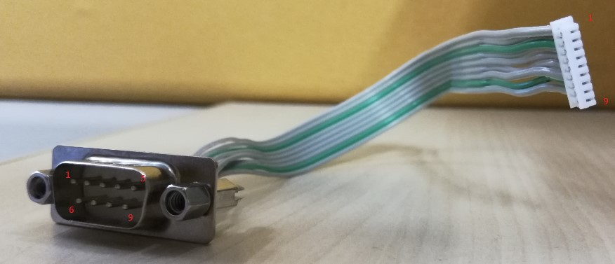
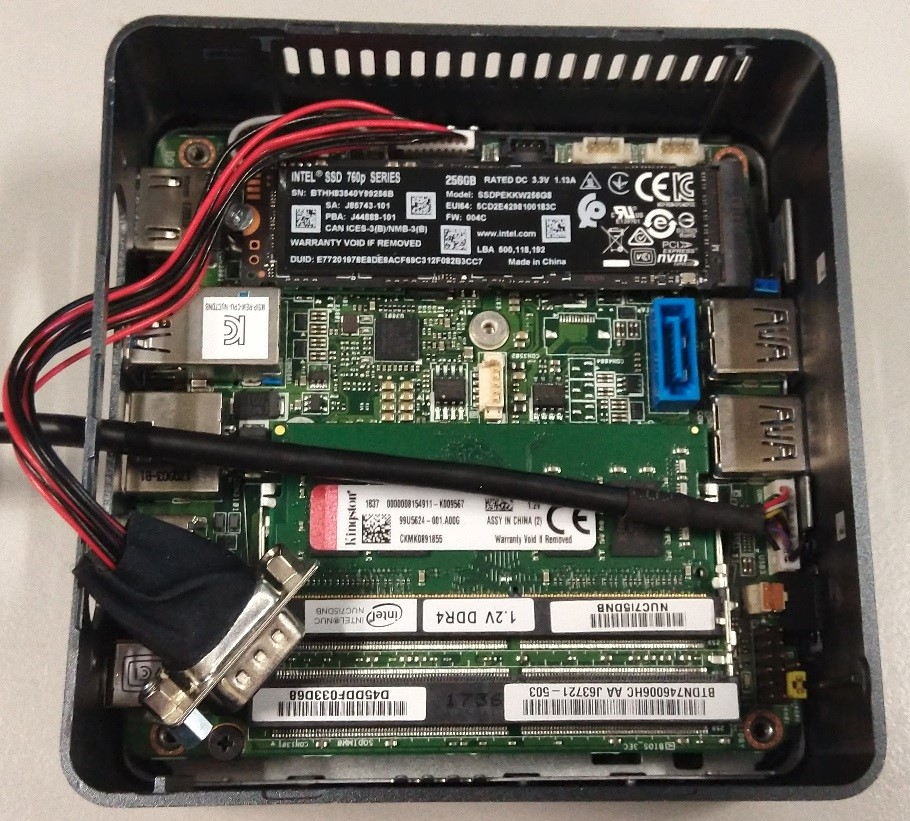
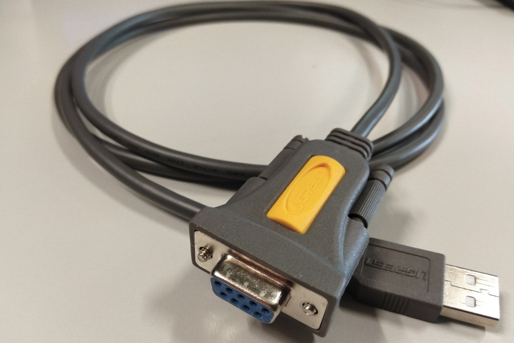
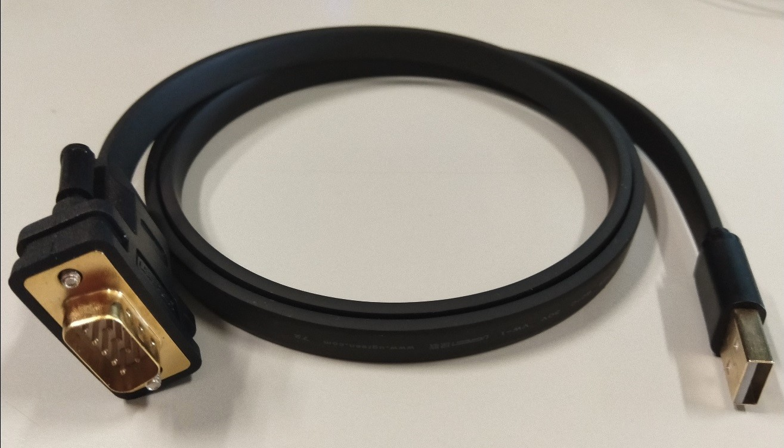

Enable the Serial Debug Logs in Celadon
=======================================

Table of Contents
#################

.. contents::
    :depth: 2
    :local:

Enable the serial debug logs on Intel®NUC Mini PC with 8th Generation Intel®Core™ Processors(i.e. `Dawson Canyon <https://ark.intel.com/content/www/us/en/ark/products/codename/126293/dawson-canyon.html>`_)
-------------------------------------------------------------------------------------------------------------------------------------------------------------------------------------------------------------

HW connection
~~~~~~~~~~~~~

The serial port is supported through the internal connector on the main board of the Intel NUC Kit NUC7i5DNHE system, using the following cable to exercise the UART output:

The following figure shows the location of the internal connector to be plugged with the UART cable.

Connect the UART cable to the host PC with a serial-to-USB converter cable.

SW support
~~~~~~~~~~

Modify the *serialport* setting in the *mixins.spec* configuration file, and re-build the Celadon image.

    .. code-block:: text

	serialport: ttyS0

On the host PC, you can open the serial port to capture the debug logs with the following command:

    .. code-block:: bash

	sudo minicom -D /dev/ttyUSB0

Status
~~~~~~

You will get the output logs from the BIOS, Kernelflinger, Linux kernel, and Celadon Android stack during the Intel NUC system starting up.

Enable the serial debug logs on Intel® NUC Kit with Intel® Celeron® Processors (i.e. `Arches Canyon <https://ark.intel.com/content/www/us/en/ark/products/codename/95587/arches-canyon.html>`_) 
-----------------------------------------------------------------------------------------------------------------------------------------------------------------------------------------------

HW connection
~~~~~~~~~~~~~

On Apollo Lake based Intel NUC Kit, only logs from the Linux kernel, and the Celadon Android stack can be captured using the following male connector type USB-to-serial cable. The ttyUSB driver is supported in the kernel.

Connect the previous UART-to-serial cable to the host PC with a female connector type serial-to-USB converter cable.

SW support
~~~~~~~~~~

Modify the *serialport* setting in the *mixins.spec* configuration file, and re-build the Celadon image.

    .. code-block:: text

	serialport: ttyUSB0

On the host PC, you can open the serial port to capture the debug logs with the following command:

    .. code-block:: bash

	sudo minicom -D /dev/ttyUSB0

Because Kernelflinger has no ttyUSB driver, the logs is saved to a file (location: fs0:\kernelflinger-log.txt).

Status
~~~~~~

The logs from the Linux kernel, and Celadon Android stack will be captured in the *minicom* serial console on the host PC

Enable the Serial debug logs on Intel Whiskey Lake CRB (Customer Reference Platform)
------------------------------------------------------------------------------------

HW connection
~~~~~~~~~~~~~

On Intel Whiskey Lake CRB, the UART port is accessible through an on-board 9-pin connector. Connect the cable to the host PC using the following serial-to-USB converter cable.

SW support
~~~~~~~~~~

Modify the *serialport* setting in the *mixins.spec* configuration file, and re-build the Celadon image.

    .. code-block:: text

	serialport: ttyS0

On the host PC, you can open the serial port to capture the debug logs with the following command:

    .. code-block:: bash

	sudo minicom -D /dev/ttyUSB0

Status
~~~~~~

You will get the output logs from the BIOS, Kernelflinger, Linux kernel, and Celadon Android stack during the board starting up.
