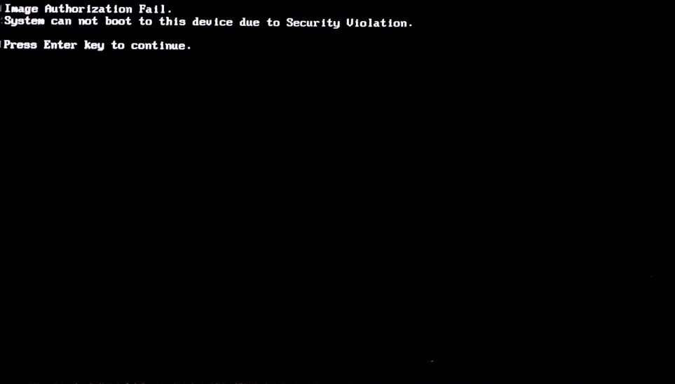

.. _how-to:

How do I ...
############

This page explains some configuration tasks in |C|.

.. contents::
    :depth: 1
    :local:

How to support secure boot
**************************

Secure boot is enabled on the BIOS of some PCs by default. It adds the BIOS
vendor's key and Windows key by default. However, the default setting does
not include the key to verify the kernelflinger. If the BIOS has enabled
secure boot, you will get the following error message:

You'll need a USB drive with at least 1GB of free space to perform the
following steps to add the key used to verify the kernelflinger
to BIOS.

#. Download the files that comprise *Keytool* from their respective
   locations:

   #. :file:`KeyTool.efi` is a tool included in the *efitools* tarball.
      Download the tarball from
      https://git.kernel.org/pub/scm/linux/kernel/git/jejb/efitools.git.

   #. Download
      `DB.auth <https://raw.githubusercontent.com/projectceladon/celadon-documentation/master/blob/DB.auth>`_.

   #. Download
      `KEK.auth <https://raw.githubusercontent.com/projectceladon/celadon-documentation/master/blob/KEK.auth>`_.

#. Format the USB drive to use the FAT filesystem. Put the
   :file:`KeyTool.efi`, :file:`DB.auth`, and :file:`KEK.auth` files on the
   USB drive.

#. Disable the device secure boot.

   #. Plug in the USB drive and reboot the device.
   #. Press :kbd:`F10` to enter the Boot Menu.
   #. Select "UEFI : Build-in EFI Shell" and then find your USB device.
   #. Execute :command:`KeyTool.efi` and you will see the KeyTool menu.
   #. Select :menuselection:`Edit Keys` to replace the keys.

      .. figure:: images/keytool.jpg
         :align: center

#. Select the :menuselection:`(db)` option and press :kbd:`Enter`.

   .. figure:: images/select-menu.jpg
      :align: center

#. Choose :menuselection:`Add New Key` to add the DB key.

   .. figure:: images/add-db.jpg
      :align: center

#. Browse your USB drives to locate your keys and add them one at a time.

   .. figure:: images/browse-db-from-usb.jpg
      :align: center

   .. figure:: images/auth-key.jpg
      :align: center

   Repeat the same steps and add the new key for KEK

   .. figure:: images/menu-kek.jpg
      :align: center

How to change the partition size in |C| image
*********************************************

An Android system is typically comprised of multiple disk partitions. Each
parition is associated with an :file:`\*.img` file in the |C| image. In
addition, |C| supports a whole GPT image to be flashed to the entire disk.
Some partitions (e.g. the system partition) are huge, but some of them are
empty. The :command:`SPARSE` image format is used to reduce the image size.

The default partition size is defined in the following files:

    .. list-table::

       * - device/intel/mixins/groups/boot-arch/project-celadon/gpt.ini
       * - device/intel/mixins/groups/boot-arch/project-celadon/option.spec
       * - device/intel/mixins/groups/vendor-partition/true/option.spec
       * - device/intel/mixins/groups/config-partition/true/gpt.ini
       * - device/intel/mixins/groups/factory-partition/true/gpt.ini

Modify :file:`device/intel/project-celadon/[lunch_target]/mixins.spec` to
change some of the default settings.

.. note::
    1. Changing the partition size will cause the OTA update to fail.
    2. The system partition requires at least 2560MB of disk space.
