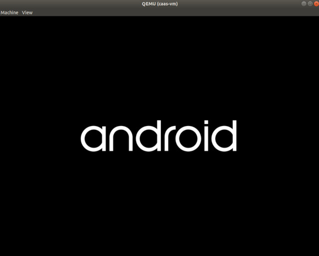
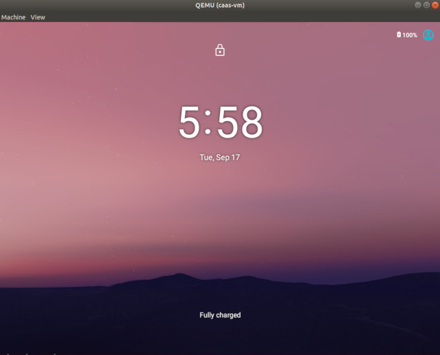

.. _caas-on-vm:

Run |C| in a virtual machine
############################

This page explains what you'll need to run |C| in a virtual machine.

Depending on your applications, you can run :abbr:`CiV (Celadon in VM)` using
Intel® GVT-g technology, or allowing for GPU passthrough to a single Android
guest VM through Intel® GVT-d technology, or VirtIO GPU, or pure software rendering.

.. contents::
   :local:
   :depth: 1

Prerequisites
*************

* A |NUC| with 5th Generation or newer Intel Core Processors.
* Ubuntu 20.04 (Focal Fossa) preinstalled which runs Linux\* kernel
  version 5.0.0 or above.

  .. note::
     :abbr:`CiV (Celadon in VM)` releases have been validated on
     |NUC| model `NUC7i5DNHE`_. Releases after **April 17th 2020** are
     validated on |NUC| model `NUC10i7FNK`_ and `NUC10i7FNH`_ to
     take performance advantages of 10th Generation Intel® Core Processors.

Intel GVT-d overview
********************

Intel Graphics Virtualization Technology covers three distinct flavors
of graphics virtualization approaches. Among these approaches,
Intel GVT-d is based on
:abbr:`Intel® VT-d (Intel® Virtualization Technology for Directed I/O)`
technology, it also includes additional graphics related configuration
options when compared to standard NIC pass-through devices.
Intel® GVT-d allows direct assignment of an entire GPU's capacity to
a single user, passing the native driver capabilities through the hypervisor
without limitations.

Refer to this `article <https://01.org/sites/default/files/downloads/igvt-g/gvtflyer.pdf>`_
for introduction on Intel Graphics Virtualization Technology.

Prepare the host environment
****************************

Set up QEMU and Intel GVT technology
====================================

The host device that launches the virtual machine requires Ubuntu 20.04.
To simpify the preparation works, a helper script :file:`setup_host.sh` is
provided.
The script re-builds the :file:`OVMF.fd` firmware and `QEMU`_ emulator
from source depending on the target graphics virtualization technology,
and installs the required software on the installed Ubuntu system for running
|C| in a VM with QEMU.

Download and extract release package(`caas-releasefiles-<$buildvariant>.tar.gz`)
from: `celadon-binary <https://github.com/projectceladon/celadon-binary>`_
Meanwhile, you can also refer :ref:`build-os-image` section to build release
packages.

     .. code-block:: bash

        $ mkdir -p ~/civ && cd ~/civ
        $ tar zxvf caas-releasefiles-<$buildvariant>.tar.gz
        $ chmod +x scripts/setup_host.sh

Launch the script with no argument to set up the environment for running
CiV using Intel GVT technology:

     .. code-block:: bash

        $ sudo -E ./scripts/setup_host.sh

During the installation, you will be prompted by some questions to confirm the
changes to the packages, it's safe to respond :kbd:`y` to all of them.

Use |C| kernel
==============

The Linux kernel is extremely important on every Android devices, Google
recommends using `AOSP common kernels`_ on Android devices to include
features and implementations required by Android.
In addition to the AOSP common kernel, |C| also integrates several
`staging patches <https://github.com/projectceladon/vendor-intel-utils/tree/master/host/kernel/lts2019-chromium>`_
to take advantages of high performance new Intel processors,
so it's strongly recommended to run the |C| kernel as the host OS,
especially running CiV on `NUC10i7FNK`_ or `NUC10i7FNH`_ |NUC| devices.
To that end, a
`helper script <https://github.com/projectceladon/vendor-intel-utils/blob/master/host/kernel/lts2019-chromium/build.sh>`_
:file:`build.sh` is designed to facilitate
the building and deploying of |C| kerenl on a Ubuntu host.
Refer to the `README`_ for detailed instructions.

.. _README: https://github.com/projectceladon/vendor-intel-utils/blob/master/host/kernel/lts2019-chromium/README

Build |C| images running in VM
******************************

Refer to the :ref:`build-os-image` section in the Getting Started Guide and
specify :envvar:`caas` as the lunch target to build the CiV images. The
following CiV image types are generated at the end of the build:

:file:`caas.img`

    The GPT disk image for direct booting. Skip next section to
    boot the CiV image with QEMU.

:file:`caas-flashfiles-eng.<user>.zip`

    The compressed *flashfile* package contains the |C| partition images for running in a VM.
    Proceed with the following section to install these images to a virtual
    disk image in `qcow2 <https://www.linux-kvm.org/page/Qcow2>`_ format.

:file:`caas-releasefiles-<$buildvariant>.tar.gz`

    The release tar ball contains all required flashfiles/scrips for running Celadon in VM.

Create a CiV virtual disk
*************************

.. note::
        Skip this section if you plan to boot the device directly with the GPT disk image :file:`caas.img`.

Follow the instructions below to create and set up CiV partitions on
a *qcow2* formatted virtual disk.

#. Run the helper script :file:`start_flash_usb.sh`.

    .. code-block:: bash

        $ cd ~/civ
        $ sudo ./scripts/start_flash_usb.sh caas-flashfiles-eng.<user>.zip

#. By running the :file:`start_flash_usb.sh` script, a QEMU window will be popped up, it
   will drop to the built-in UEFI Shell and start flashing the partitions to
   the virtual disk image.

    .. figure:: images/qemu-bios-flashing.png
        :align: center

#. The QEMU window will be closed automatically once flash complete.
   Now we get the CiV virtual disk :file:`android.qcow2` under the current
   directory.

Boot to Android UI
******************

A script `start_civ.sh` is developed to facilitate the CiV images
booting process. It supports various options:

.. code-block:: bash

    start_civ.sh [-h] [-m] [-c] [-g] [-d] [-f] [-v] [-s] [-p] [-b] [-e] [--passthrough-pci-usb] [--passthrough-pci-audio] [--passthrough-pci-eth] [--passthrough-wifi] [--thermal-mediation] [--battery-mediation] [--guest-pm-control] [--guest-time-keep]

.. list-table::
   :widths: 35 78
   :header-rows: 0

   * - :kbd:`-h`
     - show this help message.

   * - :kbd:`-m`
     - specify guest memory size, eg. "-m 4G". Default is 2G if this is not specified.

   * - :kbd:`-c`
     - specify guest cpu number, eg. "-c 4". Default is 1 if this is not specified.

   * - :kbd:`-g`
     - specify guest graphics mode, current support **VirtIO | GVT-g | GVT-d | QXL**.

       VirtIO GPU, eg. "-g VirtIO"

       QXL VGA, eg. "-g QXL"

       GVT-g, eg. "-g GVT-g,uuid=4ec1ff92-81d7-11e9-aed4-5bf6a9a2bb0a", if uuid is not specified, a hardcoded uuid will be used

       GVT-d: romfile is supported for GVT-d, eg. "-g GVT-d,romfile=/path/to/romfile", romfile is optional.

       The default value is VirtIO if this parameter is not specified.

   * - :kbd:`-d`
     - specify guest virtual disk image, eg. "-d /path/to/android.img". Default is "$PWD/android.qcow2" if this is not specified.

   * - :kbd:`-f`
     - specify guest firmware image, eg. "-d /path/to/ovmf.fd". Default is "$PWD/OVMF.fd" if this is not specified.

   * - :kbd:`-v`
     - specify guest vsock cid, eg. "-v 4". Default is 3.

   * - :kbd:`-s`
     - specify guest share folder path, eg. "-s /path/to/share/with/guest".

   * - :kbd:`-p`
     - specify host forward ports, current support adb/fastboot, eg. "-p adb=6666,fastboot=7777". Default is adb=5555,fastboot=5554

   * - :kbd:`-b`
     - specify host block device as guest virtual device, eg." -b /dev/mmcblk0 "

   * - :kbd:`-e`
     - specify extra qemu cmd, eg. "-e "-full-screen -monitor stdio""

   * - :kbd:`--passthrough-pci-usb`
     - passthrough USB PCI bus to guest.

   * - :kbd:`--passthrough-pci-audio`
     - passthrough Audio PCI bus to guest.

   * - :kbd:`--passthrough-pci-eth`
     - passthrough Ethernet PCI bus to guest.

   * - :kbd:`--passthrough-pci-wifi`
     - passthrough WiFi PCI bus to guest.

   * - :kbd:`--thermal-mediation`
     - enable thermal mediation.

   * - :kbd:`--battery-mediation`
     - enable battery mediation.

   * - :kbd:`--guest-pm-control`
     - allow guest control host PM.

   * - :kbd:`--guest-time-keep`
     - reflect guest time setting on Host OS.

Intel GVT option
================

Enter the following commands to run the script `start_civ.sh` with
root permissions to facilitate the booting of CiV images with QEMU.

.. code-block:: bash

    $ cd ~/civ
    # The following command runs CiV using Intel GVT-g
    $ sudo -E ./scripts/start_civ.sh -g GVT-g

.. code-block:: bash

    # The following command runs CiV using Intel GVT-d, and passes
    # all the attached USB devices such as keyboard, mouse to the VM.
    $ sudo -E ./scripts/start_civ.sh -g GVT-d --passthrough-pci-usb

USB PCI controller pass-through option
======================================

You can pass-through not only the GPU but also the USB host controller (xHCI)
to the Android VM, in order to attach all the connected USB devices
(e.g. camera, USB thumb drive) to the VM.
By passing :command:`--passthrough-pci-usb` argument to the `start_civ.sh` script,
all the USB devices connected to the platform get automatically enumerated inside
the Android VM:

.. code-block:: bash

    # The following command pass-through the xHCI to the VM
    $ sudo -E ./scripts/start_civ.sh --passthrough-pci-usb

.. warning::
    All the USB devices, including keyboard and mouse, will be disconnected
    from the host OS and get attached to the Android VM.

An alternative methodology is to passthrough only selected USB devices
to the Android VM by modifying the `start_civ.sh` script.
For example, to pass-through the USB SD card reader in the following list,
whose vendorID and productID are **14cd** and **125c** respectively:

    .. code-block:: bash

        $ lsusb
        Bus 004 Device 001: ID 1d6b:0003 Linux Foundation 3.0 root hub
        Bus 003 Device 001: ID 1d6b:0002 Linux Foundation 2.0 root hub
        Bus 001 Device 003: ID 8087:0a2b Intel Corp.
        Bus 001 Device 005: ID 093a:2510 Pixart Imaging, Inc. Optical Mouse
        Bus 001 Device 004: ID 1c4f:0002 SiGma Micro Keyboard TRACER Gamma Ivory
        Bus 001 Device 008: ID 14cd:125c Super Top SD card reader

Execute `start_civ.sh` script as below, to enumerate the device
in the Android VM:

    .. code-block:: none

        sudo -E ./scripts/start_civ.sh -e "-device usb-host,vendroidid=0x14cd,productid=0x125c"

Launching with SD card
======================

In case your hardware platform supports SD cards through the :abbr:`SDHCI
(Secure Digital Host Controller Interface)` controller, you can enable
SDHCI mediation by adding :command:`-b <sdcard block device>` option argument while
invoking the `start_civ.sh` script if the SD card is present in the slot.

With the following command, the SD card interface will be mediated to the
Android guest OS, and Android will mount the SD card on boot.
The external SD card mount is validated with sdcardfs file system and the
mount point is available in the standard UI interfaces like file explorer,
storage settings etc.

.. code-block:: bash

    $ sudo -E ./scripts/start_civ.sh -b /dev/mmcblk0p1

.. note::
    #. This option should be given only if SD card is present in the slot.
    #. Do not specify :command:`--passthrough-pci-usb` argument together
       with the SD card options, or the SD card won't be operational.

Audio pass-through option
=========================

The audio controller can be passd through to the guest
by adding :command:`--passthrough-pci-audio` argument while invoking the
`start_civ.sh` script, the host then has no control over it.

.. code-block:: bash

    $ sudo -E ./scripts/start_civ.sh --passthrough-pci-audio

.. note::
    With the above setup, PCI controllers, which are part of the same IOMMU
    group as the audio controller, will also be pass-through to the guest.
    For example, if the Ethernet controller and the audio controller are
    in the same IOMMU group, the Ethernet controller will be moved to the guest.
    Thus if you are connecting to the host via Ethernet, the network accesses to
    the host will be drop. Since the Android guest has accesses to the Ethernet
    controller, you can connect to it using the command:

    .. code-block:: bash

       $ adb connect <guest-ip-addr>:5555

.. _Intel Graphics Virtualization Technology: https://01.org/igvt-g

.. _QEMU: https://www.qemu.org/

.. _NUC7i5DNHE: https://www.intel.com/content/www/us/en/products/boards-kits/nuc/kits/nuc7i5dnhe.html

.. _NUC10i7FNK: https://www.intel.com/content/www/us/en/products/boards-kits/nuc/kits/nuc10i7fnk.html

.. _NUC10i7FNH: https://www.intel.com/content/www/us/en/products/boards-kits/nuc/kits/nuc10i7fnh.html

.. _AOSP common kernels: https://source.android.com/devices/architecture/kernel/android-common
