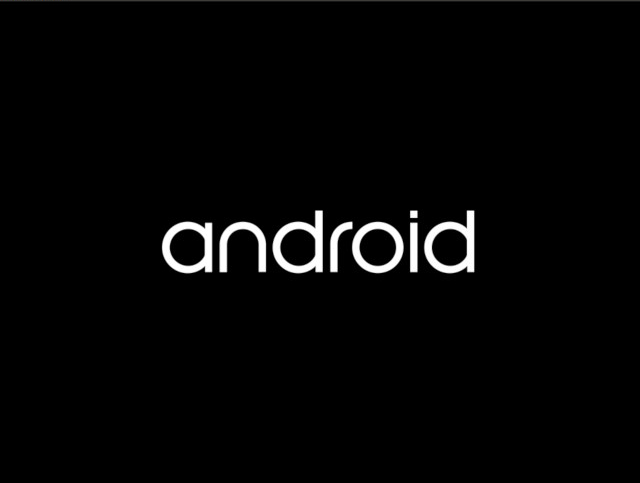

.. _caas-on-vm:

Run |C| in a virtual machine
############################

This page explains what you'll need to run |C| in a virtual machine.

Depending on your applications, you can run :abbr:`CiV (Celadon in VM)` using
Intel® GVT-g technology, or allowing for GPU passthrough to a single
Android\* guest VM through Intel® Virtualization Technology (Intel® VT) for
Directed I/O (Intel® VT-d) technology, or SR-IOV (single root input/output
virtualization) Intel VT to have a balance of GPU sharing
(for multiple VMs) and performance as good as bare metal, VirtIO GPU,
or pure software rendering.

.. contents::
   :local:
   :depth: 2

Prerequisites
*************

* An |NUC-attr| with an eighth generation (12th generation for SR-IOV) or newer |Core-attr| Processor.
* Ubuntu\* 20.04 (Focal Fossa) preinstalled that runs Linux\* kernel
  version 5.0.0 (5.10.100 for SR-IOV) or above.

  .. note::
     :abbr:`CiV (Celadon in VM)` releases have been validated on
     |NUC| model `NUC7i5DNHE`_. Releases after **April 17th 2020** are
     validated on |NUC| model `NUC10i7FNK`_ and `NUC10i7FNH`_ to
     take performance advantages of 10th Generation |Core| Processors.
     For SR-IOV, they are validated on |NUC| model NUC12WSH with 12th generation
     |Core| Processors.

Intel GVT-d overview
********************

Intel® Graphics Virtualization Technology (Intel® GVT) covers three distinct
flavors of graphics virtualization approaches. Among these approaches,
Intel GVT-d is based on Intel VT-d
technology, it also includes additional graphics related configuration
options when compared to standard NIC pass-through devices.
Intel GVT-d allows direct assignment of an entire GPU's capacity to
a single user, passing the native driver capabilities through the hypervisor
without limitations.

Refer to this `article <https://01.org/sites/default/files/downloads/igvt-g/gvtflyer.pdf>`_
for an introduction to Intel Graphics Virtualization Technology.

Intel GPU SR-IOV overview
*************************

An Intel GPU can isolate GPU PCIe devices to improve performance to a level that is similar to bare-metal levels. Intel GPU SR-IOV is based on SR-IOV technology, SR-IOV consists of two basic units: PF (Physical Function), which supports SR-IOV PCIe extended capability and manages entire physical devices; and VF (Virtual Function), a “lightweight” PCIe function that is a passthrough device for VMs.

Refer to `this article <https://projectacrn.github.io/latest/tutorials/sriov_virtualization.html>`_ and `this video <https://videoportal.intel.com/media/GPU+VirtualizationA+SRIOV+and+Beyond/0_2a3dmpu0>`_
for an introduction to SR-IOV Technology.

Prepare the host environment
****************************

Set up QEMU and Intel GVT/SR-IOV technology
===========================================

The host device that launches the virtual machine requires Ubuntu 20.04.
To simplify the preparation work, a helper script :file:`setup_host.sh` is
provided. The script re-builds the :file:`OVMF.fd` firmware and
`QEMU`_ emulator from source depending on the target graphics virtualization
technology, and installs the required software on the installed Ubuntu
system for running |C| in a VM with QEMU.

Download and extract the release
package(`caas-releasefiles-<$buildvariant>.tar.gz`)
from: `celadon-binary <https://github.com/projectceladon/celadon-binary>`_
Meanwhile, you can also refer to :ref:`build-os-image` section to build
release packages.

.. code-block:: bash

   $ sudo mkdir -p /opt/civ-1 && sudo chown -R $(id -u):$(id -g) /opt/civ-1
   $ tar zxvf caas-releasefiles-<$buildvariant>.tar.gz
   $ chmod +x scripts/setup_host.sh

Launch the script with no argument to set up the environment for running
CiV using Intel GVT/SR-IOV technology:

.. code-block:: bash

   $ sudo -E ./scripts/setup_host.sh

During the installation, you will be prompted by some questions to
confirm the changes to the packages, it's safe to respond :kbd:`y` to all of
them.

Use |C| kernel
==============

The Linux kernel is extremely important on every Android device. Google\*
recommends using `AOSP common kernels`_ on Android devices to include
features and implementations required by Android.
In addition to the AOSP common kernel, |C| also integrates several
`staging patches <https://github.com/projectceladon/vendor-intel-utils/tree/master/host/kernel/lts2019-chromium>`_
to take advantages of high performance new Intel processors,
so it's strongly recommended to run the |C| kernel as the host OS,
especially running CiV on `NUC10i7FNK`_ or `NUC10i7FNH`_ (NUC12WSH for SR-IOV) |NUC| devices.
To that end, a helper script :file:`build.sh` is designed to facilitate
building and deploying the |C| kernel on an Ubuntu host.
Refer to the
`README <https://github.com/projectceladon/vendor-intel-utils/blob/master/host/kernel/lts2020-chromium/README>`_
for detailed GVT kernel build instructions. Refer to
`this README <https://github.com/projectceladon/vendor-intel-utils/blob/master/host/kernel/lts2020-yocto/README>`_
for detailed SR-IOV kernel build instructions.

Build |C| images running in VM
******************************

Refer to the :ref:`build-os-image` section in the Getting Started Guide and
specify :envvar:`caas` as the lunch target to build the CiV images. The
following CiV image types are generated at the end of the build:

:file:`caas.img`

The GPT disk image for direct booting. Skip the next section to
boot the CiV image with QEMU.

:file:`caas-flashfiles-eng.<user>.zip`

The compressed *flashfiles* package contains the |C| partition images for
running in a VM. Proceed with the following section to install these
images to a virtual disk image in
`qcow2 <https://www.linux-kvm.org/page/Qcow2>`_ format.

:file:`caas-flashfile-eng.<user>.iso.zip`

:file:`cass-flashfile-eng.<user>.iso.zip` is an ISO format bootable image that can be
burned to a bootable CD/DVD or cloned to USB pendrive. It is used to install Caas images
in VM and BM (Bare Metal). It is independent on a UEFI Shell.
:file:`cass-flashfiles-eng.<user>.zip` image flashing dependents on BIOS UEFI shell. For
|C| in VM solution, it always works because VMM (like QEMU) can provide a UEFI Shell.
But for Celadon in a bare mental solution, it doesn't work because some devices don't
have a built-in UEFI Shell. So we need provide a new solution to flash Caas images to such devices.

:file:`caas-releasefiles-<$buildvariant>.tar.gz`

:file:`caas-releasefile-<$buildvariant>.iso.tar.gz`

The release tar ball contains all required flashfiles/scrips for running
|C| in VM.

Create a CiV virtual disk
*************************

.. note::
        Skip this section if you plan to boot the device directly with the
        GPT disk image :file:`caas.img`.

Follow the instructions below to create and set up CiV partitions on
a *qcow2* formatted virtual disk.

#. Run the helper script :file:`start_flash_usb.sh`.

    .. code-block:: bash

        $ cd /opt/civ-1
        $ sudo ./scripts/start_flash_usb.sh caas-flashfiles-eng.<user>.zip

   If you are using an iso image, run the following commands:

    .. code-block:: bash

        $ cd /opt/civ-1
        $ sudo ./scripts/start_flash_usb.sh caas-flashfiles-eng.<user>.iso.zip

#. By running the :file:`start_flash_usb.sh` script, a QEMU window will pop
   up, it will drop to the built-in UEFI Shell, and start flashing the
   partitions to the virtual disk image.

    .. figure:: images/qemu-bios-flashing.png
        :align: center

#. The QEMU window will be closed automatically once flashing is complete.
   Now we get the CiV virtual disk :file:`android.qcow2` under the current
   directory.

Boot to Android UI
******************

There are two ways to start a CiV instance:
`vm-manager` and `start_civ.sh`.
For Android-12 and later releases, please refer to
`vm-manger <#use-vm-manager>`_.
For Android-11 and previous releases, please refer to
`start_civ.sh <#use-start-civ-sh>`_.
Check Release Notes here: https://docs.01.org/celadon/release-notes.html.

Use vm-manager
==============

The `vm-manager` tool was developed to facilitate the CiV images
booting process. It supports various options:

.. code-block:: bash

    vm-manager [-c] [-d vm_name] [-b vm_name] [-q vm_name] [-f vm_name] [-u vm_name] [--get-cid vm_name] [-l] [-v] [-h]

.. list-table::
   :widths: 35 78
   :header-rows: 0

   * - :kbd:`-c`
     - Create a new CiV guest configuration

   * - :kbd:`-d`
     - Delete a CiV guest

   * - :kbd:`-b`
     - Start a CiV guest

   * - :kbd:`-q`
     - Stop a CiV guest

   * - :kbd:`-f`
     - Flash a CiV guest

   * - :kbd:`-u`
     - Update an existing CiV guest

   * - :kbd:`--get-cid`
     - Get cid of a guest

   * - :kbd:`-l`
     - List existing CiV guest

   * - :kbd:`-v`
     - Show CiV vm-manager version

   * - :kbd:`--start-server`
     - Start host server

   * - :kbd:`--stop-server`
     - Stop host server

   * - :kbd:`--daemon`
     - start server as a daemon

   * - :kbd:`-h`
     - Show this help message

All CiV guest configuration file (INI formated) are stored at
:file:`$HOME/.intel/.civ/`,

#. Install vm-manager
   Download the latest release package from: https://github.com/projectceladon/vm_manager/releases.
   Install it with this command:

   .. code-block:: bash

      sudo apt-get install ./vm-manager_vx.y.z_$OS_VER.deb

#. Create a ini file under :file:`$HOME/.intel/.civ/civ-1.ini` for GVT-g. Configure it
   as shown below: ::

     [global]
     name=civ-1
     flashfiles=/opt/civ-1/caas-flashfiles-CR0000317.zip
     # flashfiles=/opt/civ-1/caas-flashfiles-CR0000317.iso.zip #use iso image

     [emulator]
     path=/usr/bin/qemu-system-x86_64

     [memory]
     size=4G

     [vcpu]
     num=1

     [firmware]
     type=unified
     path=/opt/civ-1/OVMF.fd

     [disk]
     size=30G
     path=/opt/civ-1/android.qcow2

     [graphics]
     type=GVT-g
     gvtg_version=i915-GVTg_V5_4
     vgpu_uuid=1fc89c23-e8a6-47a9-83be-ec23d6f4bb17

     [net]
     adb_port=5555
     fastboot_port=5554

     [vtpm]
     bin_path=/usr/bin/swtpm
     data_dir=/opt/civ-1/vtpm0

     [rpmb]
     bin_path=/opt/civ-1/scripts/rpmb_dev
     data_dir=/opt/civ-1/

     [aaf]
     path=/opt/civ-1/scripts/aaf

     [extra]
     cmd=-chardev socket,id=charserial0,path=/tmp/civ-console,server=on,wait=off,logfile=/tmp/civ-1_serial.log -serial chardev:charserial0

#. Create an ini file under :file:`$HOME/.intel/.civ/civ-2.ini` for SR-IOV.
   Configure it as shown below: ::

     [global]
     name=civ-2
     flashfiles=/home/adl/sriov/caas-flashfiles-CRe011142-r1.zip

     [emulator]
     path=/usr/bin/qemu-system-x86_64

     [memory]
     size=4G

     [vcpu]
     num=1

     [firmware]
     type=unified
     path=/home/adl/caas1/OVMF.fd

     [disk]
     size=30G
     path=/home/adl/caas1/android.qcow2

     [graphics]
     type=SRIOV

     [net]
     adb_port=5555
     fastboot_port=5554

     [vtpm]
     bin_path=/usr/bin/swtpm
     data_dir=/home/adl/caas1/vtpm0

     [rpmb]
     bin_path=/home/adl/sriov/scripts/rpmb_dev
     data_dir=/home/adl/caas1

     [aaf]
     path=/home/adl/caas1/aaf

     [extra]
     cmd=-monitor stdio

#. Start the instance:
    for GVT-g:
      .. code-block:: bash

         $ sudo vm-manager -b civ-1

    for SR-IOV:
      .. code-block:: bash

         $ sudo vm-manager -b civ-2

For more details, please reference the following wiki to get started:
`CiV VM Manager User Guide <https://github.com/projectceladon/vm_manager/wiki/User-Guide>`_.

Use start_civ.sh
================

The `start_civ.sh` script was developed to facilitate the CiV images
booting process. It supports the following options:

.. code-block:: bash

    start_civ.sh [-h] [-m] [-c] [-g] [-d] [-f] [-v] [-s] [-p] [-b] [-e] [--passthrough-pci-usb] [--passthrough-pci-audio] [--passthrough-pci-eth] [--passthrough-wifi] [--thermal-mediation] [--battery-mediation] [--guest-pm-control] [--guest-time-keep]

.. list-table::
   :widths: 35 78
   :header-rows: 0

   * - :kbd:`-h`
     - show this help message.

   * - :kbd:`-m`
     - specify guest memory size, eg. "-m 4G". Default is 2G if this is not specified.

   * - :kbd:`-c`
     - specify guest cpu number, eg. "-c 4". Default is 1 if this is not specified.

   * - :kbd:`-g`
     - specify guest graphics mode, current support **VirtIO | GVT-g | GVT-d | QXL**.

       VirtIO GPU, eg. "-g VirtIO"

       QXL VGA, eg. "-g QXL"

       GVT-g, eg. "-g GVT-g,uuid=4ec1ff92-81d7-11e9-aed4-5bf6a9a2bb0a", if uuid is not specified, a hardcoded uuid will be used

       GVT-d: romfile is supported for GVT-d, eg. "-g GVT-d,romfile=/path/to/romfile", romfile is optional.

       The default value is VirtIO if this parameter is not specified.

   * - :kbd:`-d`
     - specify guest virtual disk image, eg. "-d /path/to/android.img". Default is "$PWD/android.qcow2" if this is not specified.

   * - :kbd:`-f`
     - specify guest firmware image, eg. "-d /path/to/ovmf.fd". Default is "$PWD/OVMF.fd" if this is not specified.

   * - :kbd:`-v`
     - specify guest vsock cid, eg. "-v 4". Default is 3.

   * - :kbd:`-s`
     - specify guest share folder path, eg. "-s /path/to/share/with/guest".

   * - :kbd:`-p`
     - specify host forward ports, current support adb/fastboot, eg. "-p adb=6666,fastboot=7777". Default is adb=5555,fastboot=5554

   * - :kbd:`-b`
     - specify host block device as guest virtual device, eg." -b /dev/mmcblk0 "

   * - :kbd:`-e`
     - specify extra qemu cmd, eg. "-e "-full-screen -monitor stdio""

   * - :kbd:`--passthrough-pci-usb`
     - passthrough USB PCI bus to guest.

   * - :kbd:`--passthrough-pci-audio`
     - passthrough Audio PCI bus to guest.

   * - :kbd:`--passthrough-pci-eth`
     - passthrough Ethernet PCI bus to guest.

   * - :kbd:`--passthrough-pci-wifi`
     - passthrough WiFi PCI bus to guest.

   * - :kbd:`--thermal-mediation`
     - enable thermal mediation.

   * - :kbd:`--battery-mediation`
     - enable battery mediation.

   * - :kbd:`--guest-pm-control`
     - allow guest control host PM.

   * - :kbd:`--guest-time-keep`
     - reflect guest time setting on Host OS.

Intel GVT option
================

Enter the following commands to run the script `start_civ.sh` with
root permissions to facilitate booting CiV images with QEMU.

.. code-block:: bash

    $ cd /opt/civ-1
    # The following command runs CiV using Intel GVT-g
    $ sudo -E ./scripts/start_civ.sh -g GVT-g

.. code-block:: bash

    # The following command runs CiV using Intel GVT-d, and passes
    # all the attached USB devices such as keyboard, mouse to the VM.
    $ sudo -E ./scripts/start_civ.sh -g GVT-d --passthrough-pci-usb

USB PCI controller pass-through option
======================================

You can pass-through not only the GPU but also the USB host controller (xHCI)
to the Android VM to attach all the connected USB devices
(e.g. camera, USB thumb drive) to the VM.
By passing :command:`--passthrough-pci-usb` argument to the `start_civ.sh`
script, all the USB devices connected to the platform are automatically
enumerated inside the Android VM:

.. code-block:: bash

    # The following command passes through the xHCI to the VM
    $ sudo -E ./scripts/start_civ.sh --passthrough-pci-usb

.. warning::
    All the USB devices, including keyboard and mouse, will be disconnected
    from the host OS and get attached to the Android VM.

An alternative methodology is to passthrough only selected USB devices
to the Android VM by modifying the `start_civ.sh` script.
For example, to pass-through the USB SD card reader in the following list,
whose vendorID and productID are **14cd** and **125c** respectively:

    .. code-block:: bash

        $ lsusb
        Bus 004 Device 001: ID 1d6b:0003 Linux Foundation 3.0 root hub
        Bus 003 Device 001: ID 1d6b:0002 Linux Foundation 2.0 root hub
        Bus 001 Device 003: ID 8087:0a2b Intel Corp.
        Bus 001 Device 005: ID 093a:2510 Pixart Imaging, Inc. Optical Mouse
        Bus 001 Device 004: ID 1c4f:0002 SiGma Micro Keyboard TRACER Gamma Ivory
        Bus 001 Device 008: ID 14cd:125c Super Top SD card reader

Execute `start_civ.sh` script as shown below, to enumerate the device
in the Android VM:

    .. code-block:: none

        sudo -E ./scripts/start_civ.sh -e "-device usb-host,vendroidid=0x14cd,productid=0x125c"

Launching with SD card
**********************

If your hardware platform supports SD cards through the :abbr:`SDHCI
(Secure Digital Host Controller Interface)` controller, you can enable
SDHCI mediation by adding :command:`-b <sdcard block device>` option
argument while invoking the `start_civ.sh` script if the SD card is present
in the slot.

With the following command, the SD card interface will be mediated to the
Android guest OS, and Android will mount the SD card on boot.
The external SD card mount is validated with the sdcardfs file system and the
mount point is available in the standard UI interfaces, such as file
explorer, storage settings etc.

.. code-block:: bash

    $ sudo -E ./scripts/start_civ.sh -b /dev/mmcblk0p1

.. note::
    #. This option should be given only if SD card is present in the slot.
    #. Do not specify :command:`--passthrough-pci-usb` argument together
       with the SD card options, or the SD card won't be operational.

Audio pass-through option
*************************

The audio controller can be passed through to the guest
by adding :command:`--passthrough-pci-audio` argument while invoking the
`start_civ.sh` script, the host then has no control over it.

.. code-block:: bash

    $ sudo -E ./scripts/start_civ.sh --passthrough-pci-audio

.. note::
    With the above setup, PCI controllers, which are part of the same IOMMU
    group as the audio controller, will also be pass-through to the guest.
    For example, if the Ethernet controller and the audio controller are
    in the same IOMMU group, the Ethernet controller will be moved to the
    guest. Thus if you are connecting to the host via Ethernet, the network
    accesses to the host will be drop. Since the Android guest has accesses
    to the Ethernet controller, you can connect to it using the following
    command:

    .. code-block:: bash

       $ adb connect <guest-ip-addr>:5555

.. figure:: images/caas-qemu-lockscreen.jpg
    :align: center

.. _Intel Graphics Virtualization Technology: https://01.org/igvt-g

.. _QEMU: https://www.qemu.org/

.. _NUC7i5DNHE: https://www.intel.com/content/www/us/en/products/boards-kits/nuc/kits/nuc7i5dnhe.html

.. _NUC10i7FNK: https://www.intel.com/content/www/us/en/products/boards-kits/nuc/kits/nuc10i7fnk.html

.. _NUC10i7FNH: https://www.intel.com/content/www/us/en/products/boards-kits/nuc/kits/nuc10i7fnh.html

.. _AOSP common kernels: https://source.android.com/devices/architecture/kernel/android-common
