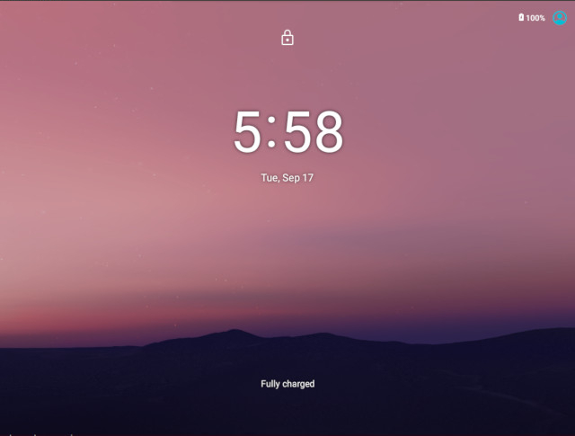

.. _caas-on-vm:

Run |C| in a virtual machine
############################

This page explains what you'll need to run |C| in a virtual machine.

Running |C| in VMs requires `Intel Graphics Virtualization Technology`_ (GVT)
to deliver excellent virtual GPU performance in VMs. Depending on your
applications, you can run :abbr:`CiV (Celadon in VM)` using Intel® GVT-g
technology (default), or allowing for GPU passthrough to a single Android
guest VM through Intel® GVT-d technology.

.. contents::
   :local:
   :depth: 1

Prerequisites
*************

* A |NUC| with 5th Generation or newer Intel Core Processors.
* Ubuntu 18.04.3 or later version preinstalled which runs Linux\* kernel
  version 5.0.0 or above.

  .. note::
     :abbr:`CiV (Celadon in VM)` releases have been validated on
     |NUC| model `NUC7i5DNHE`_. Releases after **April 17th 2020** are
     validated on |NUC| model `NUC10i7FNK`_ and `NUC10i7FNH`_ to
     take performance advantages of 10th Generation Intel® Core Processors.

Intel GVT-d overview
********************

Intel Graphics Virtualization Technology covers three distinct flavors
of graphics virtualization approaches. Among these approaches,
Intel GVT-d is based on
:abbr:`Intel® VT-d (Intel® Virtualization Technology for Directed I/O)`
technology, it also includes additional graphics related configuration
options when compared to standard NIC pass-through devices.
Intel® GVT-d allows direct assignment of an entire GPU's capacity to
a single user, passing the native driver capabilities through the hypervisor
without limitations.

Refer to this `article <https://01.org/sites/default/files/downloads/igvt-g/gvtflyer.pdf>`_
for introduction on Intel Graphics Virtualization Technology.

Prepare the host environment
****************************

Set up QEMU and Intel GVT technology
====================================

The host device that launches the virtual machine requires Ubuntu 18.04.
To simpify the preparation works, a helper script :file:`setup_host.sh` is
provided.
The script re-builds the :file:`OVMF.fd` firmware and `QEMU`_ emulator
from source depending on the target graphics virtualization technology,
and installs the required software on Ubuntu 18.04 for running
|C| in a VM with QEMU.

Download and extract release package(`caas-releasefiles-<$buildvariant>.tar.gz`)
from: `celadon-binary <https://github.com/projectceladon/celadon-binary>`_
Meanwhile, you can also refer :ref:`build-os-image` section to build release
packages.

     .. code-block:: bash

        $ mkdir -p ~/civ && cd ~/civ
        $ tar zxvf caas-releasefiles-<$buildvariant>.tar.gz
        $ chmod +x scripts/setup_host.sh

Launch the script with no argument to set up the environment for running
CiV using Intel GVT-g technology:

     .. code-block:: bash

        $ sudo -E ./scripts/setup_host.sh

Or, pass :command:`--gvtd` argument to the script for setting up an
Intel GVT-d environment:

     .. code-block:: bash

        $ sudo -E ./scripts/setup_host.sh --gvtd

During the installation, you will be prompted by some questions to confirm the
changes to the packages, it's safe to respond :kbd:`y` to all of them.

.. note::
    After setting up the Intel GVT-d environment, your Ubuntu host is
    configured to disable GUI desktop on next boot. It's required to run
    the host OS in text mode, so that the GPU can be pass-through to the
    Android VM. To start GUI destkop temporary, run the following command:

    .. code-block:: bash

       $ sudo systemctl start gdm3

Use |C| kernel
==============

The Linux kernel is extremely important on every Android devices, Google
recommends using `AOSP common kernels`_ on Android devices to include
features and implementations required by Android.
In addition to the AOSP common kernel, |C| also integrates several
`staging patches <https://github.com/projectceladon/vendor-intel-utils/tree/master/host/kernel/lts2019-chromium>`_
to take advantages of high performance new Intel processors,
so it's strongly recommended to run the |C| kernel as the host OS,
especially running CiV on `NUC10i7FNK`_ or `NUC10i7FNH`_ |NUC| devices.
To that end, a
`helper script <https://github.com/projectceladon/vendor-intel-utils/blob/master/host/kernel/lts2019-chromium/build.sh>`_
:file:`build.sh` is designed to facilitate
the building and deploying of |C| kerenl on a Ubuntu host.
Refer to the `README`_ for detailed instructions.

.. _README: https://github.com/projectceladon/vendor-intel-utils/blob/master/host/kernel/lts2019-chromium/README

Build |C| images running in VM
******************************

Refer to the :ref:`build-os-image` section in the Getting Started Guide and
specify :envvar:`caas` as the lunch target to build the CiV images. The
following CiV image types are generated at the end of the build:

:file:`caas.img`

    The GPT disk image for direct booting. Skip next section to
    boot the CiV image with QEMU.

:file:`caas-flashfiles-eng.<user>.zip`

    The compressed *flashfile* package contains the |C| partition images for running in a VM.
    Proceed with the following section to install these images to a virtual
    disk image in `qcow2 <https://www.linux-kvm.org/page/Qcow2>`_ format.

:file:`caas-releasefiles-<$buildvariant>.tar.gz`

    The release tar ball contains all required flashfiles/scrips for running Celadon in VM.

Create a CiV virtual disk
*************************

.. note::
        Skip this section if you plan to boot the device directly with the GPT disk image :file:`caas.img`.

Follow the instructions below to create and set up CiV partitions on
a *qcow2* formatted virtual disk.

#. Run the helper script :file:`start_flash_usb.sh`.

    .. code-block:: bash

        $ cd ~/civ
        $ sudo ./scripts/start_flash_usb.sh caas-flashfiles-eng.<user>.zip

#. By running the :file:`start_flash_usb.sh` script, a QEMU window will be popped up, it
   will drop to the built-in UEFI Shell and start flashing the partitions to
   the virtual disk image.

    .. figure:: images/qemu-bios-flashing.png
        :align: center

#. The QEMU window will be closed automatically once flash complete.
   Now we get the CiV virtual disk :file:`android.qcow2` under the current
   directory.

Reboot to Android UI
********************

A script :file:`start_android_qcow2.sh` is developed to facilitate the CiV images
booting process. However, before launching the script to boot to the Android UI,
you may need to edit the CiV image filename in the script, as the default image
file `android.qcow2` is hard-coded in the script:

.. code-block:: bash

    #!/bin/bash

    work_dir=$PWD
    caas_image=$work_dir/android.qcow2
    ...

Intel GVT option
================

Enter the following commands to run the script :file:`start_android_qcow2.sh` with
root permissions to facilitate the booting of CiV images with QEMU.
The script utilizes Intel GVT-g for graphics virtualization by default,
you can pass :command:`--gvtd` argument to the script to run the CiV images
using Intel GVT-d technology.

.. code-block:: bash

    $ cd ~/civ
    # The following command runs CiV using Intel GVT-g
    $ sudo -E ./scripts/start_android_qcow2.sh

.. code-block:: bash

    # The following command runs CiV using Intel GVT-d, and passes
    # all the attached USB devices such as keyboard, mouse to the VM.
    $ sudo -E ./scripts/start_android_qcow2.sh --gvtd --usb-host-passthrough

xHCI pass-through option
========================

You can pass-through not only the GPU but also the USB host controller (xHCI)
to the Android VM, in order to attach all the connected USB devices
(e.g. camera, USB thumb drive) to the VM.
By passing :command:`--usb-host-passthrough` argument to the
:file:`start_android_qcow2.sh` script, all the USB devices connected to
the platform get automatically enumerated inside the Android VM:

.. code-block:: bash

    # The following command pass-through the xHCI to the VM
    $ sudo -E ./scripts/start_android_qcow2.sh --usb-host-passthrough

.. warning::
    All the USB devices, including keyboard and mouse, will be disconnected
    from the host OS and get attached to the Android VM.

An alternative methodology is to passthrough only selected USB devices
to the Android VM by modifying the :file:`start_android_qcow2.sh` script.
For example, to pass-through the USB SD card reader in the following list,
whose vendorID and productID are **14cd** and **125c** respectively:

    .. code-block:: bash

        $ lsusb
        Bus 004 Device 001: ID 1d6b:0003 Linux Foundation 3.0 root hub
        Bus 003 Device 001: ID 1d6b:0002 Linux Foundation 2.0 root hub
        Bus 001 Device 003: ID 8087:0a2b Intel Corp.
        Bus 001 Device 005: ID 093a:2510 Pixart Imaging, Inc. Optical Mouse
        Bus 001 Device 004: ID 1c4f:0002 SiGma Micro Keyboard TRACER Gamma Ivory
        Bus 001 Device 008: ID 14cd:125c Super Top SD card reader

Add a new setting to the "*common_usb_device_passthrough*" list in the
:file:`start_android_qcow2.sh` script as below, to enumerate the device
in the Android VM:

    .. code-block:: none

        ...
        common_usb_device_passthrough="\
         -device qemu-xhci,id=xhci,addr=0x8 \
         `/bin/bash $usb_switch` \
         -device usb-host,vendorid=0x03eb,productid=0x8a6e \
         -device usb-host,vendorid=0x0eef,productid=0x7200 \
         -device usb-host,vendorid=0x222a,productid=0x0141 \
         -device usb-host,vendorid=0x222a,productid=0x0088 \
         # Pass-through specific USB device as below       \
         -device usb-host,vendorid=0x14cd,productid=0x125c \
         $bt_passthrough \
         ...

.. figure:: images/caas-qemu-booting.jpg
    :align: center

.. _Intel Graphics Virtualization Technology: https://01.org/igvt-g

.. _QEMU: https://www.qemu.org/

.. _start_android_qcow2.sh: https://raw.githubusercontent.com/projectceladon/device-androidia-mixins/master/groups/device-specific/caas/start_android_qcow2.sh

.. _NUC7i5DNHE: https://www.intel.com/content/www/us/en/products/boards-kits/nuc/kits/nuc7i5dnhe.html

.. _NUC10i7FNK: https://www.intel.com/content/www/us/en/products/boards-kits/nuc/kits/nuc10i7fnk.html

.. _NUC10i7FNH: https://www.intel.com/content/www/us/en/products/boards-kits/nuc/kits/nuc10i7fnh.html

.. _AOSP common kernels: https://source.android.com/devices/architecture/kernel/android-common
