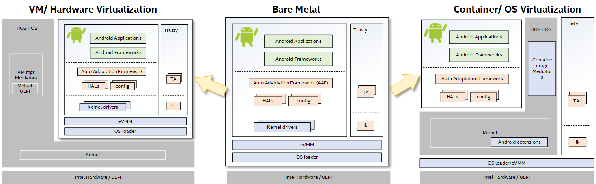

.. _run-as-service:

Run Project |C| on Intel® architectures
=======================================

The idea of :abbr:`CaaS (Celadon as a Service)` is to run |C| as a service
seamlessly on bare metal systems with Intel architecture, virtual machines,
and containers based on an unified software architecture. The architecture of
CaaS is designed to be fully compliant with the Google* Android*
`CDD <https://source.android.com/compatibility/cdd>`_, and allows the
scalability and extensibility for flexible customizations at the same time.

With CaaS, Android transitioned from a platform-specific OS to a generic OS
that can help
`leapfrog the competition <https://en.wikipedia.org/wiki/Leapfrogging>`_,
accelerates workload consolidation, and drives high compute demands.

The diagram shown below illustrates the overall CaaS software architecture.
The :abbr:`AAF (Auto Adaptation Framework)` is the key component introduced
to automatically detect and bind the kernel drivers, and to load the HAL
modules and configurations for a variety of devices exposed on different bare
metal systems and virtual platforms. Therefore, when you run Android on bare
metal systems, VMs, and containers, they are all served by a single image
with an unified architecture.

.. note::
   The CaaS is currently under early development. This is an early Pre-
   Production CaaS and |C| in Container (CIC) Release for evaluation and
   development purposes.

.. toctree::
   :maxdepth: 1

   on-bm
   on-vm
   on-container
