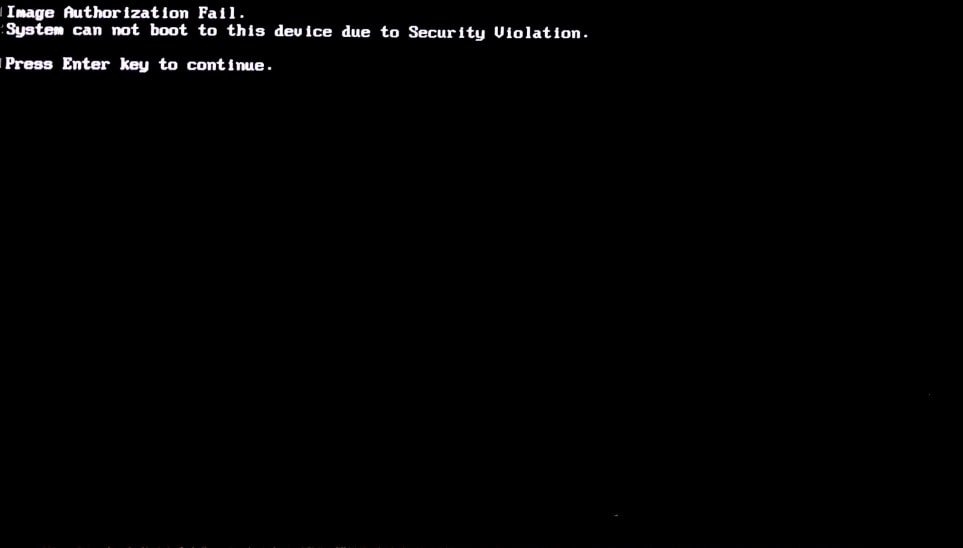

.. _how-to:

How do I ...
############

This page explains some configuration tasks in |C|.

.. contents::
    :depth: 1
    :local:

How to support secure boot
**************************

Secure boot is enabled on the BIOS of some PCs by default. It adds the BIOS
vendor's key and Windows\* key by default. However, the default setting does
not include the key to verify the kernelflinger. If the BIOS has enabled
secure boot, you will get the following error message:

You'll need a USB drive with at least 1GB of free space to perform the
following steps to add the key used to verify the kernelflinger
to BIOS.

#. Download the files that comprise *Keytool* from their respective
   locations:

   #. :file:`KeyTool.efi` is a tool included in the *efitools* tarball. 
      Download the tarball from
      https://git.kernel.org/pub/scm/linux/kernel/git/jejb/efitools.git.

   #. Download 
      `DB.auth <https://raw.githubusercontent.com/projectceladon/celadon-documentation/master/blob/DB.auth>`_.

   #. Download
      `KEK.auth <https://raw.githubusercontent.com/projectceladon/celadon-documentation/master/blob/KEK.auth>`_.

#. Format the USB drive to use the FAT filesystem. Put the
   :file:`KeyTool.efi`, :file:`DB.auth`, and :file:`KEK.auth` files on the
   USB drive.

#. Disable the device secure boot. 

   #. Plug in the USB drive and reboot the device.
   #. Press :kbd:`F10` to enter the Boot Menu. 
   #. Select "UEFI : Build-in EFI Shell" and then find your USB device.
   #. Execute :command:`KeyTool.efi` and you will see the KeyTool menu.
   #. Select :menuselection:`Edit Keys` to replace the keys.

      .. figure:: images/keytool.jpg
         :align: center

#. Select the :menuselection:`(db)` option and press :kbd:`Enter`.

   .. figure:: images/select_menu.jpg
      :align: center

#. Choose :menuselection:`Add New Key` to add the DB key.

   .. figure:: images/add_db.jpg
      :align: center

#. Browse your USB drives to locate your keys and add them one at a time.

   .. figure:: images/browse_db_from_usb.jpg
      :align: center

   .. figure:: images/auth_key.jpg
      :align: center

   Repeat the same steps and add the new key for KEK

   .. figure:: images/menu_kek.jpg
      :align: center

How to enable live boot
***********************

The *live boot* feature allows you to flash a specially-built image to a USB
drive and then boot from the USB drive to Android\* directly without
installing Android to internal storage first.

The live boot feature is used only for debug purposes and must be built
with :command:`eng` or :command:`userdebug` build flavors.

For |C|, you will build a :command:`GPT` disk image, flash it to a USB drive
(similar to installing Android on the USB drive), and then boot Android from
the USB drive. With this approach, |C| supports all Android features, except
some security features that need hardware binding.

Perform the following steps to live-boot |C|.

#. Build a live boot image.

    #. Follow the steps in :ref:`build-from-source` to set up the local
       development environment and to download the source code.

    #. Open the *mixins* config file to verify that the kernelflinger
       supports the USB live boot feature for your
       :command:`[lunch_target]`, because the feature is enabled by default
       for some of the lunch targets such as :command:`"caas"`,
       :command:`"celadon_ivi"` and :command:`"celadon_tablet"`. 

       The following example shows the mixins config file
       :file:`device/intel/project-celadon/caas/mixins.spec` for the
       :command:`"caas"` lunch target:

       .. code-block:: none

          boot-arch: project_celadon(...,...,usb_storage=true,live_boot=true)

    #. Enable the live boot feature by adding the :command:`usb_storage`
       and :command:`live_boot` options to the :file:`mixins.spec` file.

    #. Execute the following command to build a live boot image:

       .. code-block:: bash

          $ make SPARSE_IMAGE=true gptimage -j $(nproc)

       As an alternative, you can pass the options in the :command:`make`
       command line:

       .. code-block:: bash

          $ make SPARSE_IMAGE=true KERNELFLINGER_SUPPORT_USB_STORAGE=true KERNELFLINGER_SUPPORT_LIVE_BOOT=true gptimage -j $(nproc)

       After a successful build, you will have an
       :file:`out/target/product/[lunch_target]/[lunch_target].img` image.
       For example, an :file:`out/target/product/caas/caas.img` image is
       generated for the :command:`caas` lunch target.

    #. The previous command creates an image file of 16GB bytes that
       contains an entire GPT disk. To change the default image size, edit
       the mixins config file 
       :file:`device/intel/project-celadon/[lunch_target]/mixins.spec`
       as follows:

       .. code-block:: none

          gptbuild: true(size=16G,generate_craff=false)

.. _usb-live-boot:

#. Flash the live boot image to a USB drive.

   * For Linux\*, use the *dd* tool to flash the image file to the USB
     drive. For example:

      .. code-block:: bash

         $ sudo dd if=caas.img of=/dev/sdc bs=1M

      .. caution::
         You **MUST** change the :file:`/dev/sdc` to the actual USB drive
         device.

      Be sure all the buffered data is written to the USB drive before
      removing the USB drive by running the :command:`sync` command in Linux.

   * For Windows, use the *rufus* tool to flash the image file to the USB
     drive.

#. Boot from the USB drive to Android directly.

   Insert the USB drive and power on the computer. Then, press a function
   key to enter the BIOS boot menu. Select :menuselection:`boot` from the
   USB drive. Now, you can boot from the USB drive to Android directly.

   If you choose to save data to this Android device and you have not
   removed the USB drive, the data will be saved to the USB drive. You can
   then use the saved data on other computers.

   .. note::
      #. If you already installed Android in the internal storage, disable
         the internal storage if you are using USB live boot.

      #. If you want to use one USB drive in two computers, make sure the
         lock state is the same on each computer.

How to dual boot |C| and Windows
********************************

You may want to install Windows and |C| Android on one device, and select
which OS to boot every time the device is powering up. To facilitate dual
boot, install Windows and |C| on two separate storage devices.

#. Use kernelflinger UEFI executables:

   The kernelflinger UEFI installer does not prompt the target storage
   device to install. Disconnect the Windows installed storage device first,
   connect the storage back to the device after installing |C|, and then
   select the OS to boot from the BIOS boot menu.

How to change the partition size in |C| image
*********************************************

An Android system is typically comprised of multiple disk partitions. Each
parition is associated with an :file:`\*.img` file in the |C| image. In
addition, |C| supports a whole GPT image to be flashed to the entire disk.
Some partitions (e.g. the system partition) are huge, but some of them are
empty. The :command:`SPARSE` image format is used to reduce the image size.

The default partition size is defined in the following files:

    .. list-table::

       * - device/intel/mixins/groups/boot-arch/project-celadon/gpt.ini
       * - device/intel/mixins/groups/boot-arch/project-celadon/option.spec
       * - device/intel/mixins/groups/vendor-partition/true/option.spec
       * - device/intel/mixins/groups/config-partition/true/gpt.ini
       * - device/intel/mixins/groups/factory-partition/true/gpt.ini

Modify :file:`device/intel/project-celadon/[lunch_target]/mixins.spec` to
change some of the default settings.

.. note::
    1. Changing the partition size will cause the OTA update to fail.
    2. The system partition requires at least 2560MB of disk space.
