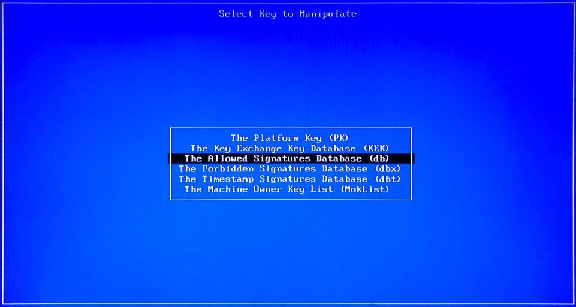

.. _how-to:

How do I ...
============

.. contents::
    :depth: 1
    :local:

How to support secure boot
--------------------------

Some PC's BIOS enable secure boot by default, and it add the BIOS vendor's key and Windows key by default. But the default setting will not include the key to verify the kernelflinger. So if the BIOS enable the secure boot, you will get the following error message:

.. figure:: images/Authorization_fail.jpg
    :align: center

You can use the following way to add the key used to verify the kernelflinger to BIOS:

Use Key tool:
`Keytool <https://git.kernel.org/pub/scm/linux/kernel/git/jejb/efitools.git>`_ is a tool which packed in efitools.
Download the KeyTool.efi from Internet, such as from Ubuntu: Download the `DB.auth <https://github.com/yang-kaix/keytool/blob/master/key/DB.auth>`_ and `KEK.auth <https://github.com/yang-kaix/keytool/blob/master/key/KEK.auth>`_

Prepare a USB disk, and format it use FAT filesystem, and put the KeyTool.efi, DB.auth and KEK.auth to an USB disk.
Disable the device secure boot. Plug in the USB disk and reboot device, press F10 to enter the Boot Menu. Select "UEFI : Build-in EFI Shell" and then find your USB device.
Execute `KeyTool.efi <https://github.com/yang-kaix/keytool/blob/master/KeyTool.efi>`_ and you will see the KeyTool menu. Select Edit Keys to replace the keys.

.. figure:: images/keytool.jpg
    :align: center

Select (db) option and enter

Choose "Add New Key" to add the DB key

.. figure:: images/add_db.jpg
    :align: center

Browse your USB disks to locate your keys and add them one at a time

.. figure:: images/browse_db_from_usb.jpg
    :align: center

.. figure:: images/auth_key.jpg
    :align: center

Repeat the same steps and add the new key for KEK

.. figure:: images/menu_kek.jpg
    :align: center

How to enable live boot
-----------------------

The live boot feature allows you to flash a live boot image to a USB disk, and then boot from this USB disk to Android directly without installing Android to the internal storage first.

The live boot feature is used only for debug purposes, and it must be built with **eng** or **userdebug** build flavors.

For |C| we build a **GPT** disk image, flash it to a USB disk (just like we install Android to the USB disk), and then boot Android from the USB disk. With this approach, |C| supports all Android features except some security features that need hardware binding.

In general, use the following steps to live-boot the |C|:

#. Build a live boot image.

    Follow the general steps to prepare for the local development, and download the source code. Open the mixins config file to verify the kernelflinger supports USB live boot feature for your **[lunch_target]**, as the feature is enabled by default for some of lunch targets such as *"caas", "celadon_ivi" and "celadon_tablet"*. The following example shows the mixins config file *device/intel/project-celadon/caas/mixins.spec* for the "caas" lunch target:

    .. code-block:: none

        boot-arch: project_celadon(...,...,usb_storage=ture,live_boot=true)

    Enable the live boot feature by adding the *usb_storage* and *live_boot* options in the *mixins.spec* file.

    Use the following command to build a live boot image:

    .. code-block:: bash

        $ make SPARSE_IMAGE=true gptimage -j $(nproc)

    Instead, you can also pass the options in the ``make`` command line:

    .. code-block:: bash

        $ make SPARSE_IMAGE=true KERNELFLINGER_SUPPORT_USB_STORAGE=true KERNELFLINGER_SUPPORT_LIVE_BOOT=true gptimage -j $(nproc)

    After a successful build you get an *out/target/product/* **[lunch_target]/[lunch_target]** *.img* image. For example, an *out/target/product/caas/caas.img* image is generated for the *caas* launch target.

    The previous command creates an image file of 16GB bytes that contains a whole GPT disk. To change the default image size, edit the mixins config file *device/intel/project-celadon/[luch_target]/mixins.spec* as following:

    .. code-block:: none

        gptbuild: true(size=16G,generate_craff=false)

.. _usb-live-boot:

#. Flash the live boot image to a USB disk.

    For Linux, use the ``dd`` tool to easily flash the image file to the USB disk. For example:

    .. code-block:: bash

        $ sudo dd if=caas.img of=/dev/sdc bs=1M

    .. caution::
        You **MUST** change the */dev/sdc* to the real USB disk device.

        Be sure all the buffered data is written to the USB disk before removing the USB disk (e.g. run the ``sync`` command in Linux).

    For Windows, use the ``rufus`` tool to flash the image file to the USB disk.

#. Boot from the USB disk to Android directly.

    Plug in the USB disk and power on. Then, press a function key to enter the BIOS boot menu. Select **boot** from the USB disk. Now, you can boot from the USB disk to Android directly.

    If you choose to save data to this Android device and you have not removed the USB disk, the data will be saved to the USB disk. You can then use the saved data on other computers.

    .. note::
        #. If you already installed Android in the internal storage, disable the internal storage if you are using USB live boot.
        #. If you want to use one USB disk in two computers, make sure the lock state is the same in each computer.

How to dual boot |C| and Windows
--------------------------------

You may want to install Windows and |C| Anroid on one device, and select which OS to boot every time the device is powering up. To achieve the dual boot, install Windows and |C| on two storage devices seperately.

#. Use kernelflinger UEFI executables:

    The kernelflinger UEFI installer does not prompt the target storage device to install. Disconnect the Windows installed storage device first, connect the storage back to the device after installing |C|, and then select which OS to boot from the BIOS boot menu.

How to change the partition size in |C| image
---------------------------------------------
An Android system is typically comprised of multiple disk partitions. Each parition is associated with an *\*.img* file in the |C| image. In addition, |C| supports a whole GPT image to be flashed to the entire disk.
Some partitions (e.g. the system partition) are huge, but some of them are empty. The **SPARSE** image format is used to reduce the image size.

The default partition size is defined in the following files:

    .. list-table::

        * - device/intel/mixins/groups/boot-arch/project-celadon/gpt.ini
        * - device/intel/mixins/groups/boot-arch/project-celadon/option.spec
        * - device/intel/mixins/groups/vendor-partition/true/option.spec
        * - device/intel/mixins/groups/config-partition/true/gpt.ini
        * - device/intel/mixins/groups/factory-partition/true/gpt.ini

Modify *device/intel/project-celadon/[lunch_target]/mixins.spec* to change some of the default settings.

.. note::
    1. Changing the partition size will cause the OTA update failure.
    2. The system partiton requires at least 2560MB in size.
