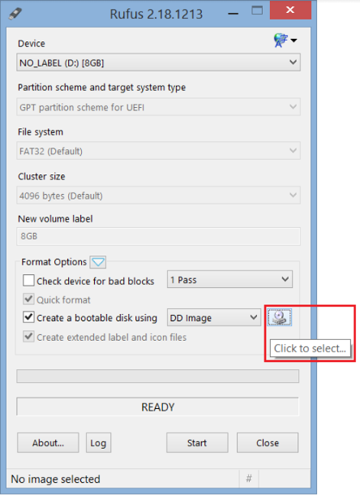

.. _install-on-nuc:

Run |C| on Intel® NUC
=====================

Prerequisites
-------------

The following hardware are required to proceed with the installation.

* |NUC| system - |C| has been validated on the following models:

    * |NUC| Kit `NUC7i5BNH <https://www.intel.com/content/www/us/en/products/boards-kits/nuc/kits/nuc7i5bnh.html>`_
    * |NUC| Kit `NUC6CAYH <https://www.intel.com/content/www/us/en/products/boards-kits/nuc/kits/nuc6cayh.html>`_

* A HDMI PC monitor display
* A USB keyboard and a USB mouse
* A 8GB USB flash drive
* A development PC workstation running 64-bit Ubuntu 16.04 LTS Linux

Prebuilt |C| installer package is available at the following link to quickly try out |C|.

    https://github.com/projectceladon/celadon-binary

Prepare a |C| installer USB flash drive
---------------------------------------

Download the prebuilt |C| installer package described in the previous section, uncompress the ZIP file and burn the installer image onto a USB flash drive. The USB flash drive will be used to bootstrap the |NUC| target device, format the disk partitions on the target device, and install |C| images to the disk partitions required by Android. You can use `Rufus <https://rufus.akeo.ie/>`_ or a similar tool to create a bootable USB drive on Windows. Alternatively, use the disk-dump command ``dd`` on any Linux system to create a |C| installer USB drive.

.. warning::
    **Caution:** *The following commands will format the USB flash drive, and destroy all its existing content. Backup your data before proceeding.*

Create |C| installer USB drive in Windows
.........................................

Download and install `Rufus <https://rufus.akeo.ie/>`_ utility if you do not have a similar tool to create bootable USB drives from image files. Launch the Rufus utility and click the CD icon on the tool panel to select the |C| installer image file in the pop up dialog box.

The Rufus utility is able to detect the presence of USB removable flash drives. After picking the image file in the `File Open` dialog box, click the *Start* button to flash the installer image to the USB drive.

Create |C| installer USB drive in Linux
.......................................

Open a terminal window and go to the directory that contains the uncompressed installer image. Plug in a USB flash drive to the Linux workstation and identify the USB flash drive using the ``lsblk`` command. This command shows all drives attached to the Linux workstation, including the primary hard drive. Make sure the drive name is assigned to the USB removable drive, as passing an incorrect drive name to the ``dd`` command might cause the workstation to not boot up.

.. code-block:: bash
    :emphasize-lines: 3

    $ lsblk
    NAME           MAJ:MIN RM   SIZE RO TYPE MOUNTPOINT
    sdb              8:16   1  14.9G  0 disk
    +-sdb1           8:17   1   870M  0 part
    sda              8:0    0 238.5G  0 disk
    +-sda1           8:1    0    80G  0 lvm  /
    +-sda2           8:2    0   3.8G  0 part [SWAP]
    +-sda3           8:3    0   477M  0 part /boot/efi

In the previous example, **/dev/sdb** is assigned to the USB removable drive. This allows you to flash the installer image to the USB drive with the following commands, replacing the drive names with the actual device node observed from the previous ``lsblk`` command.

.. code-block:: bash

    $ sudo dd if=celadon.img of=/dev/sdb bs=4K
    $ sync; sync; eject /dev/sdb

Install |C| to |NUC| using installer USB drive
----------------------------------------------

.. warning::
    **Caution:** *The primary hard drive of the Intel NUC will be completely wiped out. Backup your data before proceeding.*

Plug the bootable USB flash drive into a |NUC| device, power on the device, and press **F10** to instruct the device to boot from the USB drive.

.. figure:: images/boot-usb-stick.jpg
    :align: center

.. figure:: images/grub.jpg
    :align: center

Confirm to allow the installer to re-format the disk partitions on it. The installer will overwrite the disk partitions with |C| Android images.

.. figure:: images/installer.jpg
    :align: center

Reboot to Android UI
--------------------

Once the installation is complete, the device re-boots automatically. However, |C| implements the Android `Verified Boot <https://source.android.com/security/verifiedboot/verified-boot>`_ mechanism developed by Google. We did not enroll any keys such as other commercial Android products do, so a KernelFlinger warning screen is displayed before showing the traditional Android booting screen.

.. figure:: images/kernelflinger.jpg
    :align: center

.. figure:: images/booting.jpg
    :align: center

The first boot of the device takes time to prepare the built-in apps. Be patient, the Android home screen will show after the system boots up.

.. figure:: images/homescreen.jpg
    :align: center

.. figure:: images/builtin-apps.jpg
    :align: center
