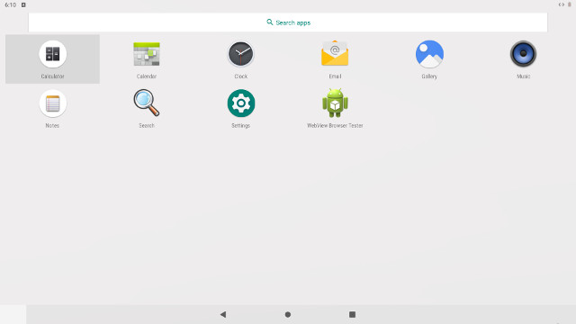
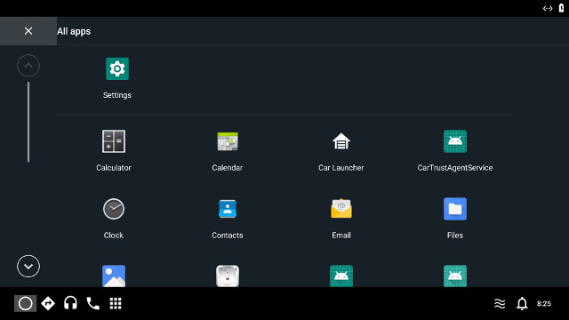

.. _install-on-nuc:

Run |C| on Intel® NUC
=====================

Prerequisites
-------------

The following hardware are required to proceed with the installation.

* |NUC| system - |C| has been validated on the following models with the listed lunch targets:

    .. list-table::
        :widths: 30 10 60
        :header-rows: 1

        * - Model
          - BIOS
          - Applicable |C| lunch targets
        * - |NUC| Kit `NUC7i5DNHE <https://www.intel.com/content/www/us/en/products/boards-kits/nuc/kits/nuc7i5dnhe.html>`_
          - `0065 <https://downloadcenter.intel.com/downloads/eula/28885/BIOS-Update-DNKBLi5v-86A-?httpDown=https://downloadmirror.intel.com/28885/eng/DNi50065.bio>`_
          - **celadon**, **cel_kbl**
        * - |NUC| Kit `NUC6CAYH <https://www.intel.com/content/www/us/en/products/boards-kits/nuc/kits/nuc6cayh.html>`_
          - `0060 <https://downloadcenter.intel.com/downloads/eula/28641/BIOS-Update-AYAPLCEL-86A-?httpDown=https://downloadmirror.intel.com/28641/eng/AY0060.bio>`_
          - **cel_apl**

* A HDMI PC monitor display
* A USB keyboard and a USB mouse
* A 8GB USB flash drive
* A development PC workstation running 64-bit Ubuntu 16.04 LTS Linux

The firmware of your target system must support **UEFI Shell** in order to install the |C| installer images.
Proceed with the following section to setup the |NUC| device with the kernelflinger UEFI executables.

Install using kernelflinger executables
----------------------------------------

Copy kernelflinger executables to a USB flash drive
~~~~~~~~~~~~~~~~~~~~~~~~~~~~~~~~~~~~~~~~~~~~~~~~~~~~

The kernelflinger installation approach does not require you to erase the content of the USB flash drive, but the USB flash drive needs to have at least a 2GB VFAT file system on it to store the kernelflinger UEFI executables. The kernelflinger executables are packaged in a *flashfile* in .ZIP format, unzip the content of the .ZIP file to a USB flash drive before the installation.

Boot the built-in EFI Shell to bootstrap the installation
~~~~~~~~~~~~~~~~~~~~~~~~~~~~~~~~~~~~~~~~~~~~~~~~~~~~~~~~~

The kernelflinger executables are loaded and run by the **UEFI Shell**. To enable the built-in UEFI Shell in the UEFI firmware of |NUC|, power on the device and press **F2** to enter the firmware setup menu.

.. figure:: images/splash.jpg
    :align: center

Click the *Advanced* button on the *Boot Order* pane, then click the *Boot Configuration* tab to ensure the Internal UEFI Shell option is checked in the *Boot Devices* list.

.. figure:: images/enable_uefi_shell.jpg
    :align: center

On a refresh of the 7th generation |NUC| model (i.e. `Dawson Canyon <https://ark.intel.com/products/codename/126293/Dawson-Canyon>`_), if you have ever installed |C| on the |NUC| system, you can install |C| on it with `Intel Platform Flash Tool Lite <https://01.org/node/2463>`_ using Android fastboot protocol. Proceed with the instructions on the :ref:`install-using-pft` section to install |C| using |PFT|.

Save any modified configuration before rebooting the system, and press **F10** to enter the Boot Menu. Plug the USB flash drive with kernelflinger executables on it to any USB port, and select **UEFI: Built-in EFI Shell** to boot the NUC. After counting down, the UEFI Shell runs the ``startup.nsh`` script on the USB flash drive, and installs the Celadon images automatically.

.. figure:: images/select_uefi_shell.jpg
    :align: center

.. figure:: images/install_kernel_flinger.jpg
    :align: center

.. _install-using-pft:

Install |C| using |PFT| Lite
~~~~~~~~~~~~~~~~~~~~~~~~~~~~

If you are installing |C| on a refresh of the 7th generation |NUC| model, to take advantage of flashing and updating the |NUC| system using fastboot protocol, make sure the firmware of the system has been updated to version 0057 or later, and the **Device Mode** option is selected for the internal USB 3.0 port header on the USB category of the Devices tab.

.. figure:: images/bios-main.jpg
    :align: center

.. figure:: images/bios-device-usb.jpg
    :align: center

You also need a USB dongle (e.g. `Dawson Canyon USB 3.0 female to 10-pin header cable <https://www.gorite.com/dawson-canyon-usb-3-0-female-to-10-pin-header-cable>`_) to exercise the internal USB 3.0 port header on the main board of the |NUC| system. Refer to the `Technical Product Specification <https://www.intel.com/content/dam/support/us/en/documents/mini-pcs/nuc-kits/NUC7i5DN_TechProdSpec.pdf>`_ to identify the USB 3.0 port header on the main board.

.. figure:: images/NUC755DNH_USB.jpg
    :align: center

Save the modified configuration before rebooting the system, press **F10** to enter the Boot Menu. Select **UEFI: Built-in EFI Shell** to boot the NUC, press any key to stop the countdown timer and enter the UEFI Shell. Run the |C| loader in Fastboot mode with the following command in the UEFI shell:

.. code-block:: console

    Shell> loader -f

Once the |NUC| system boots to the Fastboot console, connect the |NUC| system to your Ubuntu development workstation with a USB Type A male to Type A male cable.

Download and install `Intel Platform Flash Tool lite <https://01.org/node/2463>`_ on the Ubuntu workstation if you havn’t done so. Launch the |PFT| Lite, the program should detect the presence of the connected |NUC| system through Fastboot protocol:

.. figure:: images/platformflashtool-lite.jpg
    :align: center

Click the **Browse** button, enter the folder contains the content of the unzipped flashfile, open the **flash.json** configuration file, and simply press the **Start to flash** button to start the installation.

**Note:**
    Some |NUC| storage size is huge(e.g. 128G, 256G ), wipe data will take a long time. In view of this situation, we add two new flash configure(Blank_without_lock, Update_without_lock) in PFT, These configures allow device flash end without lock, so that wipe data required by lock/unlock can be skipped. General developers can select Blank_without_lock to reduce flash time.

Reboot to Android UI
--------------------

Once the installation is complete, the device re-boots automatically. However, |C| implements the Android `Verified Boot <https://source.android.com/security/verifiedboot/verified-boot>`_ mechanism developed by Google. We did not enroll any keys such as other commercial Android products do, so a kernelflinger warning screen is displayed before showing the traditional Android booting screen.

.. figure:: images/kernelflinger.jpg
    :align: center

.. figure:: images/booting.jpg
    :align: center

The first boot of the device takes time to prepare the built-in apps. Be patient, the Android home screen will show after the system boots up. The following screenshots illustrate the traditional Android tablet UI booted from a **celadon** lunch target image.

In addition to the traditional Android UI launcher, |C| supports the experimental automotive UI launcher introduced in Android 9.0 Pie. The automotive UI is enabled in the images built for **cel_kbl** and **cel_apl** lunch targets.

.. figure:: images/ivi_ui_launcher.jpg
    :align: center

