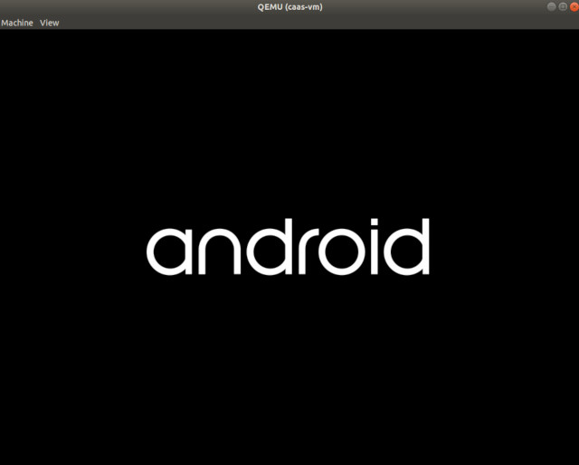
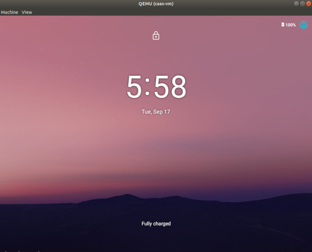

.. _caas-on-vm:

Run CaaS on Virtual Machine
===========================

Prepare Host Environment
------------------------

The host device which launchs the virtual machines, require Linux kernel version 5.0.0 or above running as the host OS. Go through the following instructions to set up `Clear Linux OS <https://clearlinux.org/>`_ 30870 as the host device. Any later Clear Linux OS version should also work.

#. Reference the `Clear Linux installation guide <https://docs.01.org/clearlinux/latest/get-started/bare-metal-install-desktop.html>`_ to install the Clear Linux OS on the host device.

#. Install the required bundles:

    .. code-block:: bash

        $ sudo swupd bundle-add kvm-host
        $ sudo mkdir -p /etc/kernel/cmdline.d/
        $ sudo echo "ignore_loglevel log_buf_len=128M console=ttyS0,115200,8n1 i915.enable_gvt=1 kvm.ignore_msrs=1 intel_iommu=on drm.debug=0" > /etc/kernel/cmdline.d/gvtg.conf
        $ sudo clr-boot-manager update

#. Reboot the host device to take effect.

Build OVMF Firmware
-------------------

**OVMF** is the project to enable UEFI support for Virtual Machines, which is used by QEMU, the open source machine emulator and virtualizer, to boot the **CaaS** images on Virtual Machines. The following steps describe instructions to build the OVMF firmware from source.

#. Get the firmware source code:

    .. code-block:: bash

        $ mkdir -p ~/caas
        $ wget https://github.com/tianocore/edk2/archive/edk2-stable201808.tar.gz -O ~/caas/edk2-stable201808.tar.gz
        $ cd ~/caas/ && tar zxvf edk2-stable201808.tar.gz

#. Install the dependencies prior the build:

    .. code-block:: bash

        $ sudo apt install -y build-essential git uuid-dev iasl nasm

#. Build the OVMF firmware binary:

    .. code-block:: bash

        $ cd edk2-edk2-stable201808
        $ source ./edksetup.sh
        $ make -C BaseTools/
        $ build -a X64 -t GCC48 -p OvmfPkg/OvmfPkgX64.dsc

#. Copy the generated firmware binary **OVMF.fd** to the working directory:

    .. code-block:: bash

        $ find . -name OVMF.fd -exec cp {} ~/caas \;

Build CaaS Image
----------------

Reference the :ref:`build-os-image` section in the Getting Started Guide, and specify **caas** as the lunch target to build the CaaS images. The following CaaS image types are generated at the end of the build:

* caas.img
    The GPT disk image for direct booting. Skip the following section to boot the CaaS image with QEMU.

* caas-flashfiles-eng.<user>.zip
    The compressed *flashfile* package contains the CaaS partition images. Proceed with the following section to install these images to a virtual disk image in `qcow2 <https://www.linux-kvm.org/page/Qcow2>`_ format.

Create CaaS Virtual Disk
------------------------

To create a virtual disk containing the CaaS partitions, a USB flash drive and at least 16GB free disk space are required. Go through the following instructions to create and set up CaaS partitions on a *qcow2* formatted virtual disk.

#. Create a 16GB empty disk image of *qcow2* type:

    .. code-block:: bash

        $ qemu-img create -f qcow2 ~/caas/android.qcow2 16G

#. Plug a USB flash drive to the development host, and identify the vendor ID and product ID of that USB flash drive from the output of the ``lsusb`` command:

    .. code-block:: bash

        $ lsusb
        ...
        Bus 002 Device 002: ID 0781:5591 SanDisk Corp.
        ...

    In the previous example, **0781** and **5591** are the device ID and vendor ID of the target USB flash drive respectively.

#. Identify the directory the USB flash drive is mounted, or mount the USB flash drive to a temporary directory if it's not mounted. Unzip the content of the CaaS *flashfile* package to the flash drive, and unmount the USB flash drive after finish:

    .. code-block:: bash

        $ sudo mount /dev/sdc /mnt   ## if the USB disk is not auto-mounted
        $ sudo unzip caas-flashfiles-eng.<user>.zip -d /mnt
        $ umount /dev/sdc

    .. note::
        In the previous example, /dev/sdc is assigned to the USB flash drive. You may need to replace the drive names with the actual device node observed from the ``lsblk`` command.

#. Download the helper script ``start_flash_usb.sh`` and edit the script with the the device ID and vendor ID for your USB flash drive observed from the previous step:

    .. code-block:: bash

        $ wget https://raw.githubusercontent.com/projectceladon/device-androidia-mixins/master/groups/device-specific/caas/start_flash_usb.sh  -O ~/aaas/start_flash_usb.sh

    .. code-block:: none

        #!/bin/bash

        qemu-system-x86_64 \
        ...
        -device usb-host,bus=xhci.0,vendorid=<your-usb-vendorid>,productid=<your-usb-productid> \
        ...
        -bios ./OVMF.fd \

#. A QEMU window will be poped up on running the ``start_flash_usb.sh``. Click the QEMU window, press the **F2** key, and select the **Boot Manager** option to enter the boot-manager menu:

    .. figure:: images/qemu-bios.png
        :align: center

#. Select the **EFI Internal Shell** entry to run the built-in UEFI Shell. The virtual UEFI firmware will detect the USB flash drive and start flashing the CaaS partition images to the **android.qcow2** virtual disk.

    .. figure:: images/qemu-bios-bootmanager.png
        :align: center

    .. figure:: images/qemu-bios-flashing.png
        :align: center

#. Close the QEMU window once complete, the USB flash drive now can be removed.

Reboot to Android UI
--------------------

A script ``start_android_qcow2.sh`` is created to faciltate the booting of CaaS images using `QEMU <https://www.qemu.org/>`_. Download the `start_android_qcow2.sh <https://raw.githubusercontent.com/projectceladon/device-androidia-mixins/master/groups/device-specific/caas/start_android_qcow2.sh>`_ script to the working directory with the following command:

.. code-block:: bash

    $ wget https://raw.githubusercontent.com/projectceladon/device-androidia-mixins/master/groups/device-specific/caas/start_android_qcow2.sh -O ~/aaas/start_android_qcow2.sh

Before launching the script to boot to the Android UI, edit the CaaS image filename in the script if necessary. The default image file *android.qcow2* is hard coded in the script:

.. code-block:: bash

    ...
    function launch_hwrender(){
        qemu-system-x86_64 \
        -m 2048 -smp 2 -M q35 \
        -name caas-vm \
        -enable-kvm \
        ...
        -drive file=./android.qcow2,if=virtio \ ### Edit the CaaS image file name on the left
        ...
    }
    ...

.. code-block:: bash

    $ cd ~/caas
    $ sudo ./start_android_qcow2.sh

