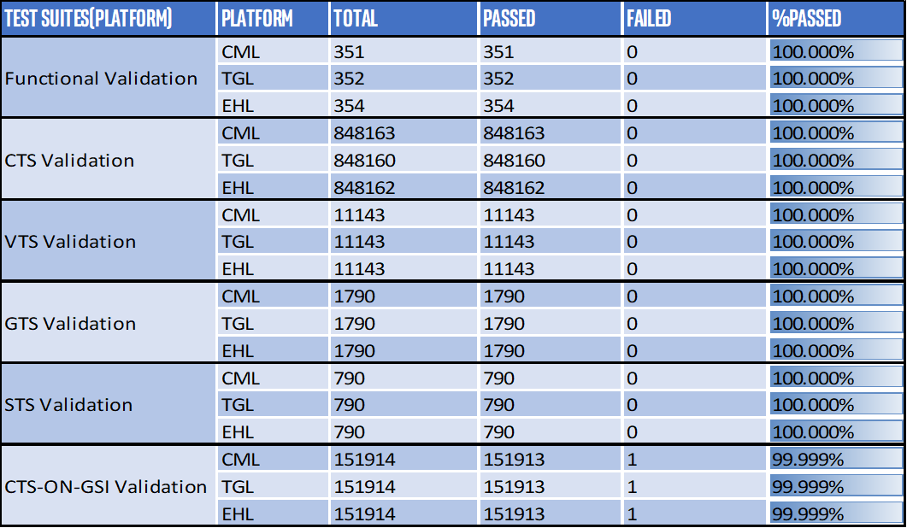

.. _stable-releases:

Stable Releases
###############

This is a Production Release for evaluation and development purposes
addressing Retail, Education, Workload consolidation and Marine segments.

.. contents::
   :local:
   :depth: 1

CIV_02.22.04.50_A12
===================

Intended audience
-----------------

* Celadon Open Source Community who has subscribed to celadon@lists.linuxfoundation.org

Customer support
----------------

* subscribe/unsubscribe celadon mailing list using :
  https://lists.linuxfoundation.org/mailman/listinfo/celadon

Introduction
------------

Feature Details
~~~~~~~~~~~~~~~

Celadon upstreamed fixes in this release:

* First stable release from Celadon_IoT for Android 12
* This release supports Alder Lake-S (ADL-S)
* IoT configuration supports SRIOV mode with 99.97% conformance on
  Alder Lake (ADL)
  platform with production ready
* Vm-Manager support to launch Android

Release Constraint list
-----------------------

* VP9 hardware codec is not enabled in the current release due to hardware constraint
* Sensor support is not enabled in current release due to hardware constraint.
* The current QEMU release doesn’t support RGBA8888 color format which impact RGBA8888 usage on Android guest os application
* USB accessory mode is not supported in the current release.
* MAC randomization feature is not supported in the current release.
* Partner modules aren’t integrated within the current GMS package.
* NN API is not supported in the current release.
* Hardware doesn’t have inbuilt cameras, only usb external camera is supported.

Known issues
------------
* Ethernet tethering option in Settings menu is active even when no USB Ethernet Adaptor connected
* System touch can’t accurately point the location
* With UserData CheckPoint feature enabled, device reboots after 1st time boot while flashing is done
* Windows freeform feature has been partially backported from Android T

Open Issue List
---------------
* :sup:`#`\16019209010	VtsHalMediaC2V1_0TargetVideoDecTest module
* 16017487117	x86_64 CtsMediaTestCases failures
* 16017342135	STS CtsSecurityTestCases failing
* 16018517871	CtsMediaV2TestCases failures related to HEVC profilelevel
* 16017974748	Failures are observed with x86_64 CtsDeqpTestCases module

Where to find the release
-------------------------

* Manifest Link: https://github.com/projectceladon/manifest/blob/master/stable-build/CIV_02.22.04.50_A12.xml
* :sup:`#`\PRs fixing this issue in repo : https://github.com/projectceladon/vendor-intel-utils-vertical-iot/pulls?q=is%3Apr+is%3Amerged
  [PR#9, PR#10, PR#11, PR#16, PR#17, PR#19]
* Below validation results are with release manifest + cherrypicked PR's

Host Kernel Release configuration
---------------------------------

* linux-intel-lts kernel
        * Branch: https://github.com/intel/linux-intel-lts
        * SHA ID: https://github.com/intel/linux-intel-lts/releases/tag/lts-v5.15.71-adl-linux-221121T044440Z
* kernel-config
        * Config-File: https://github.com/projectceladon/vendor-intel-utils-vertical-iot/blob/main/x86_64_defconfig

Reference configuration
-----------------------

* Supported hardware
    =======================   =======
    Platform                  Product
    -----------------------   -------
    Alder Lake(ADL)           | ADL RVP DDR5 C1 CPU 12th Gen Intel(R) Core(TM) i9-12900E
    Network Interface Card    | Intel® Wireless-AC 9260 5th Generation Intel802.11ac, Dual Band, 2x2Wi-Fi + Bluetooth®5.1
    =======================   =======

* Supported software
        * Android CIV Guest:
                =======================   =======
                Platform                  Product
                -----------------------   -------
                Android                   | Android 12
                Kernel                    | 5.10.145 (lts-v5.10.145-civ-android-221027T031053Z)
                AOSP                      | android-12.0.0_r28
                =======================   =======

        * Ubuntu Host:
                =======================   =======
                Platform                  Product
                -----------------------   -------
                Qemu                      | version 7.1.0
                Ubuntu                    | 22.04 LTS (Jammy Jellyfish)
                Kernel_IoTG               | 5.15.71 (lts-v5.15.71-adl-linux-221121T044440Z)
		=======================   =======

Validation results
------------------

Stable Releases (IoT) are validated with SR-IOV mode on an Alder Lake (ADL)
platform in the following function domains. Validation cycles are performed on
a GMS user-signed, widevine-enabled image, as required by google certification
requirements.

Below validation results are with Alder Lake-S (ADL-S) RVP platform.

.. figure:: ../stable-release_iot/images/Q422-2-A12_Validation_Result.png
    :width: 500px

.. note::

   \*CTS on GSI failures are a subset of CTS failures, so the overall failures
   count is 39.

CIV_03.22.03.37_A11
===================

Intended audience
-----------------

* Celadon Open Source Community who has subscribed to celadon@lists.linuxfoundation.org

Customer support
----------------

* subscribe/unsubscribe celadon mailing list using : https://lists.linuxfoundation.org/mailman/listinfo/celadon

Introduction
------------
Feature Details
---------------
* Celadon Upstreamed fixes in this release

                * AOSP Version upgraded to r_46
		* Chromium Guest Kernel upgraded to 5.4.150
		* Security Patch & ASB updated to “September'22”

Known issues
------------
-Nil- [ All known issues from previoues Release are fixed in this release ]

Where to find the release
-------------------------

* Manifest Link: https://github.com/projectceladon/manifest/blob/master/stable-build/CIV_03.22.03.37_A11.xml

Host Kernel Release configuration
---------------------------------

* linux-intel-lts kernel
        * Branch: https://github.com/intel/linux-intel-lts/tree/5.4/yocto
        * SHA ID: https://github.com/intel/linux-intel-lts/releases/tag/lts-v5.4.209-yocto-220817T175100Z
* kernel-config
        * Config-File: https://github.com/projectceladon/vendor-intel-utils-vertical-iot/blob/android/r/x86_64_defconfig

Reference configuration
-----------------------

* Supported hardware
    =======================   =======
    Platform                  Product
    -----------------------   -------
    Comet Lake(CML)           | NUC10FNH Intel(R) Core(TM) i7-10710U CPU
    Elkhart Lake(EHL)         | EHL A0/EHL Bx CRB
    Tiger Lake(TGL)           | TGL Bx RVP
    =======================   =======

* Supported software
        * Android CIV Guest:
                =======================   =======
                Platform                  Product
                -----------------------   -------
                Android                   | Android 11
                Kernel                    | 5.4.150 (linux-intel-lts2019-chromium)
                AOSP                      | android-11.0.0_r46
                =======================   =======

        * Ubuntu Host:
                =======================   =======
                Platform                  Product
                -----------------------   -------
                Qemu                      | version 4.2.0
                Ubuntu                    | 20.04 LTS (Focal Fossa)
                Kernel_IoTG               | 5.4.209 (linux-intel-lts 5.4/yocto branch)
                =======================   =======

Validation results
------------------

Stable Releases (IoT) are validated with GVT-d mode on Comet Lake(CML), Tiger Lake(TGL), and Elkhart Lake(EHL) Intel® platforms in the following function domains. Validation cycles are performed on GMS user signed widevine enabled image as required by google certification requirements

.. figure:: ../stable-release_iot/images/sep22_Validation_Result2.png
    :align: right
    :width: 750px

CIV_02.22.01.12_A11
===================

Intended audience
-----------------

* Open Source Community who has subscribed to celadon@lists.linuxfoundation.org

Customer support
----------------

* subscribe/unsubscribe celadon mailing list using : https://lists.linuxfoundation.org/mailman/listinfo/celadon

Introduction
------------
Feature Details
---------------
* Features supported in this release

                * RTC (Real Time Clock) - Android Time keeping
                * Alarm Virtualization
                * Support wipe Google Factory Reset protection credentials on reset
                * Support secure data erase on dedicated partition
                * Use mesa i965 driver on CML and EHL

        * Celadon Upstreamed fixes

                * CiV suspend/resume stability
                * Update health values for CiV battery
                * Enable zram swap for device having <= 4G RAM
                * Enabled GuC/HuC firmware
                * Support EHL platform
                * Support Sensor enable/disable build configuration

Known issues
------------

* 1974128 '<https://android-review.googlesource.com/c/platform/test/suite_harness/+/1974128>`_  Temporarily skip platformPermissionPolicyIsUnaltered
* 1800607 '<https://android-review.googlesource.com/c/platform/test/vts-testcase/kernel/+/1800607>`_  sysfs.KernelApiSysfsTest#testAndroidUSB: enforce only if file present
* Buganizer-193114625 '<https://partnerissuetracker.corp.google.com/issues/193114625>`_ atest CtsAppTestCases/CtsAppTestCases[instant]
* 1989169 '<https://android-review.googlesource.com/c/platform/hardware/interfaces/+/1989169>`_  Fix for VTS test CleanupConnectionsOnInitialize/0_default

Where to find the release
-------------------------

* Manifest Link: https://github.com/projectceladon/manifest/blob/master/stable-build/CIV_02.22.01.12_A11.xml

Host Kernel Release configuration
---------------------------------

* linux-intel-lts kernel
        * Branch: https://github.com/intel/linux-intel-lts/tree/5.4/yocto
        * SHA ID: https://github.com/intel/linux-intel-lts/releases/tag/lts-v5.4.170-yocto-220124T222417Z
* kernel-config
        * Config-File: https://github.com/projectceladon/vendor-intel-utils-vertical-iot/blob/main/x86_64_defconfig

Reference configuration
-----------------------

* Supported hardware
    =======================   =======
    Platform                  Product
    -----------------------   -------
    Comet Lake(CML)           | NUC10FNH Intel(R) Core(TM) i7-10710U CPU
    Elkhart Lake(EHL)         | EHL A0/EHL Bx CRB
    Tiger Lake(TGL)           | TGL Bx RVP
    =======================   =======

* Supported software
        * Android CIV Guest:
                =======================   =======
                Platform                  Product
                -----------------------   -------
                Android                   | Android 11
                Kernel                    | 5.4.142 (linux-intel-lts2019-chromium)
                AOSP                      | android-11.0.0_r39
                =======================   =======

        * Ubuntu Host:
                =======================   =======
                Platform                  Product
                -----------------------   -------
                Qemu                      | version 4.2.0
                Ubuntu                    | 20.04 LTS (Focal Fossa)
                Kernel_IoTG               | 5.4.170 (linux-intel-lts 5.4/yocto branch)
                =======================   =======

Validation results
------------------

Stable Releases (IoT) build running in GVT-d mode has been validated on Comet
Lake(CML), Tiger Lake(TGL), and Elkhart Lake(EHL) Intel® platforms in the
following function domains. Validation cycles are performed on GMS user-signed
widevine enabled imag
e as required by Google certification requirements.

.. note:: CTS on GSI Failures are due to Google dependency and shall be resolved in Upcoming new GSI patch.

