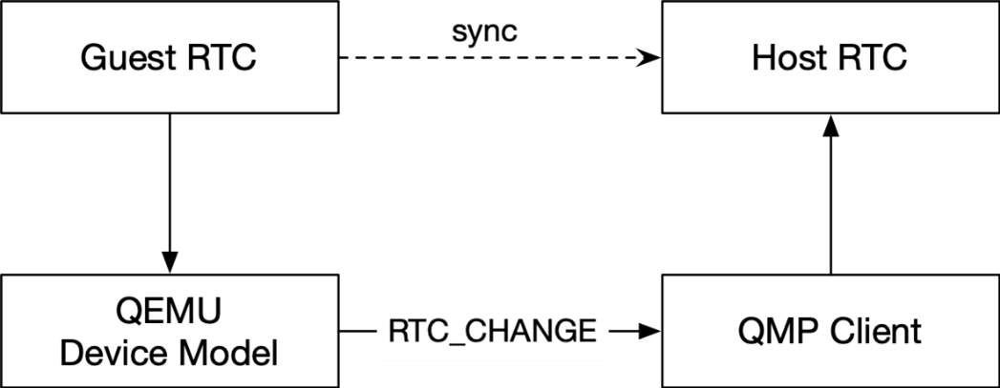
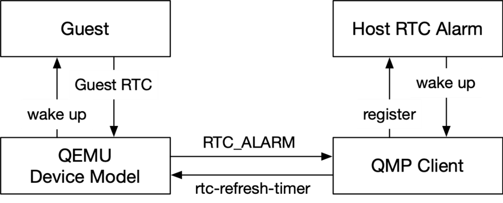
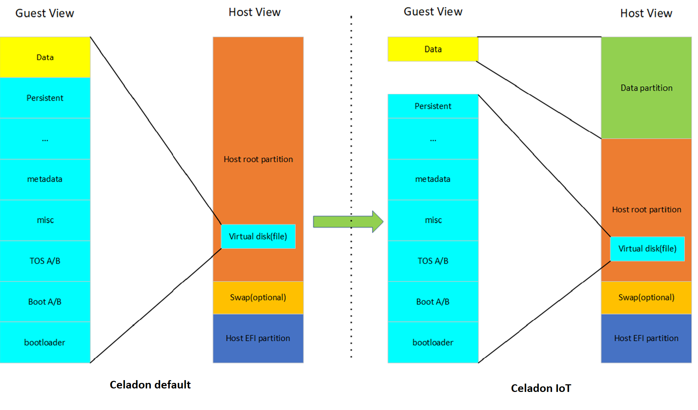
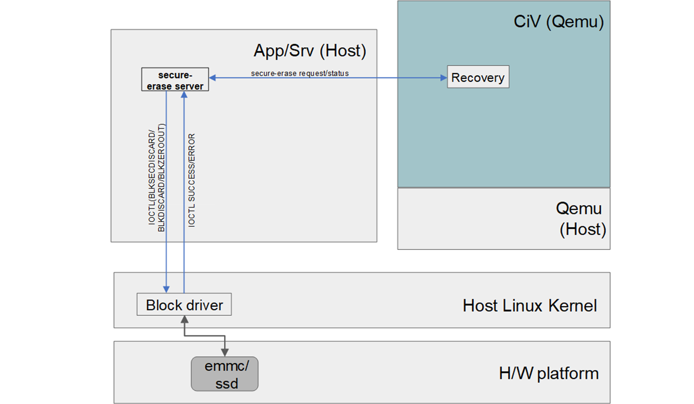

.. _android-12:

Feature Delta Offered by Stable Releases (IoT)
##############################################

Here are the additional features provided by Stable Releases (IoT).

.. contents::
    :depth: 1
    :local:

* 100% Google\* conformance on Alder Lake (ADL) with production ready
* Supporting All Alder Lake (ADL) plarforms on single baseline and Single Image
* IoT configuration support GVT-d & SRIOV mode with 100% conformance
* IoT configuration support GVT-g with no conformance

Real-time clock (RTC) and alarm virtualization
**********************************************

The Celadon in Virtual Machine (CiV) project may require operations on the
RTC device, such as changes to current time and setups of alarm, to be
synced to host and persistent across reboots. RTC device is purely emulated
by QEMU and its state will be lost after exit of QEMU process, furthermore,
guest RTC alarm is unable to wake up the guest after host suspends, which is
the case in when using --host-pm-control option in CiV.

The solution is to modify the emulated RTC device so that it emits QMP
events upon certain operations and uses a QMP client running on host to
receive the QMP events and sync the operations to host accordingly.

        Figure 1 : Architecture Diagram of RTC Time Virtualization

Whenever the guest RTC alarm time is set, QEMU emits an RTC_CHANGE
event to QMP client. The QMP client can then set up a host RTC alarm
accordingly.

        Figure 2 : Architecture Diagram of RTC Alarm Virtualization

Whenever the expire time of the guest RTC alarm changes, QEMU emits an
RTC_ALARM event to the QMP client, and the QMP client can then set up a host
RTC alarm accordingly. In the case of host suspension, the host alarm wakes
up the host and notifies the QMP client. Then, the QMP client sends an
rtc-refresh-timer command to QEMU, to ensure that QEMU wakes up the guest.

Secure data erase
*****************

In |C|, all partitions are inside a single guest virtual disk image file on
the host with the disk controller emulated by QEMU. The underlying actual
storage hardware technology be it magnetic or solid state is transparent to
the Android\* VM.

As such, due to emulation, secure partition erase would be to fall back to
“byte-by-byte overwrite” to the virtual partition. This “byte-by-byte
overwrite” operation is not solid state storage friendly.

To provide secure data erase of data partition, following enhancement is
needed in CiV:

Addition of secure data erase to make use of storage controller hardware
secure erase feature, when it is supported in hardware to erase data
partition and only finally fall back to byte-by-byte override 0 when not
supported during Android recovery/wipe data process.

1. Guest virtual disk image file enhancement

   In CiV, all Android required partitions are resided in the same
   guest virtual disk image file in host.

   To support the enhancements to add secure data partition erase via
   hardware controller secure erase where supported, the data partition
   needs to be separated from the main Celadon CiV guest disk image
   file. This allows to pass a true host partition to QEMU CiV launch
   parameters as a separate emulated disk for secure data erase.

        Figure 3 : Host/Guest VM disk/file view after SDE enhancements
        illustrates the changes in CiV guest image file in the host

2. Secure data erase enhancement

   In AOSP for data partition erase, this is performed by recovery tool
   when “--wipe-data” is written to ``/cache/recovery/command``. In generic
   AOSP data partition will have a secure partition wipe if it has
   encryption keys for the volume before any reformatting of the
   partition.

   For SDE enhancement, to add secure erase of the data partition via
   hardware controller feature, vsock communication between AOSP
   recovery tool and host side daemon application is added to add data
   partition secure erase prior to Android reformat of data partition.

   The host side daemon application is added to perform secure data
   partition wipe using hardware controller supported erase mechanism
   such as via ``BLKSECDISCARD/BLKDISCARD`` command if supported before
   falling back to ``BLKZEROOUT`` commands if none of the former are
   supported.

        Figure 4 : Data partition secure erase

User Guide
##########

System Requirements
*******************

Recommended system requirements for Host:

* CPU: 4 cores or more
* RAM: 8 GB or more
* Hard-Disk: 250 GB

How to install this release
***************************

Celadon build steps
===================

Follow the development environment set up instructions in
`<https://docs.01.org/celadon/getting-started/build-source.html#set-up-the-development-environment>`_ for |C| build host setup.

.. code-block:: bash

	# Install additional development package
	$ sudo apt install libjson-c-dev

Manifest Link: <Yet to Update > https://github.com/projectceladon/manifest/blob/master/stable-build/CIV_03.22.03.37_A11.xml

Steps to sync to this release:

.. code-block:: bash

	# Init with the default manifest
	$ repo init -u https://github.com/projectceladon/manifest.git

	# Copy te CIV manifest and use it
	$ cp <source path>/CIV_03.22.03.37_A11.xml .repo/manifests/
	$ repo init -u https://github.com/projectceladon/manifest.git -m CIV_03.22.03.37_A11.xml
        #NOTE : Manifest tag will change according to the latest release

	# Sync the code
	$ repo sync -c -q -j${nproc}

Step to generate the Android\* Image:

.. code-block:: bash

	# Perform the environment setup from directory where repo is initialized
	$ source build/envsetup.sh

	# Select userdebug variant
	$ lunch caas-userdebug

	# Start the build
	# To enable avx optimizations for CML/EHL, BUILD_CPU_ARCH=kabylake could be
	appended to the make command.
	# Without this flag, default architecture is silvermont which exercises sse4.1 features.
	$ make flashfiles -j $(nproc)

	# Build output (CIV flashfiles)
	$ find out/target/product/caas/ -name caas-flashfiles-*.zip
	out/target/product/caas/caas-flashfiles-xxxxx.zip

    # Ensure below host scripts and patches are available post build

    # Host scripts
	$ find out/target/product/caas/scripts -type d
	out/target/product/caas/scripts
	out/target/product/caas/scripts/sof_audio

	# Host patches
	$ find vendor/intel/utils/host -type d
	vendor/intel/utils/host
	vendor/intel/utils/host/ovmf
	vendor/intel/utils/host/qemu
	vendor/intel/utils/host/kernel
	vendor/intel/utils/host/kernel/lts2019-yocto
	vendor/intel/utils/host/kernel/lts2019-chromium
	vendor/intel/utils/host/lg
	$ find vendor/intel/utils_vertical/host -type d
	vendor/intel/utils_vertical/host
	vendor/intel/utils_vertical/host/qemu

Prerequisites and host kernel build steps:

Prerequisites

* Install Ubuntu\* 18.04 LTS
* If operating behind a corporate firewall, setup the proxy
  settings
* Install the following packages

.. code-block:: bash

	$ sudo apt install -y git fakeroot build-essential ncurses-dev xz-utils libssl-dev bc flex libelf-dev bison rsync kmod cpio

Host kernel build steps

.. code-block:: bash

	# Sync kernel
	# Note that this will pick up the latest on the branch
	$ git clone https://github.com/intel/linux-intel-lts.git -b 5.4/yocto

	# Change directory
	$ cd linux-intel-lts

	# Checkout to  specific commit (Refer to release notes for SHA ID)
	$ git checkout lts-v5.4.209-yocto-220817T175100Z

	# copy kernel config
	$ cd <source path>
	$ wget https://github.com/projectceladon/vendor-intel-utils-vertical-iot/blob/main/x86_64_defconfig
	$ cp x86_64_defconfig .config
	$ echo ""| make ARCH=x86_64 olddefconfig

	# Make kernel debian package
	$ make ARCH=x86_64 -j16 LOCALVERSION=-lts2019-iotg bindeb-pkg

        # To find output files
	$ find .. -name "*.deb"
        ../linux-libc-dev_5.4.209-lts2019-iotg-1_amd64.deb
	../linux-headers-5.4.209-lts2019-iotg_5.4.209-lts2019-iotg-1_amd64.deb
	../linux-image-5.4.209-lts2019-iotg_5.4.209-lts2019-iotg-1_amd64.deb

	# Copy built .deb packages to use during Installing Ubuntu host kernel
	$ cd ..
	$ cp *.deb <target path>

DUT setup
*********

Hardware details:

* HW Comet Lake (CML) NUC DUT details
	* NUC10FNH |Core-attr| i7-10710U CPU
	* BIOS Version FNCML357.0039.2020.0312.1734
* HW Elkhart Lake (EHL) CRB DUT details
	* For EHL A0 CRB, please ensure using BIOS version
	  EHLSFWI1.R00.2233.A07.2006180202 or later
	* For EHL Bx CRB, any BIOS version would do.
* HW Tiger Lake (TGL) RVP DUT details
	* TGL BX RVP
	* BIOS Version TGL1FUI1.R00.3412.A03.2010150719 and beyond

BIOS setting:

* Intel® Virtualization Technology (Intel® VT)

  * Settings: Security -> Security Features -> Intel
    Virtualization Technology: Enabled

* Intel® Virtualization Technology (Intel® VT) for
  Directed I/O (Intel® VT-d) TBU

  * Settings: Security -> Security Features -> Intel VT
    for Directed I/O(VT-d): Enabled

* Secure Boot
        * Boot -> Secure Boot: Disabled

.. note::
	The menu structure may differ due to BIOS differences

Host setup
**********

Prerequisites:

* Install Ubuntu 20.04 LTS
* If operating behind a corporate firewall, setup the proxy settings
* Disable Automatic suspend in host: Settings -> Power -> Suspend &
  Power Button -> Automatic suspend -> Off.

Setup Ubuntu host:

.. code-block:: bash

	# Reboot into the Ubuntu host image
            # Change directory
	$ cd ~

	# Stop unattended upgrades services and edit /etc/apt/apt.conf.d/20auto-upgrades to as below.
	$ sudo systemctl stop unattended-upgrades.service
	$ sudo systemctl disable unattended-upgrades.service
	$ sudo systemctl mask unattended-upgrades.service
	$ sudo vi /etc/apt/apt.conf.d/20auto-upgrades
	APT::Periodic::Update-Package-Lists "0";
	APT::Periodic::Download-Upgradeable-Packages "0";
	APT::Periodic::AutocleanInterval "0";
	APT::Periodic::Unattended-Upgrade "0";

	# Reboot the system
	$ sudo reboot now

	# Copy the artifact
	$ cp <source path>/caas-releasefiles-userdebug.tar.gz .

	# Extract files
	$ tar xzvf caas-releasefiles-userdebug.tar.gz

Installing Ubuntu host kernel
*****************************

.. code-block:: bash

    # Copy the deb files generated from build kernel instructions
    $ cp <source path>/*.deb .

    # Install the deb files
    $ sudo dpkg -i *.deb

    #set GRUB to default boot to install kernel
    $sudo vi /etc/default/grub
    #change GRUB_DEFAULT line like below to default to
    GRUB_DEFAULT='Advanced options for Ubuntu>Ubuntu, with Linux 5.4.209-lts2019-iotg'

    #Ubdate GRUB to take in above changes
    $ sudo update-grub
    $ sudo reboot now

* After reboot completes, select to use IOTG kernel release in Ubuntu menu as per build kernel instructions

.. code-block:: bash

        # Check kernel id after reboot
        $ uname -r
        5.4.209-lts2019-iotg

Run Celadon host setup
**********************

.. code-block:: bash

	# Prepare setup_host.sh
	$ chmod +x ./scripts/setup_host.sh
	# Update the host
	# If prompted, answer y to go ahead with changes
	# Note: CiV guest autostart service could also be auto created during setup
	  (details see section "Auto start of CiV")
	# Setup option 1 example:
	# GVT-d setup without CIV guest autostart service creation
	$ sudo -E ./scripts/setup_host.sh -u headless
	# Setup option 2 example:
	# GVT-d setup with CIV autostart service with desired CiV guest startup options.
	$ sudo -E ./scripts/setup_host.sh -u headless --auto-start "-m 4G -c 4 -g GVT-d --passthrough-pci-usb --passthrough-pci-wifi --battery-mediation --passthrough-pwr-vol-button --guest-pm-control --guest-time-keep --allow-suspend"

Guest OS setup:
***************

.. _creating:

Creating Celadon guest image
============================

.. note::
	This needs to be done at least once on a properly setup Ubuntu host to create the guest image for testing.

.. code-block:: bash

	# Change directory
	$ cd ~

	# Generate Celadon guest image from caas-flashfiles.
	# the script and flashfiles have already been extracted from caas-releasefiles-userdebug.tar.gz earlier
	# wait for "Flashing is completed" msg from script.
	$ sudo -E ./scripts/start_flash_usb.sh caas-flashfiles-xxxxx.zip --display-off

	# Note:
	# if you want to flash guest image to dedicated partition (required for using Android secure data erase feature).
	# please use below command where partition is the partition device name. Eg. /dev/sda3
	$ sudo -E ./scripts/start_flash_usb.sh caas-flashfiles-xxxxx.zip -d <partition> --display-off

.. _launch:

Launching Celadon with GVT-d
============================

.. note::
   As this is a GVT-d setup, the host display will be replaced by the Android screen.Therefore it is necessary to establish a SSH connection to host first, and then launch CIV from the SSH console.

.. code-block:: bash

	# Before launching CIV, Ubuntu host must be in console login for GVT-d
	# If you see that Ubuntu host has booted up into graphical login, perform the following to reboot to console login.
	# Otherwise you can skip this step
	$ sudo systemctl set-default multi-user.target
	$ sudo reboot now

	# If already in console login, run the script to start CIV in GVT-d mode
	# the script start_civ.sh has already been extracted from caas-releasefiles-userdebug.tar.gz earlier
	$ cd ~
	$ sudo -E ./scripts/start_civ.sh -g GVT-d

	# if you want to boot guest image flashed in dedicated partition (required for using Android secure data erase feature).
	# please use below command where <partition> is the guest image partition device name. Eg. /dev/sda3
	$ sudo -E ./scripts/start_civ.sh -g GVT-d -d <partition>

To debug the guest, connect to the guest console from another shell:

.. code-block:: bash

	# Connect to Celadon guest console.
	$ cd ~
	$ sudo socat unix-connect:./kernel-console stdio

Enable keyboard and mouse
*************************

You can enable a keyboard and mouse either via USB host passthrough option or add
the extend command to ``start_civ.sh``. Via add extend command parameter of
``start_civ.sh`` to pass through selective devices

.. code-block:: bash

	# Retrieve the vendorid and productid
	# In this example, 046d is vendor id, c06a is product id
	$ lsusb

	# Bus 004 Device 003: ID 046d:c06a Logitech, Inc. USB Optical Mouse
	# Add extend command when start guest
	$ sudo -E ./scripts/start_civ.sh -g GVT-d -e "-device usb-host,vendorid=0x046d,productid=0xc06a"

Via USB host passthrough parameter of ``start_civ.sh``:

.. code-block:: bash

	# Note: all connected USB devices will be passthrough to Android with USB host passthrough option
	$ sudo -E ./scripts/start_civ.sh -g GVT-d --passthrough-pci-usb

Change guest VM memory and number of CPUs:
The default script is setup for 1 cpu and 2G ram when no addition memory/cpu
options specified. Below example shows guest start configuration for 4 cores,
4G ram.

.. code-block:: bash

	# Add -m option to specify 4G of memory
	# Add -c option to specify 4 cpu cores for guest VM
	$ sudo -E ./scripts/start_civ.sh -m 4G -c 4 -g GVT-d

Optional: Below is a sample script for providing maximum ram and number of cpu
settings to guest VM automatically based on hardware platform available if so
desired.

.. code-block:: bash

	# Change to auto detect and configure max ram and cpu for guest based on hardware platform
	$ sudo -E ./scripts/start_civ.sh -m $(($(free -m | awk '{ if ($1 == "Mem:") { print $2 }}')-2048))M -c $(nproc --all) -g GVT-d

Device passthrough options for launching CiV (Passthrough Device features)

* GPU host partition USB host wifi audio power and volume buttons BT
  ethernet thermal battery sd card partition ``/dev/mmcblk0p1``

* Validate Comet Lake (CML), Tiger Lake (TGL), and Elkhart Lake (EHL)
  platforms passthrough command:

.. code-block:: bash

   sudo -E ./scripts/start_civ.sh -m 4G -c 4 -g GVT-d -d /dev/sdXX --passthrough-pci-usb --passthrough-pci-wifi --passthrough-pci-audio --passthrough-pwr-vol-button --battery-mediation --thermal-mediation --guest-pm-control --guest-time-keep --external-wakeup-mode --allow-suspend -b /dev/mmcblk0p1

#. The guest image must be created with a dedicated host partition by using the
   ``-d <guest-image partition device>`` option, where
   <guest-image partition device> is the block partition device name such
   as ``/dev/sda3``. See earlier sections `Creating Celadon guest image`_  and
   `Launching Celadon with GVT-d`_  for required
   setup. This setup is required to enable support for Android secure data erase
   feature. When the ``-d <partition>`` option is used with ``start_civ.sh``,
   the host side utility ``secure_erase_daemon`` will also be run. This daemon
   performs secure erase of the userdata section in the host partition during
   Android wipe data process triggered by factory reset or recovery wipe data
   operations. The Recovery UI/recovery.log will show "SECURE ERASE SUCCESS" upon
   success or "Secure Erase failed, format directly" on failure if secure erase of
   partition is not supported by hardware block device.

#. The ``--passthrough-pci-usb USB`` host passthrough also passes through the
   BT adapter connected via USB.

#. Ethernet lan is in same IOMMU group as audio for CML/EHL/TGL, so when using
   the ``--passthrough-pci-audio`` host lan will not be usable since lan is passed
   through also automatically.

#. An SD card must be inserted before starting the Android guest for the SD card
   mediation option ``-b /dev/mmcblk0p1``.

#. The ``--battery-mediation`` option is required for battery mediation to VM.

#. The ``--thermal-mediation`` option is required for thermal mediation to VM.

#. The ``--guest-pm-control`` option is required for power management of the host
   by the guest. Also refer to :ref:`supplement` for suspend/resume via power key.

#. The ``--guest-time-keep`` option is for synchronization of VM time settings
   back to the host platform. Please ensure time synchronization services on
   Ubuntu host have been disabled first when using this option, eg. via
   ``sudo timedatectl set-ntp off``. The ``Guest RTC alarm sync to host`` feature
   is enabled by default when --guest-time-keep option is used. When used together
   with --guest-pm-control, this feature will allow Android to set alarms to wake
   the host (and Android guest) from suspend state upon alarm expiry. If you use
   the --guest-time-keep and --guest-pm-control options, please also enable
   the --external-wakeup-mode option. it will help to avoid synchronization issue
   during suspend/resume.

#. The ``--external-wakeup-mode`` option is to disable Qemu internal timeout
   alarm for suspend/resume and use host RTC timer instead. This option should
   be used together with the ``--guest-time-keep`` and ``--guest-pm-control``
   options.

#. The ``--passthrough-pwr-vol-button`` option is for passing physical
   hardware power and volume button press (if present) and virtual key presses
   to VM via sendkey utility. See :ref:`supplement` for more details
   on what is provided by this option.

#. The ``--allow-suspend`` option is for allowing Android to enter suspend when
   idle.

#. In case the options ``--passthrough-pci-usb``, ``--passthrough-pci-wifi``,
   and ``--guest-pm-control`` are all used together, as well as the
   ``Auto start of CiV`` feature is enabled, we recommended to make the changes
   shown below in the Host to make WiFi and Bluetooth to be more stable.

* Add ``GRUB_CMDLINE_LINUX=modprobe.blacklist=xhci_pci modprobe.blacklist=xhci_hcd modprobe.blacklist=iwlwifi`` to ``/etc/default/grub`` file

* Modify ``start_civ.sh``

.. code-block:: bash

	# In function set_pt_wifi(), delete
	# local WIFI_PCI=$(lshw -C network |grep -i "description: wireless interface" -A5 |grep "bus info" |grep -o "....:..:....")
	# Use below line instead
	# local WIFI_PCI=$(lspci -D |grep -i -E "Network controller.* Wireless|Network controller.* Wi-Fi" | grep -o "....:..:..\..")

Auto starting CiV (using GVT-d)
*******************************

The Android CiV guest can be made to start automatically as a service on host
system boot and be the default configuration after setup. One way to implement
this solution is shown below. Here it is assumed that CiV has been installed to
``/home/<user>`` directory, where <user> is the ubuntu host username.
Modify ExecStart accordingly for the options desired for CiV guest startup.

.. code-block:: bash

	$ sudo vim /etc/systemd/system/civ.service

	# update file civ.service with below changes
	[Unit]
	Description=CiV Auto Start

	[Service]
	Type=forking

	TimeoutSec=infinity
	WorkingDirectory=/home/<user>
	ExecStart=/bin/bash -E /home/<user>/scripts/start_civ.sh -g GVT-d --passthrough-pci-usb --passthrough-pci-wifi --passthrough-pci-audio --passthrough-pwr-vol-button --battery-mediation --thermal-mediation --guest-pm-control --guest-time-keep --allow-suspend

	[Install]
	WantedBy=multi-user.target

	# Reload daemon and start civ service
	$ sudo systemctl daemon-reload
	$ sudo systemctl start civ

	# Enable auto start of CiV at every reboot of host CPU
	$ sudo systemctl enable civ

.. _supplement:

Supplementary guide for power and volume key support
****************************************************

Power and volume key support for guest VM.

#. Start Android with pwr/vol button passthrough option

.. code-block:: bash

	$ sudo -E ./scripts/start_civ.sh -g GVT-d --passthrough-pwr-vol-button --allow-suspend

#. Send the following adb command to enable Developer options

.. code-block:: bash

	$ adb shell settings put global development_settings_enabled 1

#. Disable “Stay awake” setting within the Developer options (Settings -> System -> Developer options)

#. Use below commands to test set volume and power button at host or press physical buttons if present

.. code-block:: bash

	# Volume Functionality:
	./sendkey --vm 0 --volume up => Increases volume in CIV
	./sendkey --vm 0 --volume down => decreases volume in CIV

	# Power Functionality:
	./sendkey --vm 0 --power 0 => Suspend/Resume in CIV
	./sendkey --vm 0 --power 5 => long press of power key for 5 seconds. Displays power options in android.

Acronyms and terms
******************

* Stable Releases (IoT) - IOTG overlay on top of Celadon

* CIV - Celadon in Virtual Machine

* CML: COMET LAKE

* TGL: TIGER LAKE

* EHL: ELKHART LAKE

* GVT-d : Intel® Graphics Virtualization Technology -g (Intel® GVT-g): virtual
  graphics processing unit (vGPU) (multiple VMs to one physical GPU)

Helpful hints / related documents
*********************************

* If you plan to use Celadon in a product, please replace all the test keys
  under ``device/intel/build/testkeys/`` with your product key
* The release of this project will be signed by test keys; it's only a
  reference for our customer and we are not responsible for this. Customers
  should use their own keys to sign their release images
* Build Celadon in VM  https://01.org/projectceladon/documentation/getting-started/build-source#build-os-image
