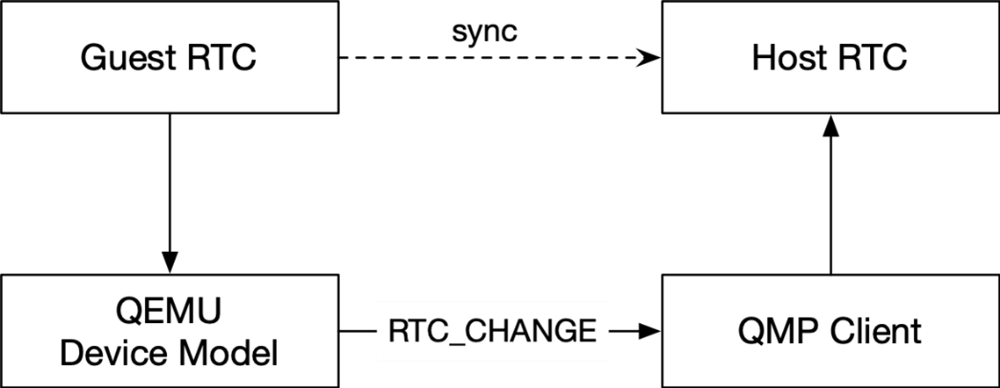
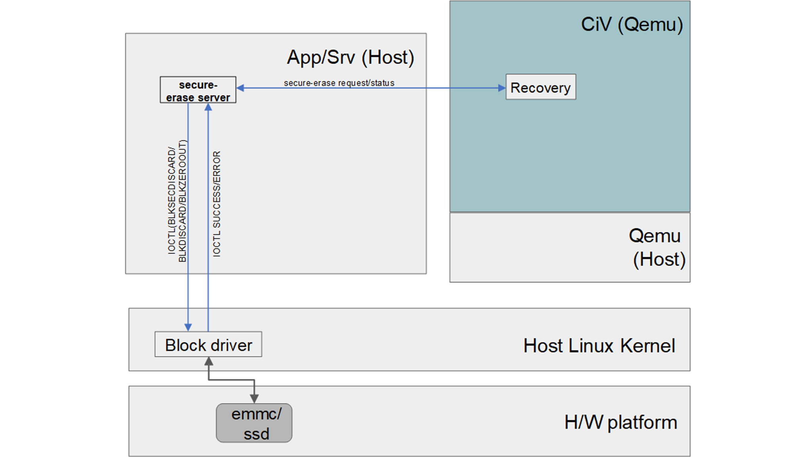

Feature Delta Offered by Stable Releases (IoT)
##############################################

Here are the additional features provided by Stable Releases (IoT).

.. contents::
    :depth: 1
    :local:

* 100% Google\* conformance on Comet Lake (CML),Tiger Lake (TGL), and
  Elkhart Lake (EHL) with production ready
* Supporting Comet Lake (CML),Tiger Lake (TGL), and Elkhart Lake (EHL)
  on single baseline and Single Image
* IoT configuration support GVT-d mode with 100% conformance
* IoT configuration support GVT-g with no conformance

Real-time clock (RTC) and alarm virtualization
**********************************************

The Celadon in Virtual Machine (CiV) project may require operations on the
RTC device, such as changes to current time and setups of alarm, to be
synced to host and persistent across reboots. RTC device is purely emulated
by QEMU and its state will be lost after exit of QEMU process, furthermore,
guest RTC alarm is unable to wake up the guest after host suspends, which is
the case in when using --host-pm-control option in CiV.

The solution is to modify the emulated RTC device so that it emits QMP
events upon certain operations and uses a QMP client running on host to
receive the QMP events and sync the operations to host accordingly.

        Figure 1 : Architecture Diagram of RTC Time Virtualization

Whenever the guest RTC alarm time is set, QEMU emits an RTC_CHANGE
event to QMP client. The QMP client can then set up a host RTC alarm
accordingly.

.. figure:: images/alarm.png
        :width: 500px
        :align: center

        Figure 2 : Architecture Diagram of RTC Alarm Virtualization

Whenever the expire time of the guest RTC alarm changes, QEMU emits an
RTC_ALARM event to the QMP client, and the QMP client can then set up a host
RTC alarm accordingly. In the case of host suspension, the host alarm wakes
up the host and notifies the QMP client. Then, the QMP client sends an
rtc-refresh-timer command to QEMU, to ensure that QEMU wakes up the guest.

Secure data erase
*****************

In |C|, all partitions are inside a single guest virtual disk image file on
the host with the disk controller emulated by QEMU. The underlying actual
storage hardware technology be it magnetic or solid state is transparent to
the Android\* VM.

As such, due to emulation, secure partition erase would be to fall back to
“byte-by-byte overwrite” to the virtual partition. This “byte-by-byte
overwrite” operation is not solid state storage friendly.

To provide secure data erase of data partition, following enhancement is
needed in CiV:

Addition of secure data erase to make use of storage controller hardware
secure erase feature, when it is supported in hardware to erase data
partition and only finally fall back to byte-by-byte override 0 when not
supported during Android recovery/wipe data process.

1. Guest virtual disk image file enhancement

   In CiV, all Android required partitions are resided in the same
   guest virtual disk image file in host.

   To support the enhancements to add secure data partition erase via
   hardware controller secure erase where supported, the data partition
   needs to be separated from the main Celadon CiV guest disk image
   file. This allows to pass a true host partition to QEMU CiV launch
   parameters as a separate emulated disk for secure data erase.

.. figure:: images/sde.png
        :width: 750px
        :align: center

        Figure 3 : Host/Guest VM disk/file view after SDE enhancements
        illustrates the changes in CiV guest image file in the host

2. Secure data erase enhancement

   In AOSP for data partition erase, this is performed by recovery tool
   when “--wipe-data” is written to ``/cache/recovery/command``. In generic
   AOSP data partition will have a secure partition wipe if it has
   encryption keys for the volume before any reformatting of the
   partition.

   For SDE enhancement, to add secure erase of the data partition via
   hardware controller feature, vsock communication between AOSP
   recovery tool and host side daemon application is added to add data
   partition secure erase prior to Android reformat of data partition.

   The host side daemon application is added to perform secure data
   partition wipe using hardware controller supported erase mechanism
   such as via ``BLKSECDISCARD/BLKDISCARD`` command if supported before
   falling back to ``BLKZEROOUT`` commands if none of the former are
   supported.

        Figure 4 : Data partition secure erase

