VTune Amplifier
===============

Introduction
------------

    `Intel VTune
    Amplifier <https://software.intel.com/en-us/intel-vtune-amplifier-xe>`__ is
    a performance analysis tool targeted for users developing serial and
    multithreaded applications. VTune Amplifier helps you analyze the
    algorithm choices and identify where and how your application can
    benefit from available hardware resources.

    Use the VTune Amplifier to locate or determine the following:

-  The most time-consuming (hot) functions in your application and/or on
   the whole system

-  Sections of code that do not effectively utilize available processor
   time

-  The best sections of code to optimize for sequential performance and
   for threaded performance

-  Synchronization objects that affect the application performance

-  Whether, where and why your application spends time on input/output
   operations

-  The performance impact of different synchronization methods,
   different numbers of threads, or different algorithms

-  Thread activity and transitions

-  Hardware-related issues in your code such as data sharing, cache
   misses, branch misprediction and others

   1. .. rubric:: Pre-requisites
         :name: pre-requisites

    The following information is important to consider before beginning
    to install Intel VTune Amplifier.

-  Review the system requirements listed in the Release Notes document.
   The document can be found online and in your installation media

-  Administrative privileges are recommended to install, change, or
   uninstall the product. Users without administrative permissions can
   install the product, but not all collectors will be available

-  Enable the SHA-2 code signing support for Windows\* 7 and Windows\*
   Server 2008 R2 operating systems by applying Microsoft Security
   update 3033929: https://technet.microsoft.com/en-us/library/security/
   3033929.aspx. If the security update is not installed, event-based
   sampling analysis types will not work properly on your system

-  A 64-bit operating system host is required to use the VTune Amplifier
   graphical user interface to analyze collected profile data. Command
   line profiling and reporting is supported on a 32-bit operating
   system host. Use the command line installer instructions to install
   on a 32-bit operating system

-  You do not need to uninstall previous versions or updates of VTune
   Amplifier before installing a newer version. However, if you do not
   remove older updates before installing a newer version, all product
   components that belong to the same major release will be replaced
   with the latest version for each major release update

    *For example*, if you have VTune Amplifier 20xx Update 1 installed
    and are currently installing VTune Amplifier 20xx Update 2, the
    older version will be uninstalled and replaced with the new content
    for Update 2. If you are installing the next major release, VTune
    Amplifier 20xy, your installation of VTune Amplifier 20xx Update 1
    will remain and the new release will be installed beside the old
    version, duplicating common files, documentation, samples, and
    product components

-  If you are installing in a cluster environment, you can install and
   use multiple versions of the product on the same system. However,
   kernel driver usage is limited to a single version of VTune
   Amplifier. This means you can have multiple copies of VTune Amplifier
   installed without the SEP drivers and a single version of the product
   with the drivers installed. The latter would be enabled with the
   advanced types of analysis using hardware event based sampling
   analysis data collection

    **Product Activation and Licensing:**

    The named-user license provisions in the Intel® end-user license
    agreement allow Intel VTune™ Amplifier to be installed on up to
    three systems. Product licensing checks for the number of systems
    when it checks for valid licenses and tracks systems on which the
    software is installed by the system host identifier. You can
    download additional host operating system versions, Windows\*,
    Linux\*, or macOS\*, with a valid license for any operating system.
    For more information about cross-operating system support, see
    https://
    software.intel.com/en-us/articles/intel-vtune-amplifier-intel-advisor-and-intel-inspector-now-include-crossos-support.

    To install on another system after reaching the limit, an old system
    host identifier must be released from the registration system. For
    more information about releasing an existing system, contact Intel
    Technical Support through https://software.intel.com/en-us/support.
    You can also review the information provided by Intel Technical
    Support on the following page:
    https://software.intel.com/en-us/articles/required-license-upgradefor-intel-system-studio-2016-and-intel-parallel-studio-xe-2016.

The end-user license agreement is available in the following locations:

-  <installation-dir>/documentation/<language>/VTune Amplifier
   XE/EULA.rtf

-  <installation-dir>/documentation/<language>/VTune Amplifier
   XE/EULA.txt

There are several methods for product activation during installation:

-  Activation using a serial number. Internet connection is required for
   this option

-  Remote activation using a serial number. Use this method when your
   computer is not connected to the internet. You must use another
   computer with internet access to complete activation

-  Activation using a license file

-  Activation using a license server

Download
--------

    Intel VTune Amplifier\ :sup:`®` is distributed as part of Intel
    System Studio, and also available as a standalone installer. If you
    are new to Intel System Studio, click
    the \ `*Download * <https://software.intel.com/en-us/system-studio/choose-download>`__\ page
    at Intel System Studio website to acquire a free renewable
    commercial license for 90-day use.

    |image0|

    Register yourself at the product download page and a product
    activation code will be sent to the registered email address. Follow
    the on-screen instructions, select Linux and Android as the
    development and target operating systems respectively. This will
    start the Intel System Studio release package download.

    |image1|

    Click on Download to get the Release package:

    |image2|

    Extract the release package:

    |image3|

    Launch the installer script install.sh.

    |image4|

    If it prompts for sudo password, enter password and click
    “\ *N*\ ext”:

    |image5|

    Installation process starts with **“Initialization”**

    |image6|

    User has to accept the “License Agreement” and click *N*\ ext:

    |image7|

    Accept or Decline Improvement Program Radio Button:

    |image8|

    Activate the License with 3 options:

1. Use existing license

2. Use Serial number to activate and install the product

3. Choose the alternative activation

    |image9|

    Check the Component selection to make sure that all the desired
    components are selected

    |image10|

    User can Integrate Intel System Studio to Wind River Linux and Wind
    River Workbench by browsing to Wind River Linux Home Location:

    |image11|

    Browse and select Android-NDK installation folder to integrate into
    Android NDK and click on *I*\ nstall:

    |image12|

    Installation process will take some time to install all the required
    components, VTune Amplifier will be installed along with Intel
    System Studio (ISS)

    |image13|

After Completion you can click on *F*\ inish button to Launch the Intel
System Studio:

    |image14|

    It prompts you to select/create Workspace for storing all
    projects/analysis while using Intel System Studio.

    |image15|

    Following is the first look of Intel System Studio:

    |image16|

Features Supported for KBL-NUCs Platform
----------------------------------------

+----------------------------+-----------+--------------------------------------------------------------------------------------------------------------------------------------------------------------------------------------------------------------------------------------------------------------------------------------------------------------------------+
| Analysis                   | Feature   | Description                                                                                                                                                                                                                                                                                                              |
+----------------------------+-----------+--------------------------------------------------------------------------------------------------------------------------------------------------------------------------------------------------------------------------------------------------------------------------------------------------------------------------+
| Basic HotSpots             | Yes       | Use the Basic Hotspots analysis to understand application flow and identify sections of code that get a lot of execution time (hotspots)                                                                                                                                                                                 |
+----------------------------+-----------+--------------------------------------------------------------------------------------------------------------------------------------------------------------------------------------------------------------------------------------------------------------------------------------------------------------------------+
| Advanced HotSpots          | Yes       | Advanced Hotspots analysis is a fast and easy way to identify performance-critical code sections (*hotspots*) in your application and correlate this data with system performance                                                                                                                                        |
+----------------------------+-----------+--------------------------------------------------------------------------------------------------------------------------------------------------------------------------------------------------------------------------------------------------------------------------------------------------------------------------+
| Remote Analysis            | Yes       |                                                                                                                                                                                                                                                                                                                          |
+----------------------------+-----------+--------------------------------------------------------------------------------------------------------------------------------------------------------------------------------------------------------------------------------------------------------------------------------------------------------------------------+
| General Exploration        | Yes       | Use the General Exploration microarchitecture analysis to triage hardware issues in your application                                                                                                                                                                                                                     |
+----------------------------+-----------+--------------------------------------------------------------------------------------------------------------------------------------------------------------------------------------------------------------------------------------------------------------------------------------------------------------------------+
| System Overview Analysis   | Yes       | Use a platform-wide System Overview analysis to monitor a general behavior of your target Linux\* or Android\* system and correlate power and performance metrics with the interrupt request (IRQ) handling                                                                                                              |
+----------------------------+-----------+--------------------------------------------------------------------------------------------------------------------------------------------------------------------------------------------------------------------------------------------------------------------------------------------------------------------------+
| Custom Analysis            | Yes       |                                                                                                                                                                                                                                                                                                                          |
+----------------------------+-----------+--------------------------------------------------------------------------------------------------------------------------------------------------------------------------------------------------------------------------------------------------------------------------------------------------------------------------+
| GPU Analysis               | Yes       | Use the Intel® VTune™ Amplifier to profile applications that use a Graphics Processing Unit (GPU) for rendering, video processing, and computations. VTune Amplifier can monitor, analyze, and correlate activities on both the CPU and GPU                                                                              |
+----------------------------+-----------+--------------------------------------------------------------------------------------------------------------------------------------------------------------------------------------------------------------------------------------------------------------------------------------------------------------------------+
| Java Code Analysis         | Yes       |                                                                                                                                                                                                                                                                                                                          |
+----------------------------+-----------+--------------------------------------------------------------------------------------------------------------------------------------------------------------------------------------------------------------------------------------------------------------------------------------------------------------------------+
| Ftrace Events Analysis     | Yes       | Use an event library provided in the Custom Analysis configuration to select Linux\* Ftrace\* and Android\* framework events to monitor with the event-based sampling collector                                                                                                                                          |
+----------------------------+-----------+--------------------------------------------------------------------------------------------------------------------------------------------------------------------------------------------------------------------------------------------------------------------------------------------------------------------------+
| Atrace Analysis            | Yes       | Use an event library provided in the Custom Analysis configuration to select Linux\* Ftrace\* and Android\* framework events to monitor with the event-based sampling collector.                                                                                                                                         |
+----------------------------+-----------+--------------------------------------------------------------------------------------------------------------------------------------------------------------------------------------------------------------------------------------------------------------------------------------------------------------------------+
| Energy Analysis            | Yes       | Use the energy analysis capabilities available with the Intel® System Studio to analyze power and energy consumption and identify system behaviors that waste energy on an Android system running on Intel architecture. Energy data is collected using Intel SoC Watch, but results can be viewed as described below.   |
+----------------------------+-----------+--------------------------------------------------------------------------------------------------------------------------------------------------------------------------------------------------------------------------------------------------------------------------------------------------------------------------+

Usage
-----

    Use the Basic Hotspots analysis to understand application flow and
    identify sections of code that get a lot of execution time
    (hotspots). This is a starting point for your algorithm analysis.

    A large number of samples collected at a specific process, thread,
    or module can imply high processor utilization and potential
    performance bottlenecks. Some hotspots can be removed, while other
    hotspots are fundamental to the application functionality and cannot
    be removed.

    Intel® VTune™ Amplifier displays a list of functions in your
    application ordered by the amount of time spent in each function. It
    also captures the call stacks for each of these functions so you can
    see how the hot functions are called.

    The collector does not gather system-wide performance data but
    focuses on your application only. To analyze system performance, run
    the \ `*Advanced
    Hotspots* <https://software.intel.com/node/061048dd-184e-4cd4-9ef6-8a771e1d0cc9#061048DD-184E-4CD4-9EF6-8A771E1D0CC9>`__ analysis.

To use the Basic Hotspots analysis, explore:

-  Configuration options (knobs)

-  View Points

   1. .. rubric:: Launch the VTune Amplifier:
         :name: launch-the-vtune-amplifier

-  For standalone GUI interface, run the amplxe-gui command

-  For command line interface, run the amplxe-cl command

    From within the Intel System Studio IDE, select \ **Intel System
    Studio** > **VTune Amplifier** > **Launch VTune Amplifier**.
    Launching from within Intel System Studio sets all appropriate
    environment variables before opening the tool

|image17|

Configuration Options:
~~~~~~~~~~~~~~~~~~~~~~

    To configure options for the Basic Hotspots analysis:

    Prerequisites:

-  Create a Project

-  Specify ab analysis target

    Create a Project:

    Before running an analysis with the Intel® VTune™ Amplifier, you
    have to create a \ *project*, which is a container for an analysis
    target and analysis type configuration and data collection results.

Steps to create a project for a standalone GUI:

1. Open the create project dialog box using any of the following
   options:

   a. Click the \ |image18| menu button and select \ **New >
      Project...**.

   b. Click the \ |image19|\ **New Project** toolbar button

   c. Click the \ **New Project...** hyperlink in
      the \ **Welcome** page.

    For Example, on windows:

    |image20|

1. In the Create a Project dialog box, configure the following settings:

    |image21|

1. Click the Create Project button

The New Amplifier Result Tab opens

    When you create a project for the Intel® VTune™ Amplifier
    performance analysis, you have to specify what you want to profile -
    your \ *analysis target*, which could be an executable file, a
    process, or a whole system.

1. Open the Analysis Target window using any of the following options:

   a. Click the \ **Create Project** button in the \ `*Create a Project
      dialog box* <#_17dp8vu>`__

   b. Click the \ |image22|\ **Configure Project** toolbar button or
      select the \ **Configure Project...** option from the product menu

   c. Click the \ |image23|\ **New Analysis** toolbar button and click
      the \ **Choose Target** button on the command toolbar on the right

    Analysis Target window looks as below:

    |image24|

    Follow the below instructions to get your target ready for analysis.

    1 →Now select Android device (ADB) as shown in the picture under
    select a target system to profile section

    2→ select the Android destination device, if multiple devices are
    connected to your host machine be careful to choose the right device
    based on the device id

    3→Select a target type of profile by selecting one these, “Attach to
    Process”, “Profile System”, “Launch Application” and “Launch Android
    Package”

    For example, in the picture selected “Attach to Process”

    4 → After selecting one of the target profile type, corresponding
    options will be available on the middle pane, here as an example,
    selected “Attach to Process” profile type and corresponding “Attach
    to Process” options will appear to select specific process based on
    either Process name or PID. Once process name entered you can see
    the list of Process names.

    For example, *com.google.chrome* is chrome browser process name is
    entered

    5 → you can confirm by selecting the same process name in the below
    list, which shows details of the process like, Process Name, PID,
    Command Line.

    Once done click on “Choose Analysis” on the right pane.

    |image25|

    1→ Select the Algorithm Analysis type, here as an example, “Basic
    Hotspots”

    2→Sampling interval, Analyzing user tasks, events, counters etc…

    3→ Once selected what all Hotspots you are interested to debug,
    click on “Start” after making sure that your use case is running on
    the target device

    VTune will collect the Basic Hotspots data as shown below:

    |image26|

    You can interrupt/stop based on your use case scenario completion by
    clicking on “Stop”.

    Basic Hotspots summary looks as below:

    |image27|

    If click on “Bottom-Up” tab you can see how your application is
    utilizing the CPU.

    |image28|

    Click on “Caller/Collee” tab to see more details on the function
    calls flow:

    |image29|

    Click on “Top-Down Tree” tab to see more call stack details:

    |image30|

    You can filter based on your interested components like:

    |image31|

Training and Documentation
--------------------------

+---------------------------------------------------------------------------------------------------------------------+-------------------------------------------------------------------------------------------------------------------------------------------------------------------------------------------------------------------------------------------------------------+
| **Document**                                                                                                        | **Description**                                                                                                                                                                                                                                             |
+---------------------------------------------------------------------------------------------------------------------+-------------------------------------------------------------------------------------------------------------------------------------------------------------------------------------------------------------------------------------------------------------+
| `*Online Training* <http://intel.ly/1aExtsW>`__                                                                     | The online training stie is an excellent resource for learning Vtune Amplifier basics with Getting Started guides, videos, tutorials, webinars and technical articles                                                                                       |
+---------------------------------------------------------------------------------------------------------------------+-------------------------------------------------------------------------------------------------------------------------------------------------------------------------------------------------------------------------------------------------------------+
| `*Intel VTune Amplifier Tutorials* <https://software.intel.com/en-us/articles/intel-vtune-amplifier-tutorials>`__   | Tutorials show you how to use basic Vtune Amplifier features. Vtune Amplifier tutorials guide a new use through basic walkthrough operations with a short sample. The tutorials provide an excellent foundation before you read the Vtune Amplieier help.   |
|                                                                                                                     |                                                                                                                                                                                                                                                             |
|                                                                                                                     | Sample code is typically installed to *<install-dir>/samples/<locale>/<programming\_language>*                                                                                                                                                              |
|                                                                                                                     |                                                                                                                                                                                                                                                             |
|                                                                                                                     | Vtune Amplifier sampl code and corresponding tutorials are also available at: https://software.intel.com/en-us/product-code-samples                                                                                                                         |
+---------------------------------------------------------------------------------------------------------------------+-------------------------------------------------------------------------------------------------------------------------------------------------------------------------------------------------------------------------------------------------------------+
| `*Intel VTune Amplifier Cookbook* <https://software.intel.com/en-us/vtune-amplifier-cookbook>`__                    | Performance analysis cookbook that contains recipes identifying and solving the most popular performance problems with the help of Vtune Amplifier’s analysis types                                                                                         |
+---------------------------------------------------------------------------------------------------------------------+-------------------------------------------------------------------------------------------------------------------------------------------------------------------------------------------------------------------------------------------------------------+
| `*Release Notes* <https://software.intel.com/en-us/intel-vtune-amplifier-2018-release-notes>`__                     | The Release Notes document contains the most up-to-date information about the product, includong a product description, technical support, and known limitations and issues.                                                                                |
|                                                                                                                     |                                                                                                                                                                                                                                                             |
|                                                                                                                     | This document also contains system requirements for installing the product. Before installation, the Release Noted document is located at the root level (same level as the isntallation cript/executable) of the installation download package.            |
+---------------------------------------------------------------------------------------------------------------------+-------------------------------------------------------------------------------------------------------------------------------------------------------------------------------------------------------------------------------------------------------------+
| `*Installation Guide* <https://software.intel.com/en-us/vtune-amplifier-install-guide-linux>`__                     | The installation Guide contains basic installation isntructions for Vtune Amplifier and post-installation configuration instructions for the various drivers and collectors.                                                                                |
|                                                                                                                     |                                                                                                                                                                                                                                                             |
|                                                                                                                     | The latest Installation Guide cab be found on the Intel\ :sup:`®` Developer Zone website                                                                                                                                                                    |
+---------------------------------------------------------------------------------------------------------------------+-------------------------------------------------------------------------------------------------------------------------------------------------------------------------------------------------------------------------------------------------------------+
| `*Intel VTune Amplifier Help* <https://software.intel.com/en-us/vtune-amplifier-help>`__                            | The help is the primary document for the Vtune Amplifier                                                                                                                                                                                                    |
+---------------------------------------------------------------------------------------------------------------------+-------------------------------------------------------------------------------------------------------------------------------------------------------------------------------------------------------------------------------------------------------------+
| `*Intel Processor Event Reference* <https://download.01.org/perfmon/index/>`__                                      | This help provides reference information for Intel processor events used by the Vtune Amplifier for hardware event-based sampling analysis. Most of theis information is drawn from the Inte Processor information sources on the web                       |
+---------------------------------------------------------------------------------------------------------------------+-------------------------------------------------------------------------------------------------------------------------------------------------------------------------------------------------------------------------------------------------------------+

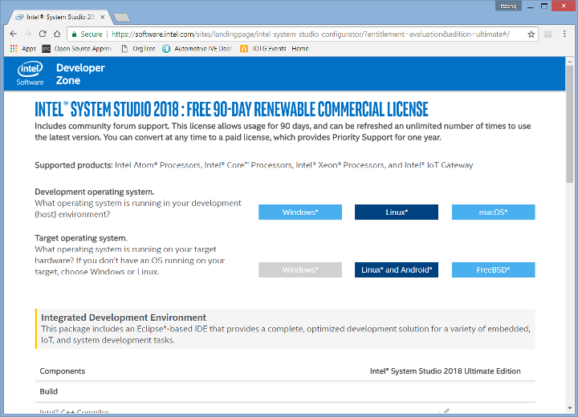
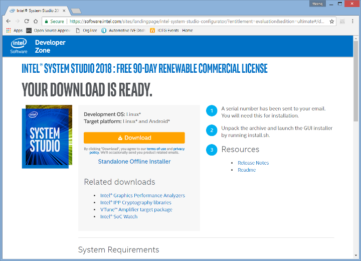
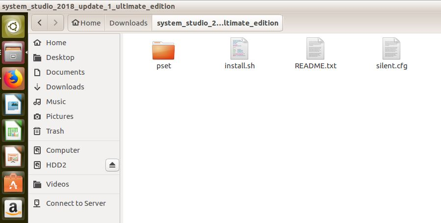
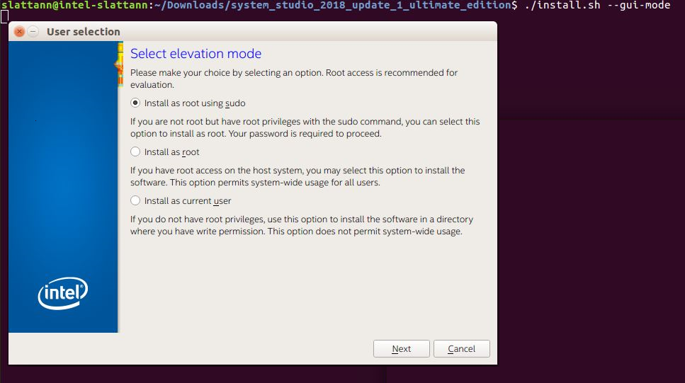
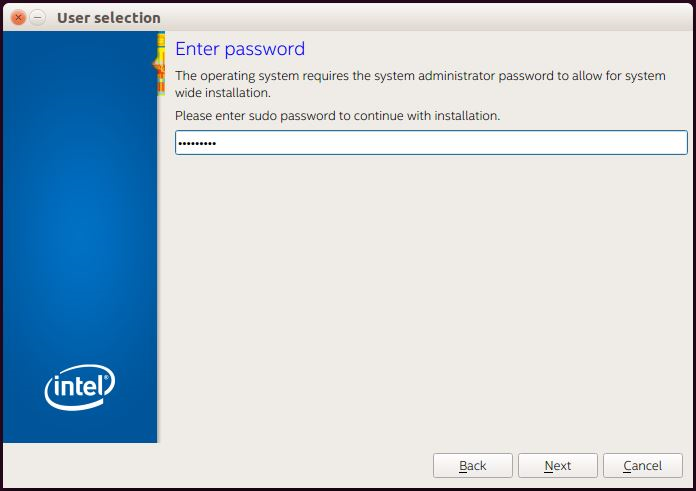
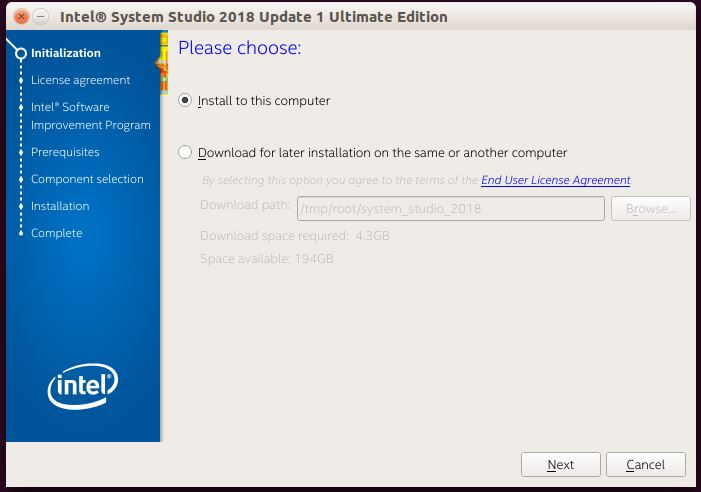
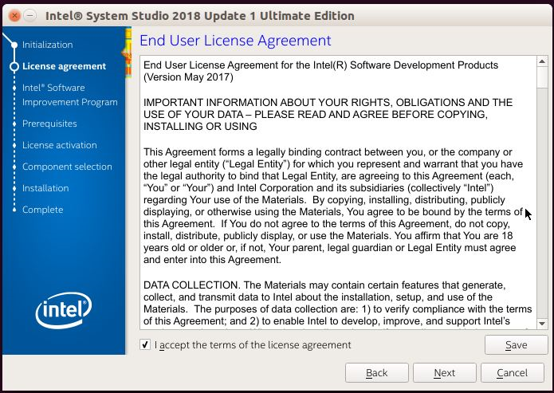
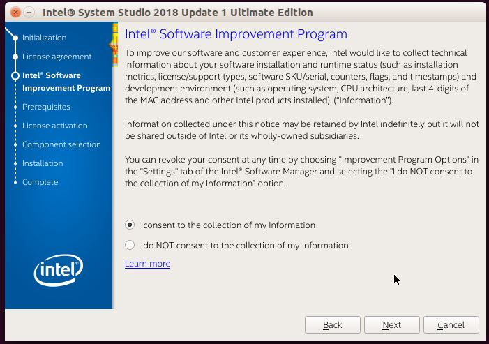
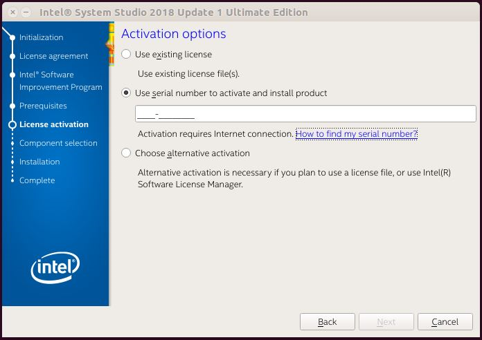
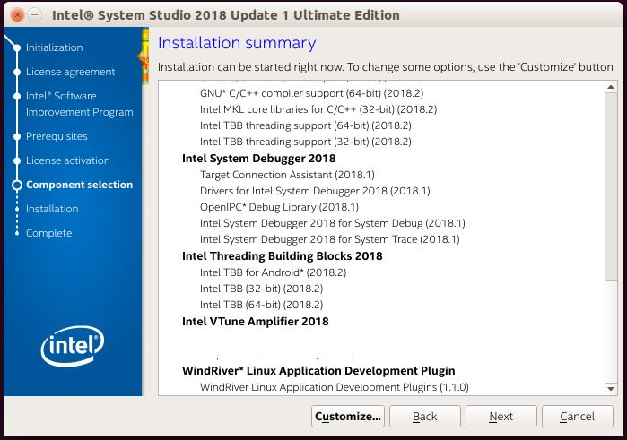
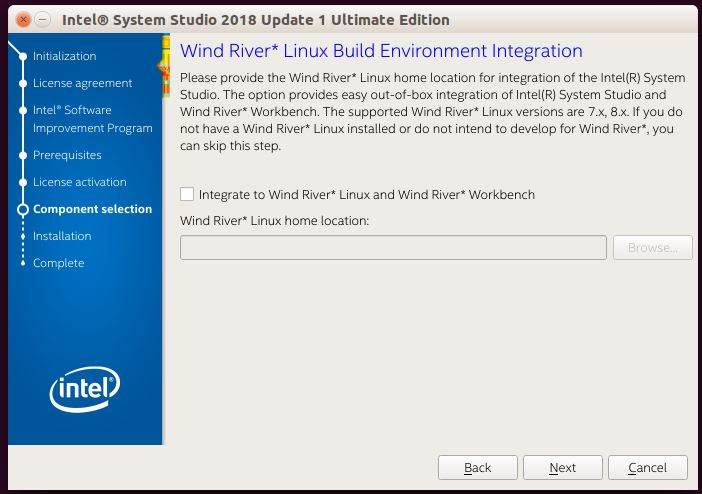
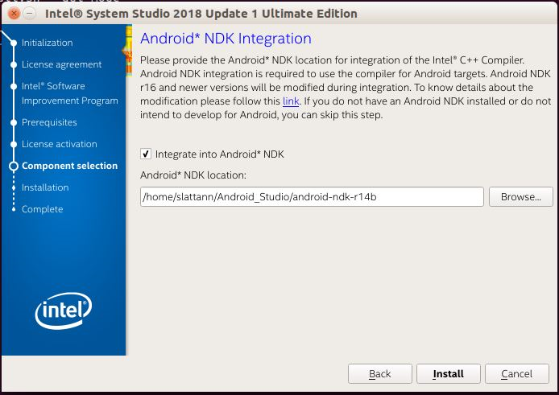
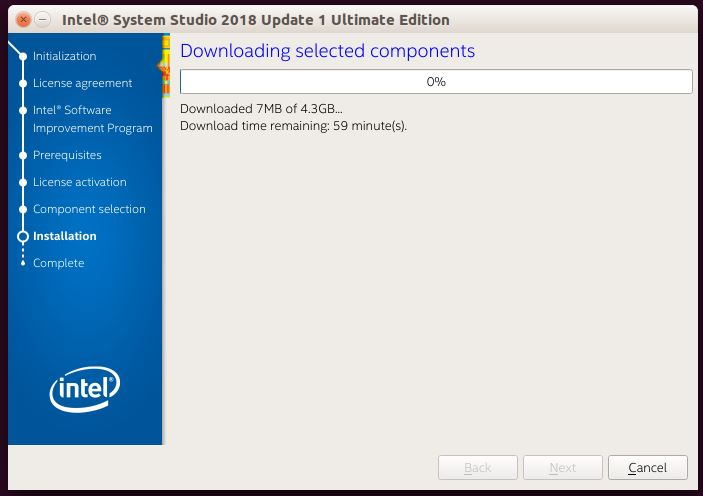
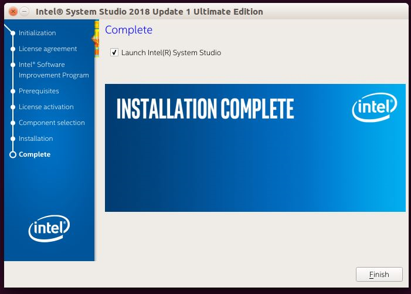
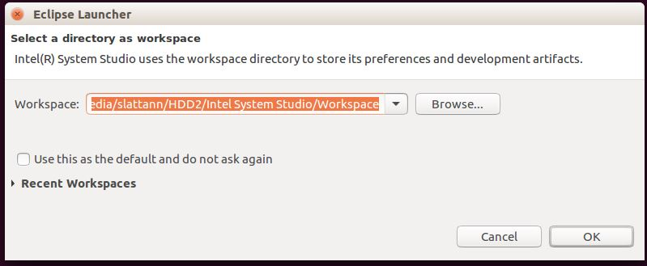
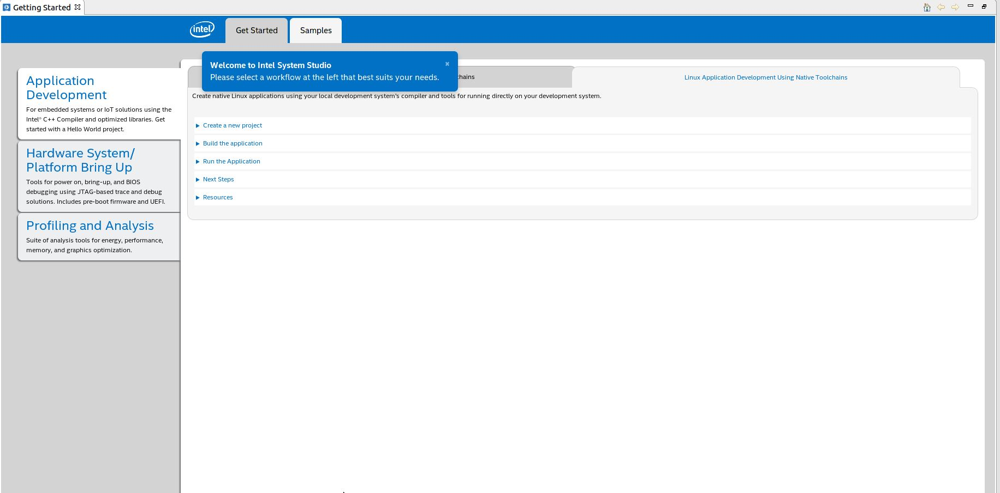
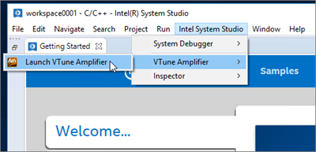

.. |image19| image:: images/image20.gif
   :width: 0.22500in
   :height: 0.22500in
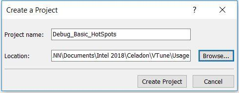
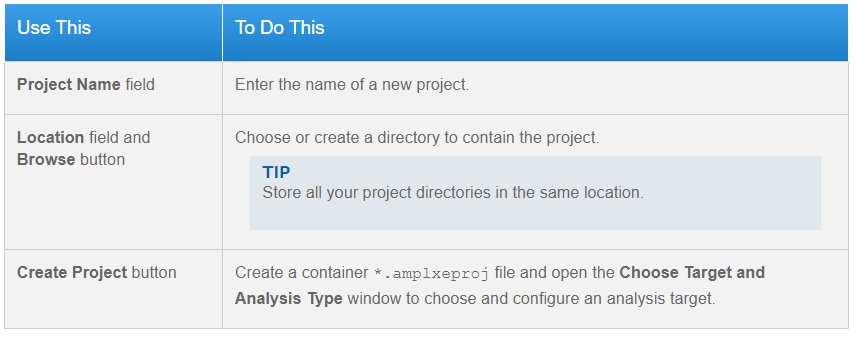

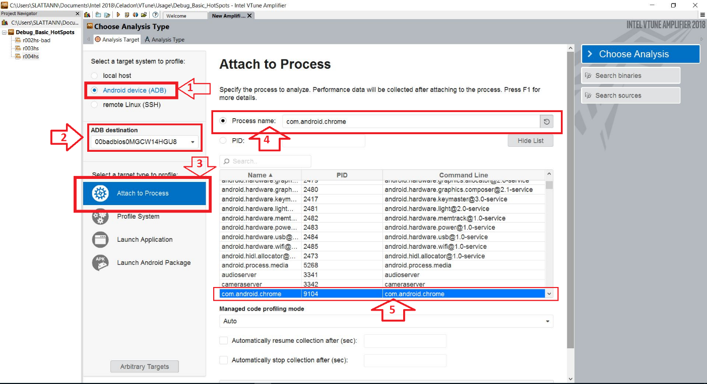
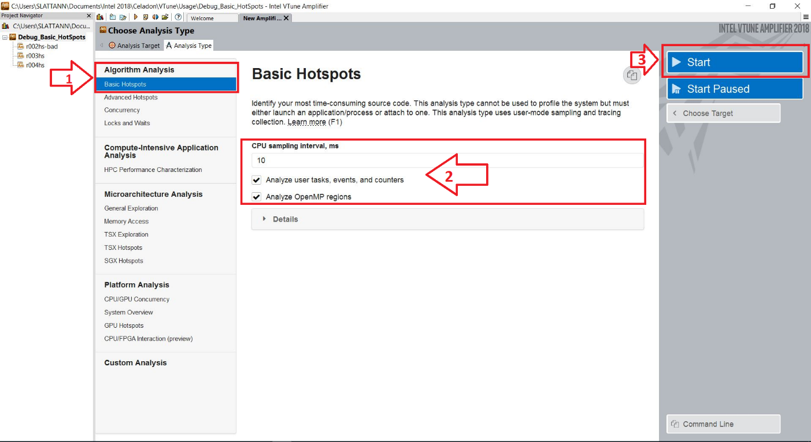
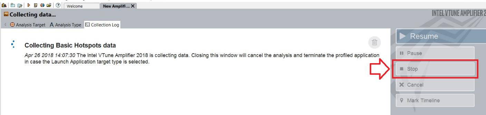
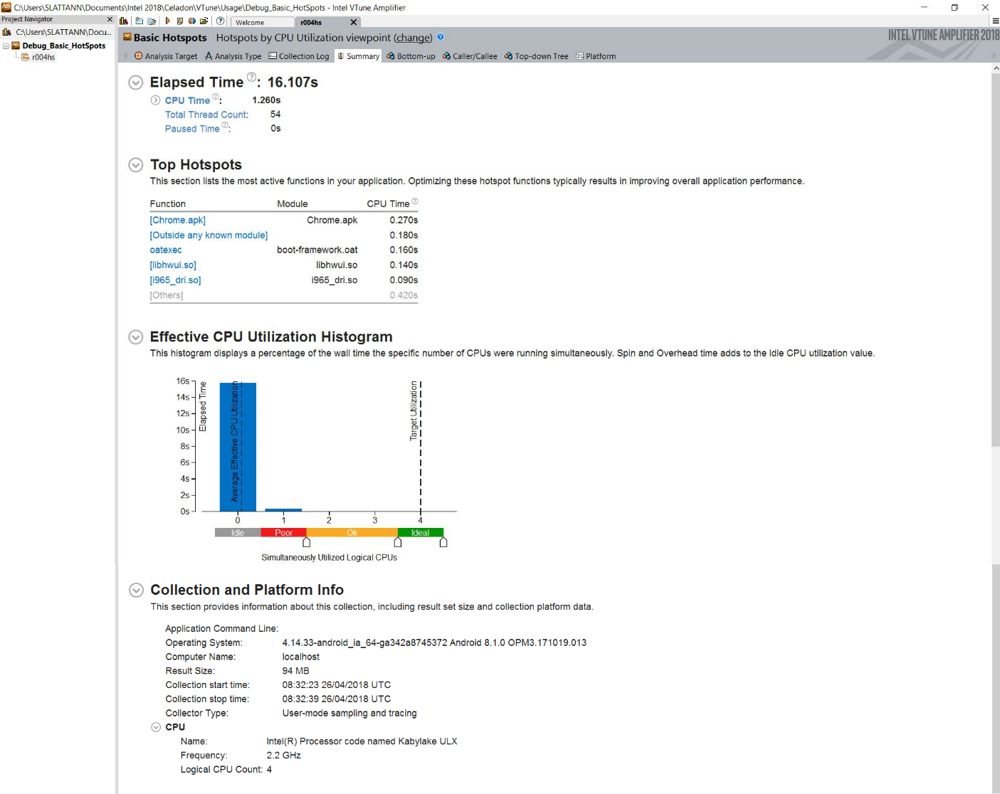
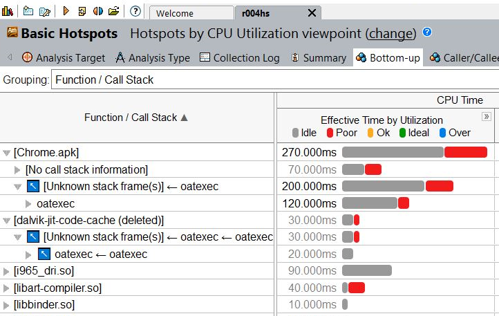
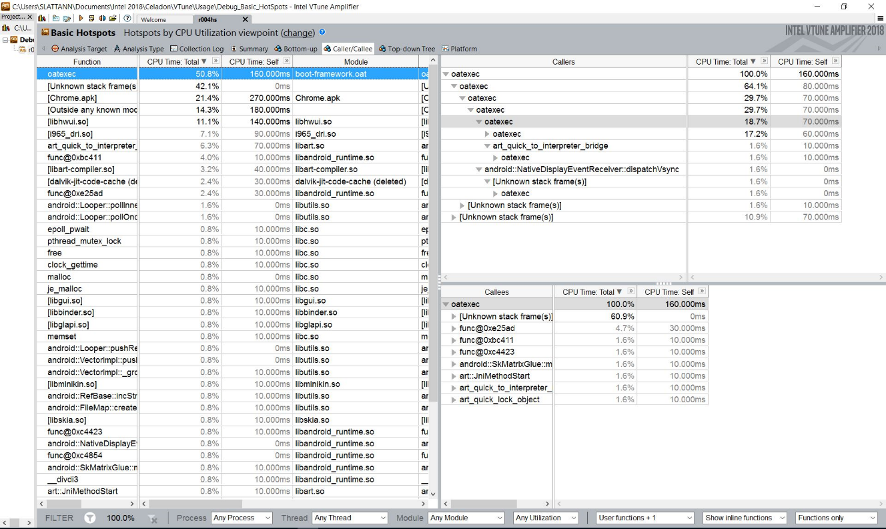
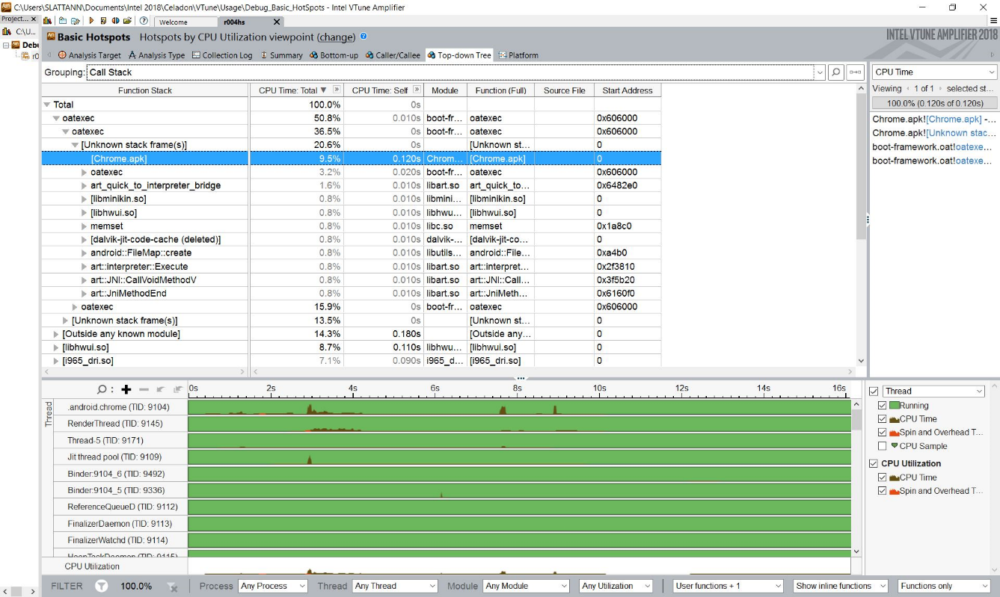

