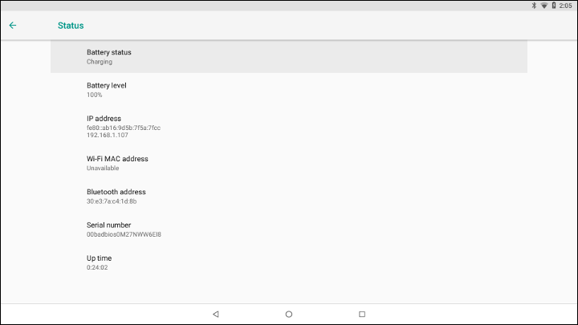

.. _add-movidius-ncsdk:

Add Intel® Movidius™ |NN| SDK to |C|
#######################################

Overview
--------

This tutorial walks you through the general process of adding software packages to your |C| image. The Intel® Movidius™ |NN| Abstraction Layer (NN HAL) is added to the |C| image in order to provide hardware acceleration for `Android Neural Networks API (NNAPI) <https://developer.android.com/ndk/guides/neuralnetworks/index.html>`_ using `Intel Movidius Neural Compute Stick (NCS) <https://developer.movidius.com>`_.

The Android Neural Networks API is a new Android C API introduced in Android 8.1 to run the computation intensive operations required by most machine learning frameworks (e.g. `TensorFlow Lite <https://www.tensorflow.org/mobile/tflite>`_ and `Caffe <http://caffe.berkeleyvision.org/>`_) to build and train neural networks on Android platforms. Intel Movidius Neural Compute Stick is a fanless deep learning USB accessory powered by |Movidius| Vision Processing Unit (VPU), which enables rapid prototyping, validation, and deployment of Deep |NN| (DNN) inference applications on PC platforms. By integrating the |Movidius| |NN| HAL to Android neural networks runtime, machine learning frameworks running on Android will perform hardware-accelerated inference operations using |Movidius| NCS.

In this tutorial, you add the |Movidius| NC SDK to your |C| image and invoke a native app to communicate with the neural compute stick using NC API. The use of Android NNAPI, leveraging |Movidius| NCS will be covered in future tutorials.

Prerequisites
-------------

* |NUC| systems supported by |C|
* |Movidius| Neural Compute Stick
* A 64-bit Ubuntu 16.04 Linux development host to build |C| images

Reference the :ref:`build-from-source` section in the Getting Started Guide to set up the |C| source tree and the build environment.

Add |Movidius| NN HAL to the build
----------------------------------

* Please go through the `Intel® Movidius™ Neural Networks HAL README <https://github.com/intel/nn-hal/tree/master/Intel_movidius_nn_hal>`_  to complete setup

* Google has released the NNAPI support since Android 8.1, and it is  included in the |C| source tree. To add |Movidius| NN HAL to the build, clone the following GitHub repository under the *external* directory in the |C| source tree:

.. code-block:: bash

    $ cd <celadon_src>
    $ git clone https://github.com/intel/nn-hal.git external/nn-hal

* Include **MvNCAPI.mvcmd**, **libncsdk**, and **ncs_test1_app** packages into the build by adding the following lines to the device makefile *device/intel/project-celadon/celadon/device.mk* . These packages represent the NC firmware, NC SDK library, and the testing app respectively.

.. code-block:: bash

    # Intel® Movidius Neural Networks HAL
    PRODUCT_PACKAGES += MvNCAPI.mvcmd libncsdk ncs_test1_app

Communicate with |Movidius| NCS
-------------------------------

To quickly test the functionality of NCSDK, you must establish an *adb* session from the Ubuntu development host to the |NUC| system. This allows you to issue commands over *adb* sessions. Boot up the |NUC| system, configure the WiFi credentials with the Android *Settings* app, and get the assigned IP address from the `Settings->System->About tablet->Status page`.

Install the Android *adb* tool on the Ubuntu development host if no *adb* executable is found. Enter the following commands to establish an *adb* session:

.. code-block:: bash

    $ sudo apt-get install -y adb
    ...
    $ adb kill-server
    $ adb connect 192.168.1.107 # the IP address of Intel NUC
    * daemon not running; starting now at tcp:5037
    * daemon started successfully
    connected to 192.168.1.107:5555

Once the `adb` session is connected, plug in the |Movidius| Neural Compute Stick to the |NUC|. Login to the system and launch the *ncs_test1_app* native app with root privilege. The app should  detect the presence of the NCS as shown in following screenshot.

.. code-block:: bash

    $ adb shell
    celadon:/ $ su
    celadon:/ # ncs_test1_app                                                      
    Hello NCS! Device opened normally.
    Goodbye NCS!  Device Closed normally.
    NCS device working.
    celadon:/ #
