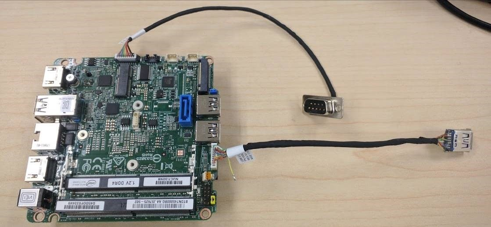
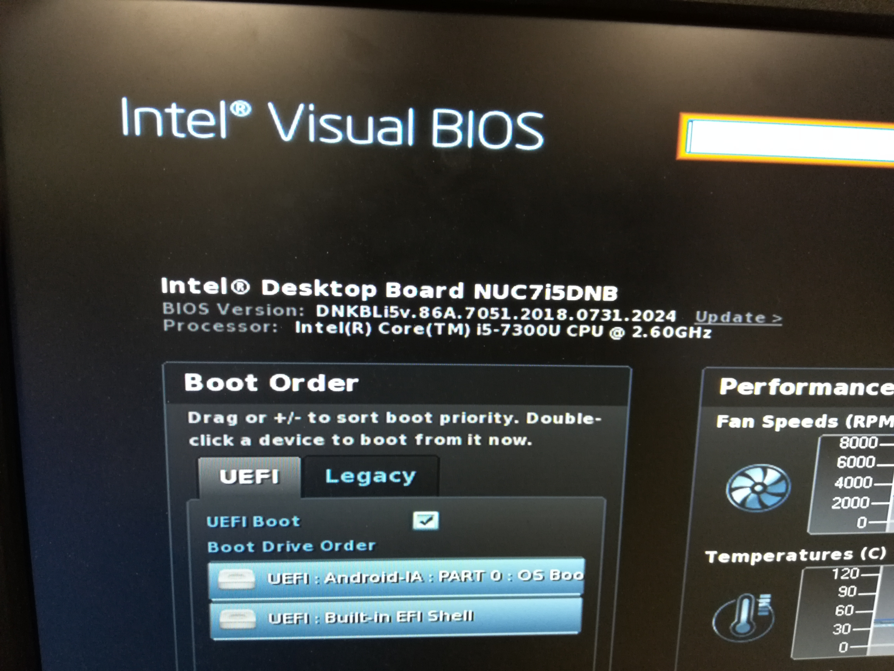
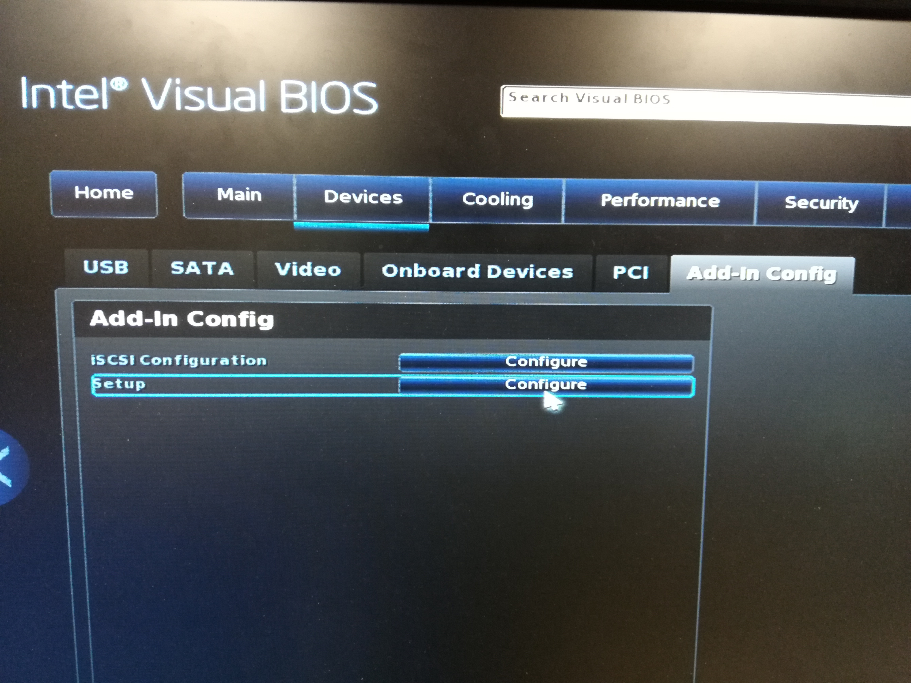

.. _enable-fastboot-in-KBL-NUC-7i5DNH:

Enable fastboot in KBL NUC 7i5DNH
=================================

Prepare for the following:
--------------------------

1. A special BIOS for your NUC, version 7051. Find the correct BIOS according your NUC type in the download directory:
    NUC 7i3DNH: DNi37051_D.zip
    
    NUC 7i5DNH: DNi57051_D.zip
    
    NUC 7i7DNH: DNi77051_D.zip
    
2. A special USB 3.0 cable, any one of the following:
    http://www.gorite.com/dawson-canyon-usb-3-0-female-to-10-pin-header-cable

    http://www.gorite.com/intel-nuc-dawson-canyon-expansion-usb-bracket

    https://www.amazon.com/Dawson-Canyon-Female-Header-Cable/dp/B07C55FC71/ref=sr_1_1?ie=UTF8&qid=1537155048&sr=8-1&keywords=Dawson+Canyon+USB+3.0+Female+to+10+Pin+Header+Cable

3. A USB type A-A cable.
    USB 2.0 is enough.

Step-by-step guide
------------------

1. Open the NUC, cut the Pin10 of the USB 3.0 cable, it is the first pin near the memory and plug in the USB 3.0 cable.
   If not cut the Pin10, the fastboot will does work, but the adb will does not work.

2. Use the USB type A-A cable connect the special USB 3.0 cable to your developer server.

3. Upgrade the NUC BIOS.

Unzip the DNi3/5/77051_D.zip to a USB disk.

Plug in the USB disk to NUC.

Power on, and press F7 to enter the upgrade BIOS menu.

Select USB disk and select the new BIOS file.

After select the BIOS file, will reboot device to finish the upgrading.

The new BIOS looks like:

4. Enable the fastboot support in BIOS.
    
Press F2 to enter BIOS setup program.

Enter "Device"->"Add-In Config" page, click the button of Setup "Configure' to enter the AMI CRB Setup page.

In the CRB Setup page, enter Chipset”->”PCH-IO Configuration”->”USB Configuration” page, set the xDCI to enabled.

.. image:: images/NUC755DNH_USB_XDCI.jpg

Then enter the "Advanced" -> "Platform Settings", set the enable FFU Support to enable.

.. image:: images/NUC755DNH_FFU.jpg

Press F10 to save the settings, and reboot the device.
