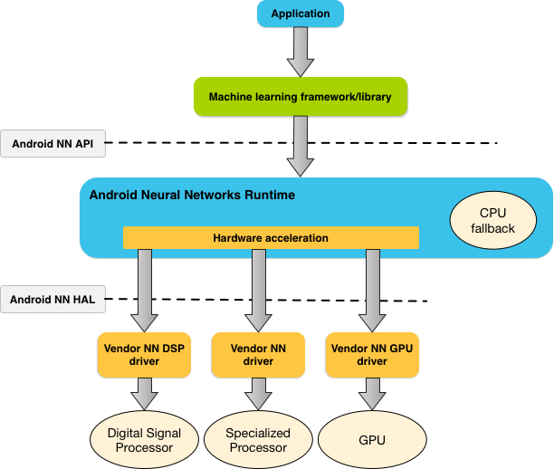
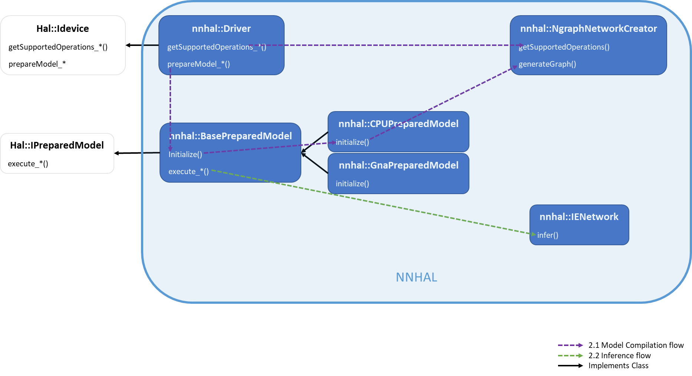
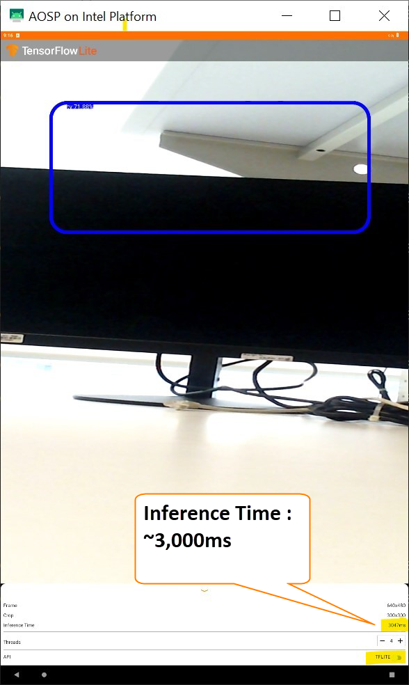

.. _enabling-nnhal-in-celadon:

Enabling Neural Networks Hardware Abstraction Layer in Celadon
##############################################################

This tutorial explains neural networks usage in project Celadon.

Neural networks hardware abstraction layer overview
***************************************************

Android provides a neural networks API (NN API) for running
computationally intensive operations for machine learning on Android
devices:

https://developer.android.com/ndk/guides/neuralnetworks

   Figure 1: System architecture for Android Neural Networks API (Source:
   https://developer.android.com/ndk/guides/neuralnetworks#runtime)

Celadon’s neural networks hardware abstraction layer (NN HAL) is the
vendor implementation of the NN API driver interface
(https://source.android.com/devices/neural-networks) specified by the HAL
definition files :file:`hardware/interfaces/neuralnetworks`.

This implementation is achieved using the OpenVINO™ Toolkit (2021.4)
components, which provide optimized solutions for AI inference on Intel
hardware.

NN HAL implementation details
*****************************

   Figure 2: Architecture for Celadon NN-HAL Implementation

The two main steps for AI inferencing using NN API are
compilation/translation and execution/inference.

Model compilation/translation
=============================

At model compilation time, the NN API framework sends the model to NN
HAL using ``IDevice::getSupportedOperations*``. NN HAL returns an array of
booleans indicating which operations of the model are supported. Based
on the response, the framework instructs NN HAL to prepare to execute a
subset of the model by calling ``IDevice::prepareModel*``, which should
return an ``IPreparedModel`` handle.

To use OpenVINO Toolkit's InferenceEngine, we need a model in IR format:

https://docs.openvino.ai/2021.4/openvino_docs_MO_DG_IR_and_opsets.html#intermediate-representation-used-in-openvino

The NgraphNetworkCreator along with other sub-components within
:file:`nn-hal/ngraph_creator`, implements ngraph conversion of each NN API
operation, and finally generates an ``ngraph::Function`` out of the NN API
model:
https://docs.openvino.ai/2021.4/openvino_docs_nGraph_DG_DevGuide.html

This ``ngraph::Function`` is further used to create an
``InferenceEngine::CNNNetwork`` object, which can be loaded to the
corresponding plugin for inference.

Execution/Inference
===================

During execution, the NN API framework calls one of
``IPreparedModel::execute*`` APIs to NN HAL with a Request parameter,
which lists the input and output operands used for the execution. NN
HAL converts the input and output operands into formats expected by
``InferenceEngine`` and then uses one of the plugins to do the
inference. Currently, we use the oneDNN plugin which helps improve
performance on Intel CPUs:

https://oneapi-src.github.io/oneDNN/

Enable and build NN HAL
***********************

To enable NN HAL and its dependencies in the Android 12 build, perform
the following steps:

#. Initialize the Android 12 repo using:

   .. code-block:: bash

      repo init -u https://github.com/projectceladon/manifest -b celadon/s/mr0/stable

#. Apply the following patch to the repo (:file:`.repo/manifests/`) for
   including the NN HAL dependencies:
   https://patch-diff.githubusercontent.com/raw/projectceladon/manifest/pull/295.patch

#. Sync the Android12 source using:

   .. code-block:: bash

      repo sync -c

#. Apply the following patch to :file:`vendor/intel/utils` to specify android
   build rules for the dependencies:
   https://github.com/projectceladon/vendor-intel-utils/pull/1617.patch

#. Enable neuralnetworks at
   mixins(:file:`device/intel/project-celadon/caas/mixins.spec`):
   | "neuralnetworks: true"

#. Run the following to update the mixin changes::

   $./device/intel/mixins/mixin-update

Execute a sample usecase
************************

Sync the tflite ``object_detection`` example below and build it using
Android Studio. The instructions are available
`in this link <https://github.com/tensorflow/examples/tree/ff5a76bdef0934719b784690616d2987d065519a/lite/examples/object_detection/android>`_ .

Since the NN API switch’s visibility is disabled in this version’s
layout, the following line has to be removed from
:file:`res/layout/tfe\_od\_layout\_bottom\_sheet.xml`:

.. code-block:: bash

   <!-- *TODO(b/112541284): Unhide when new NNAPI delegate is used.* -->
   <LinearLayout
   android:layout\_width="match\_parent"
   android:layout\_height="wrap\_content"
   android:orientation="horizontal"
   [STRIKEOUT:android:visibility="gone"]>

Notice the improvement in the inference time in the sample execution
below:

   Figure 3: Inference without NN API

.. figure:: images/cs002-f4-inference-using-nn-api.png
   :width: 4.09514in
   :height: 6.83542in

   Figure 4: Inference using NN API

.. note::
   The sample app source code does have some minor issues such as:

   - The TFLITE-NNAPI toggle button works only the first time after
       opening app

   - Only portrait mode is supported.

