Performance Analysis using Intel® VTune :sup:`™` Amplifier
===========================================================

Introduction
------------

`Intel® VTune™
Amplifier <https://software.intel.com/en-us/intel-vtune-amplifier-xe>`__ is
a performance analysis tool targeted for users developing sequential and
multithreaded applications. Intel VTune Amplifier helps you analyze the
algorithm choices and identify where and how your application can
benefit from available hardware resources.

Intel VTune Amplifier can be used to locate and determine the following:

-  The most time-consuming (hot) functions in your application and/or on
   the whole system.

-  Sections of code that do not effectively utilize available processor
   cycles.

-  The best sections of code to optimize for sequential performance and
   for threaded performance.

-  Synchronization objects that affect the application performance.

-  Whether, where, and why your application spends CPU cycles on
   input/output operations.

-  The performance impact of different synchronization methods, numbers
   of threads, or algorithms.

-  Thread activities and transitions.

-  Hardware-related issues in your code such as data sharing, cache
   misses, branch misprediction, and others.

Download and Install Intel VTune Amplifier
------------------------------------------

Intel VTune Amplifier is distributed as part of Intel\ :sup:`®` System
Studio. If you are new to Intel System Studio, click
the \ `Download <https://software.intel.com/en-us/system-studio/choose-download>`__ page
at the Intel System Studio website to acquire a free renewable
commercial license for a 90-day use.

Refer to the :ref:`download-install-iss` section of the
:ref:`Intel® SoC Watch <profiling-system-power-consumption-with-socwatch>`
tutorial to install the Intel System Studio. Ensure the Intel VTune
Amplifier is selected in the Component selection page during the
installation. Review the product
`prerequisites <https://software.intel.com/en-us/vtune-amplifier-install-guide-windows-prerequisites>`__
page before installing Intel VTune Amplifier. The Intel VTune Amplifier
package is available in the following directory after installation:

.. code-block:: bash

    <ISS_Install_Root>/system_studio_2018/vtune_amplifier/

|image0|

You can Integrate Intel System Studio to Wind River Linux\* and Wind
River\* Workbench by browsing to the Wind River/Wind River Workbench
install location. By default, the Intel System Studio installs and
launches at the end of the installation.

You will be prompted to select/create a Workspace to store all projects
and analysis while using Intel System Studio.

|image1|

The following image is the first look of Intel System Studio:

|image2|

Features Supported for Intel\ :sup:`®` Kaby Lake NUC Platforms
--------------------------------------------------------------

+----------------------------+---------------+-----------------------------------------------------------------------------------------------------------------------------------------------------------------------------------------------------------------------------------------------------------------------------------------------------------------------------------------------------------------+
| **Analysis**               | **Feature**   | **Description**                                                                                                                                                                                                                                                                                                                                                 |
+----------------------------+---------------+-----------------------------------------------------------------------------------------------------------------------------------------------------------------------------------------------------------------------------------------------------------------------------------------------------------------------------------------------------------------+
| Basic HotSpots             | Yes           | Use the Basic Hotspots analysis to understand application flow and identify sections of code that get a lot of execution time (hotspots).                                                                                                                                                                                                                       |
+----------------------------+---------------+-----------------------------------------------------------------------------------------------------------------------------------------------------------------------------------------------------------------------------------------------------------------------------------------------------------------------------------------------------------------+
| Advanced HotSpots          | Yes           | Advanced Hotspots analysis is a fast and easy way to identify performance-critical code sections (hotspots) in your application and correlate this data with system performance.                                                                                                                                                                                |
+----------------------------+---------------+-----------------------------------------------------------------------------------------------------------------------------------------------------------------------------------------------------------------------------------------------------------------------------------------------------------------------------------------------------------------+
| Remote Analysis            | Yes           |                                                                                                                                                                                                                                                                                                                                                                 |
+----------------------------+---------------+-----------------------------------------------------------------------------------------------------------------------------------------------------------------------------------------------------------------------------------------------------------------------------------------------------------------------------------------------------------------+
| General Exploration        | Yes           | Use the General Exploration microarchitecture analysis to triage hardware issues in your application.                                                                                                                                                                                                                                                           |
+----------------------------+---------------+-----------------------------------------------------------------------------------------------------------------------------------------------------------------------------------------------------------------------------------------------------------------------------------------------------------------------------------------------------------------+
| System Overview Analysis   | Yes           | Use a platform-wide System Overview analysis to monitor a general behavior of your target Linux\* or Android\* system and correlate power and performance metrics with the interrupt request (IRQ) handling.                                                                                                                                                    |
+----------------------------+---------------+-----------------------------------------------------------------------------------------------------------------------------------------------------------------------------------------------------------------------------------------------------------------------------------------------------------------------------------------------------------------+
| Custom Analysis            | Yes           |                                                                                                                                                                                                                                                                                                                                                                 |
+----------------------------+---------------+-----------------------------------------------------------------------------------------------------------------------------------------------------------------------------------------------------------------------------------------------------------------------------------------------------------------------------------------------------------------+
| GPU Analysis               | Yes           | Use the Intel VTune Amplifier to profile applications that use a Graphics Processing Unit (GPU) for rendering, video processing, and computations. Intel VTune Amplifier can monitor, analyze, and correlate activities on both the CPU and GPU.                                                                                                                |
+----------------------------+---------------+-----------------------------------------------------------------------------------------------------------------------------------------------------------------------------------------------------------------------------------------------------------------------------------------------------------------------------------------------------------------+
| Java Code Analysis         | Yes           |                                                                                                                                                                                                                                                                                                                                                                 |
+----------------------------+---------------+-----------------------------------------------------------------------------------------------------------------------------------------------------------------------------------------------------------------------------------------------------------------------------------------------------------------------------------------------------------------+
| Ftrace Events Analysis     | Yes           | Use an event library provided in the Custom Analysis configuration to select Linux\* Ftrace\* and Android\* framework events to monitor with the event-based sampling collector.                                                                                                                                                                                |
+----------------------------+---------------+-----------------------------------------------------------------------------------------------------------------------------------------------------------------------------------------------------------------------------------------------------------------------------------------------------------------------------------------------------------------+
| Atrace Analysis            | Yes           | Use an event library provided in the Custom Analysis configuration to select Linux Ftrace and Android framework events to monitor with the event-based sampling collector.                                                                                                                                                                                      |
+----------------------------+---------------+-----------------------------------------------------------------------------------------------------------------------------------------------------------------------------------------------------------------------------------------------------------------------------------------------------------------------------------------------------------------+
| Energy Analysis            | Yes           | Use the energy analysis capabilities available with the Intel System Studio to analyze power and energy consumption and identify system behaviors that waste energy on an Android system running on Intel\ :sup:`®` architecture. Energy data is collected using Intel\ :sup:`®` SoC Watch, but results can be viewed as described in the following sections.   |
+----------------------------+---------------+-----------------------------------------------------------------------------------------------------------------------------------------------------------------------------------------------------------------------------------------------------------------------------------------------------------------------------------------------------------------+

Intel VTune Amplifier Usage
---------------------------

This section uses the Basic Hotspots analysis as an example to
understand application flow and identify sections of code that get a lot
of execution time (hotspots). This is a starting point to analyze your
algorithm.

A large number of samples collected at a specific process, thread, or
module can imply high processor utilization and potential performance
bottlenecks. Some hotspots can be removed, while other hotspots are
fundamental to the application functionality and cannot be removed.

Intel® VTune Amplifier displays a list of functions in your application,
ordered by the amount of time spent in each function. It also captures
the call stacks for each of these functions so you can see how the hot
functions are called.

Note that the collector does not gather system-wide performance data,
but instead focuses on your application only. To analyze system
performance, you should run the
`Advanced Hotspots <https://software.intel.com/en-us/vtune-amplifier-help-advanced-hotspots-analysis>`__ analysis.

Use the Basic Hotspots analysis to explore:

-  Configuration options (knobs)

-  View Points

Launch the Intel VTune Amplifier
~~~~~~~~~~~~~~~~~~~~~~~~~~~~~~~~

You can launch the Intel VTune Amplifier from within the Intel System
Studio IDE by selecting the \ **Intel System Studio** > **VTune
Amplifier** > **Launch VTune Amplifier** menu items. The IDE sets all
appropriate environment variables before opening the tool.

    |image3|

You can also launch the Intel VTune Amplifier directly with one of the
following commands:

-  To use the standalone GUI interface, run the ``amplxe-gui`` command.

-  To use the command line interface, run the ``amplxe-cl`` command.

|image4|

Create a Project
~~~~~~~~~~~~~~~~

Before you run an analysis with the Intel VTune Amplifier, you have to
create a *project*. A project is a container for an analysis target,
analysis type configuration, and data collection results.

There are three options available to create a project using the
standalone GUI:

1. Click the \ |image5| menu button in the upper right corner and select \ **New > Project...**.

2. Click the \ |image6|\ **New Project** toolbar button.

3. Click the \ **New Project...** hyperlink in the \ **Welcome** page.

Enter the project name in the pop-up **Create a Project** dialog box:

    |image7|

Input fields in the **Create a Project** dialog box are summarized as
follows:

    |image8|

Click the **Create Project** button, and the tool opens a **New
Amplifier Result** tab, which represents the **Analysis Target** window.
You can re-open the **Analysis Target** window anytime with the
following options:

1. Click the \ |image9|\ **Configure Project** toolbar button or select
   the \ **Configure Project...** option from the product menu.

2. Click the \ |image10|\ **New Analysis** toolbar button and click
   the \ **Choose Target** button on the command toolbar on the right.

Start Analysis
~~~~~~~~~~~~~~

When you create a project for the Intel VTune Amplifier performance
analysis, you have to specify what you want to profile - your analysis
target (this could be an executable file), a process, or a whole system.

The following are instructions to prepare your target for analysis:

|image11|

1. Select the **Android\* device (ADB)** option as shown in the
previous figure under **Select a target system to profile** section.

2. Select your Android target device. If multiple devices are connected
to your host machine, be careful to choose the right device based on the
device ID.

3. Choose a target type to profile by selecting the **Attach to
Process**, **Profile System**, **Launch Application,** or **Launch
Android Package** option. The **Attach to Process** option is
selected in this tutorial.

|image12|

4. After you select the target profile type, the corresponding options
are available on the middle pane. Using the **Attach to Process**
profile type, the associated options appear to select the specific
processes based on either **Process name** or **PID**. Once the target
process name is entered, you can see the list of **Process names**. For
example, the Chrome\* browser process name ’\ *com.google.chrome*\ ’ is
selected in the previous figure.

|image13|

5. Next, click on **Choose Analysis** in the right pane to proceed with
the **Analysis Type** selection.

|image14|

6. Within **Analysis Type** you can select an **Algorithm Analysis**
type such as **Basic Hotspots.** You can also configure analysis options
(e.g. **sampling interval** or **Analyzing user tasks, events,
counters)** here.

|image15|

7. Once you select all hotspots you want to debug, click the **Start**
button after you verify that your use case is running on the target
device.

    |image16|

8. Intel VTune Amplifier collects the **Basic Hotspots** data as shown
in the following image. You can interrupt or stop based on your use case
scenario completion by clicking on **Stop** button.

    |image17|

Analysis Reports
~~~~~~~~~~~~~~~~

Intel VTune Amplifier generates the analysis reports after manual data
collection is stopped, or the configed stop conditions are met. The
following figure shows an example what the **Basic Hotspots** summary
looks like:

    |image18|

    **Top Hotspots**

    |image19|

    **Effective CPU Utilization Histogram**

    |image20|

    **Collection and Platform Information**

    |image21|

In addition to the report summary, several views are available to
profile the collected data. For example, click on the **Bottom-Up** tab
to see how your application utilized the CPU:

    |image22|

Click on the **Caller/Callee** tab to see more details on the
function calls flow:

    |image23|

Click on the **Top-Down Tree** tab to see more call stack details:

    |image24|

You can also set the filter based on your interested components at the
bottom of the window:

    |image25|

Resources
---------

+---------------------------------------------------------------------------------------------------------------------+---------------------------------------------------------------------------------------------------------------------------------------------------------------------------------------------------------------------------------------------------------------------------------------------------------------------------------------------------------------------------------------------------------------------------------------------------------------------------------------------------------------------------------------------------------------------+
| **Document**                                                                                                        | **Description**                                                                                                                                                                                                                                                                                                                                                                                                                                                                                                                                                     |
+---------------------------------------------------------------------------------------------------------------------+---------------------------------------------------------------------------------------------------------------------------------------------------------------------------------------------------------------------------------------------------------------------------------------------------------------------------------------------------------------------------------------------------------------------------------------------------------------------------------------------------------------------------------------------------------------------+
| `Online Training   <http://intel.ly/1aExtsW>`__                                                                     | The online training site is an excellent resource for learning Intel VTune Amplifier basics with Getting Started guides, videos, tutorials, webinars, and technical articles.                                                                                                                                                                                                                                                                                                                                                                                       |
+---------------------------------------------------------------------------------------------------------------------+---------------------------------------------------------------------------------------------------------------------------------------------------------------------------------------------------------------------------------------------------------------------------------------------------------------------------------------------------------------------------------------------------------------------------------------------------------------------------------------------------------------------------------------------------------------------+
| `Intel VTune Amplifier Tutorials   <https://software.intel.com/en-us/articles/intel-vtune-amplifier-tutorials>`__   | Tutorials show you how to use basic Intel VTune Amplifier features. Intel VTune Amplifier tutorials guide a new use through basic walkthrough operations with a short sample. The tutorials provide an excellent foundation before you read the Intel VTune Amplifier help. Sample code is available in the \`samples\` folder inside the VTune Amplifier install directory. More Intel VTune Amplifier sample code and corresponding tutorials are also available at `*Intel Developer Zone website* <https://software.intel.com/en-us/product-code-samples>`__.   |
+---------------------------------------------------------------------------------------------------------------------+---------------------------------------------------------------------------------------------------------------------------------------------------------------------------------------------------------------------------------------------------------------------------------------------------------------------------------------------------------------------------------------------------------------------------------------------------------------------------------------------------------------------------------------------------------------------+
| `Intel VTune Amplifier Cookbook   <https://software.intel.com/en-us/vtune-amplifier-cookbook>`__                    | Performance analysis cookbook that contains recipes identifying and solving the most popular performance problems with the help of Intel VTune Amplifier’s analysis types.                                                                                                                                                                                                                                                                                                                                                                                          |
+---------------------------------------------------------------------------------------------------------------------+---------------------------------------------------------------------------------------------------------------------------------------------------------------------------------------------------------------------------------------------------------------------------------------------------------------------------------------------------------------------------------------------------------------------------------------------------------------------------------------------------------------------------------------------------------------------+
| `Release Notes   <https://software.intel.com/en-us/intel-vtune-amplifier-2018-release-notes>`__                     | The Release Notes document contains the most up-to-date information about the product, including a product description, technical support, and known limitations and issues.                                                                                                                                                                                                                                                                                                                                                                                        |
|                                                                                                                     |                                                                                                                                                                                                                                                                                                                                                                                                                                                                                                                                                                     |
|                                                                                                                     | This document also contains system requirements for installing the product. Before installation, the Release Notes document is located at the root level (same level as the installation script/executable) of the installation download package.                                                                                                                                                                                                                                                                                                                   |
+---------------------------------------------------------------------------------------------------------------------+---------------------------------------------------------------------------------------------------------------------------------------------------------------------------------------------------------------------------------------------------------------------------------------------------------------------------------------------------------------------------------------------------------------------------------------------------------------------------------------------------------------------------------------------------------------------+
| `Installation Guide   <https://software.intel.com/en-us/vtune-amplifier-install-guide-linux>`__                     | The installation Guide contains basic installation instructions for Intel VTune Amplifier and post-installation configuration instructions for the various drivers and collectors.                                                                                                                                                                                                                                                                                                                                                                                  |
|                                                                                                                     |                                                                                                                                                                                                                                                                                                                                                                                                                                                                                                                                                                     |
|                                                                                                                     | The latest Installation Guide can be found on the Intel Developer Zone website.                                                                                                                                                                                                                                                                                                                                                                                                                                                                                     |
+---------------------------------------------------------------------------------------------------------------------+---------------------------------------------------------------------------------------------------------------------------------------------------------------------------------------------------------------------------------------------------------------------------------------------------------------------------------------------------------------------------------------------------------------------------------------------------------------------------------------------------------------------------------------------------------------------+
| `Intel VTune Amplifier Help   <https://software.intel.com/en-us/vtune-amplifier-help>`__                            | The help is the primary document for the Intel VTune Amplifier.                                                                                                                                                                                                                                                                                                                                                                                                                                                                                                     |
+---------------------------------------------------------------------------------------------------------------------+---------------------------------------------------------------------------------------------------------------------------------------------------------------------------------------------------------------------------------------------------------------------------------------------------------------------------------------------------------------------------------------------------------------------------------------------------------------------------------------------------------------------------------------------------------------------+
| `Intel Processor Event Reference   <https://download.01.org/perfmon/index/>`__                                      | This help provides reference information for Intel processor events used by the Intel VTune Amplifier for hardware event-based sampling analysis. Most of this information is drawn from the Intel Processor information sources on the web.                                                                                                                                                                                                                                                                                                                        |
+---------------------------------------------------------------------------------------------------------------------+---------------------------------------------------------------------------------------------------------------------------------------------------------------------------------------------------------------------------------------------------------------------------------------------------------------------------------------------------------------------------------------------------------------------------------------------------------------------------------------------------------------------------------------------------------------------+

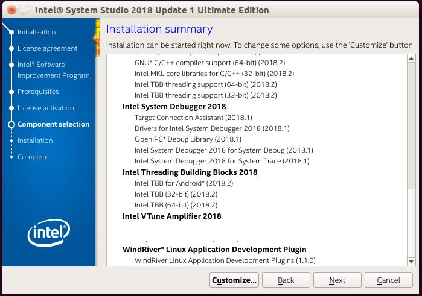
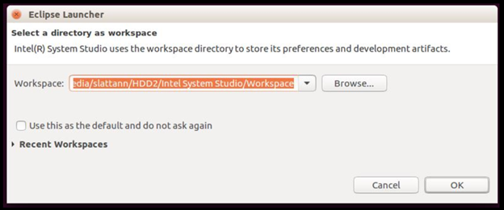
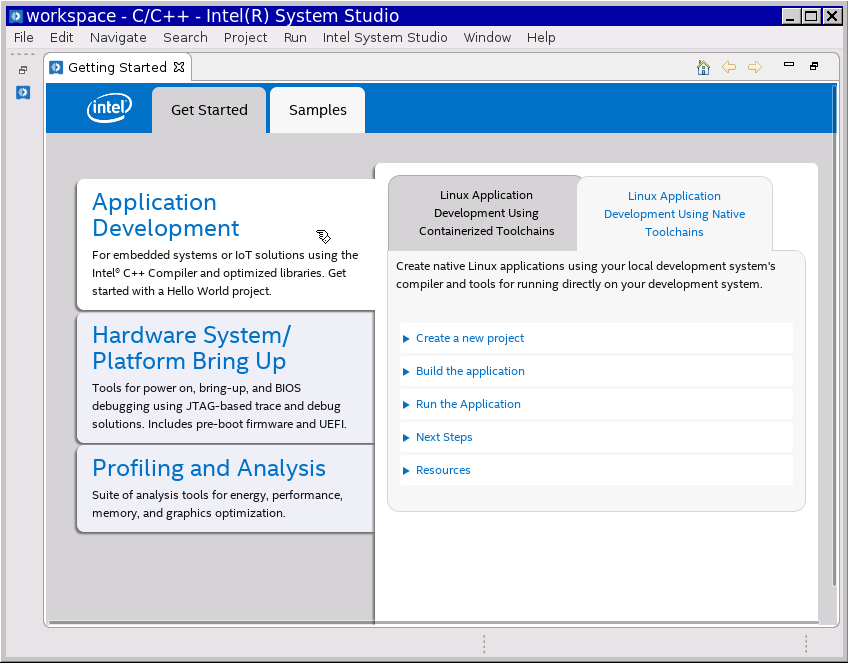
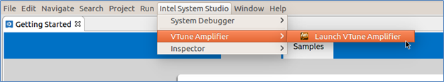
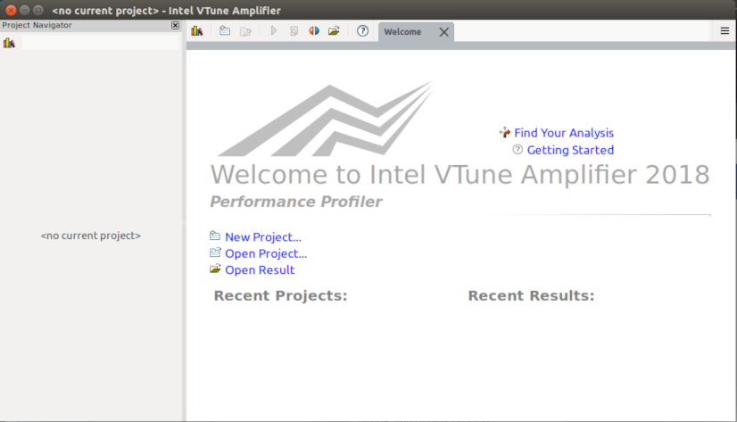

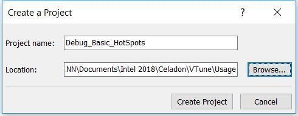
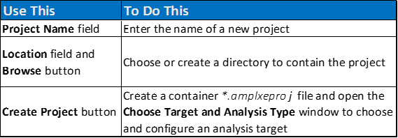

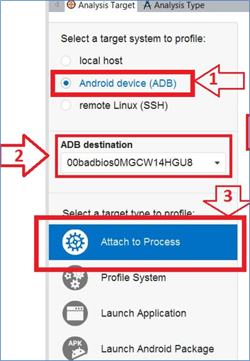
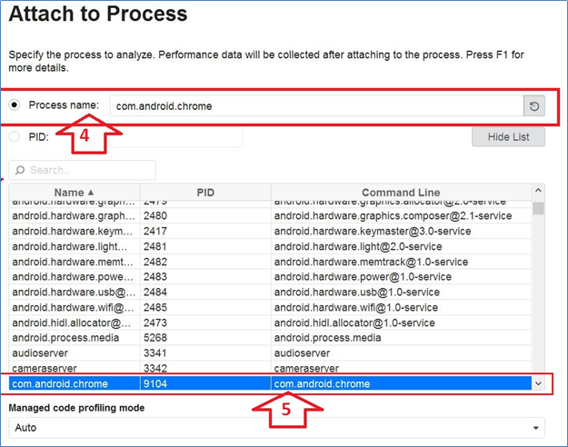
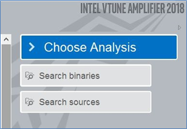
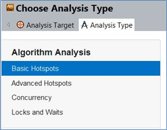
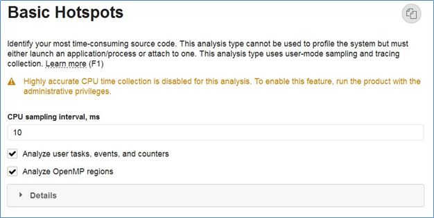
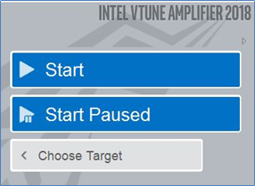
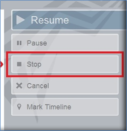
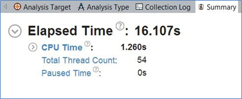
.. |image19| image:: images/image20.png
   :width: 4.52083in
   :height: 1.86458in
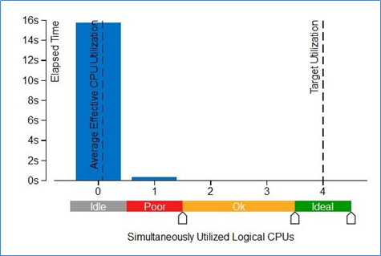
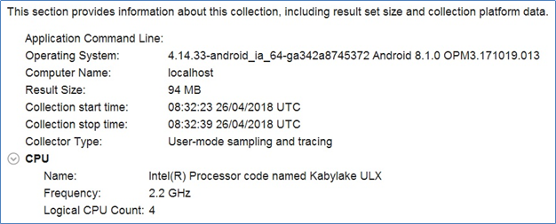
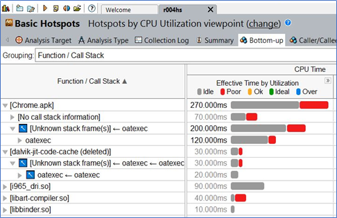
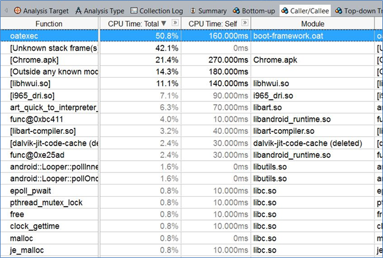
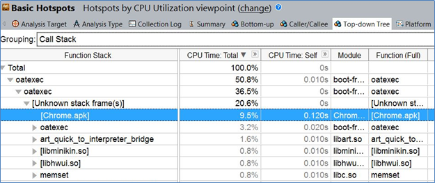

