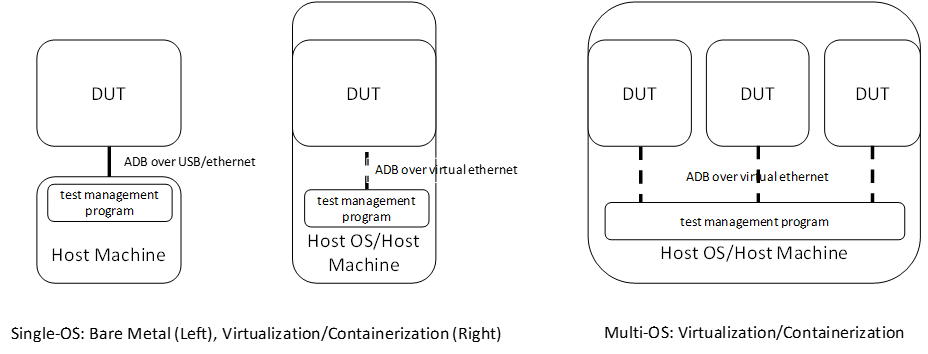
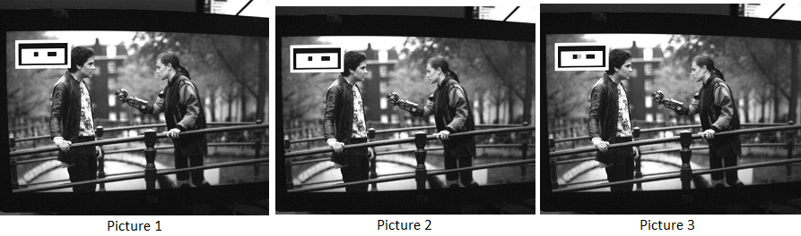
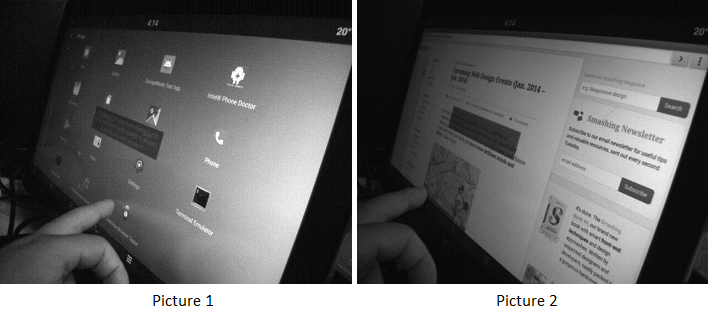

.. _pnp-testsuite:

|C| Power and Performance Test Suite
####################################

This guide describes the workloads included in the |C| Power and Performance (PnP)
test suite and provides details for running the tests.

.. contents::
   :local:
   :depth: 1

Introduction
============

|C| supports deployment models of bare metal, virtual machine, and container.
|C| can be run as the only Google* Android instance on the platform, either on a physical
hardware device or a host OS using virtualization or containerization technology.
Or, it can be run simultaneously with other |C| instances in a virtual machine or container
in the workload consolidation scenario.

Due to the different types of deployment models, there are two supported modes
for measuring performance and power on |C|:

* **Single-OS mode**: only one |C| instance is launched. When deployed on a host OS,
  no concurrent host OS workloads are issued, except the required device emulation
  loads.

* **Multi-OS mode**: multiple |C| instances are launched and running identical workloads.
  No loads other than the required device emulation tasks are issued in the host OS.

The |C| power and performance measurement workloads cover the general purpose
usage scenario for Edge devices, as well as scenarios for visual collaboration and portable devices.
The full suite of test workloads can be used for Single-OS tests, and part of the workloads
suite can be modified for Multi-OS tests.
While the Single-OS test items are designed to explore both hardware capability and
the end user experience, the Multi-OS test items are focused on the end user experience of
each instance when multiple OSes are running concurrently. In the Multi-OS profile, hardware
capabilities are shared among multiple instances and the acceptable user experience
of each instance is the key indicator to deliver. Refer to the following table for
more information about the test workloads.

.. list-table:: Celadon Power and Performance Test Suite
    :header-rows: 1

    * - Category
      - :abbr:`Celadon PnP Test Name (eliminate disadvantage & build advantage of Intel® architecture on Android* ecosystem against competitor)`
      - Unit
      - Description
      - :abbr:`Single-OS (platform: BM/VM/Container)`
      - :abbr:`Multi-OS (platform: VM/Container)`
      - Usage Scenario
    * - Video & Camera
      - H.264 3840x2160 60fps Playback
      - fps
      - | Accelerated high resolution video playback with display frame rate is reported.
      - Y
      - Y
      - General
    * - 
      - Peak 1080p H.264 Decoding FPS
      - fps
      - | Peak video decoding frame rate when accelerator 100% saturated.
        | This case is designed for multi-way media processing.
      - Y
      - 
      - Visual
    * - 
      - Peak 1080p H.264 Encoding FPS
      - fps
      - | Peak video encoding frame rate when accelerator 100% saturated.
        | This case is designed for multi-way media processing.
      - Y
      - 
      - Visual
    * - 
      - Video Conference - 1080p30 WebRTC
      - fps
      - | Accelerated high resolution video conference, in a loop back environment,
        | with display frame rate is reported.
      - Y
      - 
      - Visual
    * - Graphics
      - | GFXBench5.0 Manhattan 3.1
        | Benchmark Off Screen
      - score
      - | Industrial synthesized GPU benchmark, with scores reported.
      - Y
      - 
      - General
    * - Runtime
      - Geekbench Multi Core
      - score
      - | Industrial synthesized CPU benchmark, with scores reported.
      - Y
      - Y
      - General
    * - 
      - Antutu v6.3.3
      - score
      - | Industrial synthesized system benchmark, with scores reported.
      - Y
      - Y
      - General
    * - User Experience
      - Browser Warm Launch Latency
      - ms
      - | Latency of application launch. Here warm launch indicates the application
        | is launched before and put backgrounds ahead of time.
      - Y
      - Y
      - General
    * - 
      - Frame Rate of Kinetic Panning Web Page List in Browser
      - fps
      - | Smoothness of application rendering, where the test application is designed
        | to render at full frame rate, a.k.a. 60fps, with actual display frame rate reported.
      - Y
      - Y
      - General
    * - 
      - Touch Display Latency
      - ms
      - | Latency from touch/mouse events to UI response
      - Y
      - Y
      - General
    * - Connectivity
      - | WPA2 TCP 5GHz 80MHz AP
        | Throughput - Down Link
      - Mbps
      - | Bandwidth of TCP download link, oriented to platforms with on SoC connectivity capability,
        | recommended to measure in a shielding box.
      - Y
      - 
      - General
    * - SoC Power Management
      - Idle Display On
      - mW
      - | SoC on-chip power meter measurements when system is idle with display ON.
      - Y
      - 
      - Portable

Test Setup
==========

For the single-OS configuration, the :abbr:`DUT (Device Under Test)` is connected
to a host machine running Ubuntu* 18.04. The host machine uses :abbr:`ADB (Android Debug Bridge)`
to download test workloads to and collect logs from the DUT.
For single-OS on a bare metal device, enter command ``adb`` through the USB cable
or Ethernet link. For single-OS on virtualization or containerization platform, the host OS
is directly used as the host machine, and connects to the DUT via ``adb``
over the virtual Ethernet link.

A multi-OS configuration that is based on virtualization or containerization uses
the host OS as the host machine for testing and connecting to multiple DUT via
``adb`` over the Ethernet link. Refer to the following feature for details.

    Figure 1. DUT and Host Machine Setup

Test Tools
==========

High Speed Camera (HSC)
-----------------------

HSC is used for measuring :abbr:`FPS (Frames per Second)` and various latencies.
As an example, testers can use
`FLIR Flea*3 USB 3.0 Cameras <https://www.edmundoptics.com/f/point-grey-flea3-usb-3.0-cameras/14563/>`_,
which support 640x512 at 480 FPS, or Apple* iPhone* 6s slow motion mode to capture 240 FPS videos.
The captured video sequences should be divided into still frames using `FFmpeg <https://www.ffmpeg.org/>`_
or similar tools for further processing.

For FPS measurement, the displayed content on the DUT should be specially designed
so that each frame has an obvious difference that can be recognized by a human tester
or test automation tools based on visual object detection algorithm.
For example, in the video playback FPS test, gray barcodes can be applied to video clips
in test to facilitate the detection manually or automatically. In practice, we set
the HSC to capture 640x512 video clips at 480 FPS as an example. When the HSC captures
videos, the frame interval is 1000 / 480 = 2.083 msec. During our tests, we captured videos
continuously for 10 seconds, for a total of 4800 (480 x 10) picture frames, then counted
how many unique picture frames based on the signature or bar code were added to each
of the frames in the video clip.

For example, the following pictures were captured from a coded (added a signature or barcode) movie.
We observed that picture 1 and picture 2 have the same barcode, so it counted as one frame,
while picture 3 had a different barcode, so it counted as another unique frame. The total number
of unique frames were used to calculate the FPS.

    Figure 2. Grey Bar-Coded FPS Calculation

For latency measurements, we used HSC to capture the gesture/operation step by step
as designed by the test cases, and analyzed the snapshots to get the starting and ending
points in the operation sequence. For example, the following pictures were captured
when we launched the browser. In this example, picture 1 (e.g. picture number 366)
marks the time the user touched the screen (i.e. the starting point),
and picture 2 (e.g. picture number 583) marks the time when the browser completely
rendered on the screen (i.e. the ending point). Based on this information,
we calculated the launch time as (583 - 366) x 1000 / 480 = 452 msec.

    Figure 3. Latency Calculation

The adoption of HSC is similar for both single-OS and multi-OS test cases, however,
for multi-OS tests, multiple objects are used in recognition. HSC methods are accurate,
and end to end.
If the HSC methodology (and its corresponding frame difference detection mechanism)
is not available, users can implement log-based methods to obtain approximate results.

Intel® SoC Watch
----------------

The Intel SoC Watch command line tool is used for measuring SoC power consumption
in various scenarios.

For example:

    * System idle scenario, where the system is not in use during the collection time,
      and it's expected to reduce its energy usage as lower as possible.
      Set a longer collection period (e.g. several minutes) to allow the system enters
      deep sleep states.

    * Active workload, such as video or audio playback. Launch the test programs and
      start collecting data for a predetermined time period, or manually stop the data
      collection. Use the :command:`help` command to learn various options to start/stop
      the data collection.

Our recommended testing method is:

#. Push the Intel SoC Watch package to the DUT.

    .. code-block:: bash

        $ adb push socPowerTool /data/

#. Run the ``socPowerTool`` command and specify a collection time period (e.g. 1800 seconds)
   in the ``adb`` shell.

    .. code-block:: console

        $ adb shell
        celadon:/ # /data/socPowerTool --get_power_once 1800

#. The system returns the average power consumption during the specified time period.

    .. figure:: images/socwatch-example.png
        :align: center

#. Learn more about the additional data that can be collected on DUT by entering
   the :command:`help` command.

    .. code-block:: console

        celadon:/ # /data/socPowerTool -h

Test Suite
==========

This section describes how to run the workloads included in the |C| Power and Performance (PnP)
test suite and the Key Performance Indicators (KPIs) measured during the tests.

H.264 3840x2160 60fps Playback
------------------------------

This KPI measures frame rate for video playback of a locally stored video clip using HSC.

**Environment Setup**

    #. Device is maintained in a stable state and is not running any other applications.

    #. Set up HSC environment.

**Measurement Steps**

    #. Download the H.264 3840x2160 60fps video source and push it into the device.

    #. Play the video using the Gallery application or other video playback application.

    #. Calculate FPS using HSC.

Peak 1080p H.264 Decoding FPS
-----------------------------

This KPI measures the capability of parallel multiway decoding using an Intel® Media SDK sample.
For example, this could be built with the command: 

.. code-block:: bash

    $ make -j8 BOARD_HAVE_MEDIASDK_OPEN_SOURCE=true sample_decode

The output is located in :file:`out/target/product/cel_kbl/vendor/bin` folder.

**Environment Setup**

    #. Device is maintained in a stable state and is not running any other applications.

    #. Compile or download the decoder sample file.

    #. Download or create a H.264 testing video clip (FFmpeg can be used).

**Measurement Steps**

    #. Push the H.264 video clip and the compiled decoder sample binary file to the test device.

    #. Set the decoder binary file executable, and execute the decoder sample binary file to get FPS.
       Since single decoder program may not fully utilize 100% of the decoding engine's capability
       on many platforms, it's recommended to create a script to run multiple instances (e.g. 4)
       of the decoding program in parallel to fully saturate the decoding hardware,
       and aggregate the reported FPS numbers as the final result.

Peak 1080p H.264 Encoding FPS
-----------------------------

This KPI measures the capability of parallel multiway encoding using an Intel® Media SDK sample. 
This could be built using the command:

.. code-block:: bash

    $ make -j8 BOARD_HAVE_MEDIASDK_OPEN_SOURCE=true sample_encode

The output is located in :file:`out/target/product/cel_kbl/vendor/bin` folder.

**Environment Setup**

    #. Device is maintained in a stable state and is not running any other applications.

    #. Compile or download the encoder sample file.

    #. Download or create a 1080p testing YUV video clip (FFmpeg can be used).

**Measurement Steps**

    #. Push the YUV video clip and the compiled encoder sample binary file to the test device.

    #. Set the encoder binary file executable, and execute the encoder sample binary file to get FPS.
       Since single encoder program may not fully utilize 100% of the encoding engine's capability
       on many platforms, it's recommended to create a script to run multiple instances (e.g. 4)
       of the encoding program in parallel to fully saturate the encoding hardware,
       and aggregate the reported FPS numbers as the final result.

Video Conference - 1080p30 WebRTC
---------------------------------

This KPI measures the smoothness of WebRTC using HSC.

**Environment Setup**

    #. Device is maintained in a stable state and is not running any other applications.

    #. Set up HSC environment.

**Measurement steps**

    #. Open the browser with the URL :file:`https://apprtc.appspot.com`

    #. Click :kbd:`Join` to enter a room.

    #. Calculate FPS using HSC.

GFXBench 5.0 Manhattan 3.1 Benchmark Off Screen
-----------------------------------------------

This KPI measures the graphics performance using `GFXBench <https://gfxbench.com/>`_ application.

**Environment Setup**

    #. Device is maintained in a stable state and is not running any other applications.

**Measurement Steps**

    #. Download the GFXBench benchmark application from the Google* Play* store and install it.

    #. Launch the GFXBench GL benchmark application, select :kbd:`Manhattan 3.1 Benchmark Off Screen` to run.

    #. Get the result.

Geekbench* Multi Core
---------------------

This KPI measures the processor and memory performance using the
`Geekbench <https://www.geekbench.com/>`_ application.

**Environment Setup**

    #. Device is maintained in a stable state and is not running any other applications.

**Measurement Steps**

    #. Download the Geekbench app from the Google Play store and install it.

    #. Launch the Geekbench app and run it.

    #. Get the result.

Antutu* v6.3.3
--------------

This KPI measures system performance using the `Antutu <https://www.antutu.com/>`_ application.

**Environment Setup**

    #. Device is maintained in a stable state and is not running any other applications.

**Measurement Steps**

    #. Download the Antutu application from
       `Antutu6.3.3 <https://antutu-benchmark.en.uptodown.com/android/download/1462551>`_ and install it.

    #. Launch the Antutu app and start testing.

    #. Record score.

Browser Warm Launch Latency
---------------------------

This KPI measures the warm launch time of a browser using HSC.

**Environment Setup**

    #. Device is maintained in a stable state and is not running any other applications.

    #. Open the browser app and navigate to the example testing website.
       Press :kbd:`home` to move the app to the background, and then launch
       the browser app again to check the original navigation can be comlete
       automatically without manual operations (i.e. warm launch).

    #. Set up HSC environment.

**Measurement Steps**

    #. Open HSC and start capture.

    #. Launch the browser app and navigate the testing website.

    #. Calculate latency based on the pictures that are captured by HSC.

Frame Rate of Sliding Web Page List in Browser
----------------------------------------------

This KPI measures smoothness while sliding the web page in the browser using HSC.

**Environment Setup**

    #. Device is maintained in a stable state and is not running any other applications.

    #. Set up HSC environment.

**Measurement Steps**

    #. Launch the browser app and open a website that shows a scroll bar on the right
       for moving up and down the page.

    #. Slide the page up and down using your finger.

    #. Measure FPS using HSC.

Touch Display Latency
---------------------

This KPI measures the latency time from the physical touch event to the screen update using HSC.

**Environment Setup**

    #. Device is maintained in a stable state and is not running any other applications.

    #. Find a screen view which will be changed immediately when a user touches the screen.

    #. Set up HSC environment.

**Measurement Steps**

    #. Open the screen view.

    #. Open HSC and start capture.

    #. Use your finger to click the screen and wait for the screen to change.

    #. Calculate latency based on the picture that is captured by HSC.

WPA2 TCP 5GHz 80MHz AP Throughput - Down Link
---------------------------------------------

This KPI measures WLAN download data throughput performance using the
`iperf <https://iperf.fr/iperf-download.php>`_ tool.

**Environment Setup**

Note: We recommend that you perform this test in a shielding box.

    #. An Ubuntu host.

    #. Device is maintained in a stable state and is not running any other applications.

    #. Compile or download the iperf tools.

**Measurement Steps**

    #. Push the iperf tools into the device.

    #. Get the IP address of the device and Ubuntu host.

    #. Execute the following commands. On the Ubuntu host:

        .. code-block:: bash

            $ ./iperf -c device _IP -i 5 -t 60

       In the Android shell:

        .. code-block:: console

            celadon:/ ./iperf -s -i 5

    #. Evaluate the returned results.

Idle Display On
---------------

This KPI measures the power consumption in idle state using
`Intel SoC Watch <https://software.intel.com/en-us/get-started-with-socwatch>`_ tool.

**Environment Setup**

    #. Device is maintained in a stable state and is not running any other applications.

    #. Download the Intel SoC Watch tool and push into the device.

**Measurement Steps**

    #. Reboot the device till it is stable (wait more than 5 minutes).

    #. Start the power measurement for 1800 seconds using Intel SoC Watch.

    #. Record pkg_power value (Unit w) as result.
