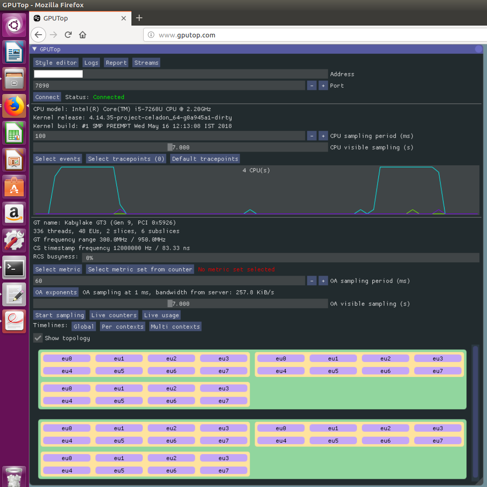
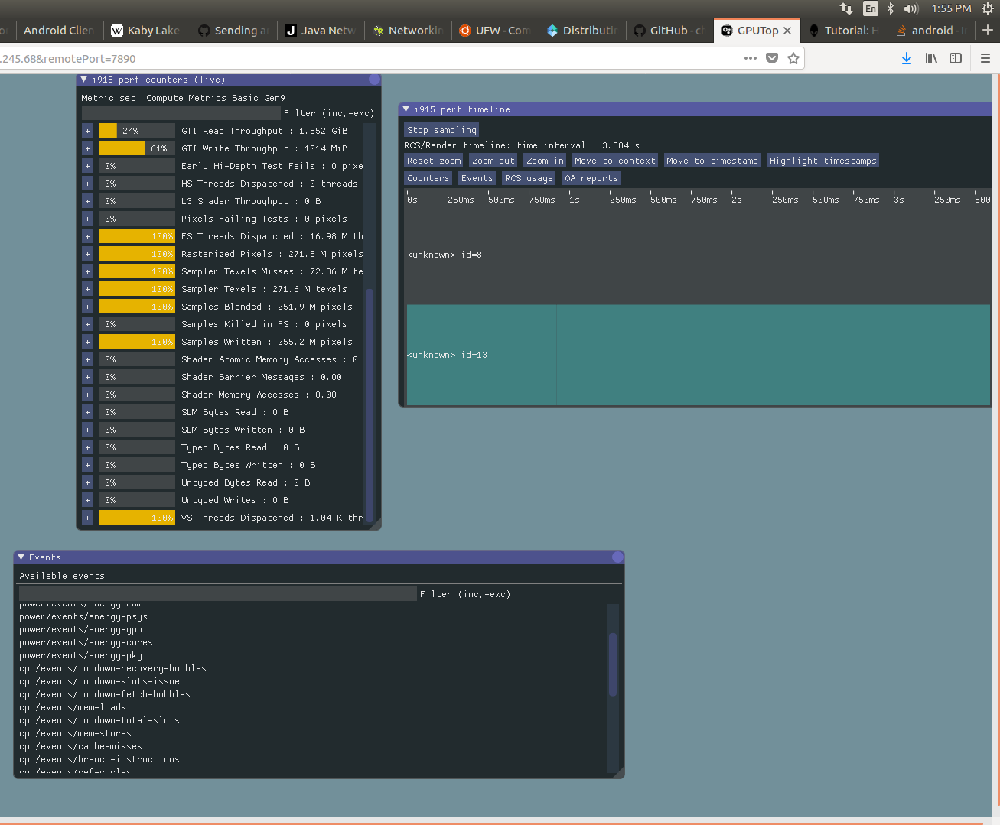

.. _profiling-gpu:

Profiling GPU on |C| Using GPU Top
##################################

Hardware prerequisites
======================

* Build machine/PC with Ubuntu 16.04
* USB drive 8GB, ext4 formatted
* Target |NUC|/Platform that will run a |C| image

Steps on the Ubuntu build machine
=================================

#. Install the dependencies packages

    .. code-block:: bash

        $ sudo apt-get install gksu debootstrap schroot

#. Clone and build GPU Top tool

    **gputop** has two parts, client and server. A server runs on the target machine and exports GPU information to clients over the network. Please refer to the `gputop GitHub repository <https://github.com/rib/gputop>`_ for more information on *gputop*.

    Follow the `build instructions <https://github.com/rib/gputop/wiki/Build-Instructions>`_ in the *gputop* GitHub repository to build the *gputop* client and server executables. The generated *gputop* server executable is available under */usr/local/bin*, it depends on *gputop-system* (binary) and *libgputop.so* (shared object library).

#. Plug in the USB drive on the build machine

    Mount a USB stick with an ext4 filesystem on it to the build machine. For example:

    .. code-block:: bash

        $ sudo mkdir /mnt/work
        $ sudo mount /dev/sdb1 /mnt/work/

    In the above command, */dev/sdb1* was assigned to the first primary partition of the USB stick, it can be assigned a different node number on your system. You can find the node number from the ``dmesg`` output after you plug in the USB stick.

#. Install and build the chrooted Linux distro using the following:

    .. code-block:: bash

        $ sudo debootstrap --arch=amd64 xenial /mnt/work http://archive.ubuntu.com/ubuntu/
        $ sudo mount -o bind /dev /mnt/work/dev
        $ sudo mount -t proc /proc /mnt/work/proc
        $ sudo mount -t sysfs /sys /mnt/work/sys
        $ sudo cp /etc/resolv.conf /mnt/work/etc/resolv.conf

#. Copy the ``gputop`` server executable and its dependencies to the chrooted USB stick:

    .. code-block:: bash

        $ sudo cp /usr/local/bin/gputop /mnt/work/usr/local/bin
        $ sudo cp /usr/local/bin/gputop-system /mnt/work/usr/local/bin
        $ sudo cp /build/server/libgputop.so /mnt/work/usr/local/bin

#. Unmount the root file system:

    .. code-block:: bash

        $ sudo umount  /mnt/work/dev
        $ sudo umount /mnt/work/sys
        $ sudo umount /mnt/work/proc

Run *gputop* on an Android target
=================================

#. Plug in the chrooted USB stick to the Android target.

    It is assumed *ADB* connection is enabled with an Android target through your build machine. Alternatively, you can use a Windows machine where an *ADBDriver* is installed.

#. On the |NUC| target device, note the IP address of the target platform. You can find the IP address by using the mouse on the Android target to select the "Settings -> System -> About tablet -> Status" menu item.

#. Connect to the target device and follow these steps:

    .. code-block:: none

        $ adb connect <ip_address_of_target>:5555
        $ adb shell
        celadon:/ $ su
        celadon:/ # mkdir -p /mnt/data/work
        celadon:/ # mount -o rw /dev/block/sdb1 /mnt/data/work
        celadon:/ # mount -o bind /dev /mnt/data/work/dev/
        celadon:/ # mkdir -p /mnt/data/work/dev/sys
        celadon:/ # mount -t sysfs /sys /mnt/data/work/dev/sys
        celadon:/ # mount -t proc /proc /mnt/data/work/proc
        celadon:/ # chroot /mnt/data/work/
        
        # below commands are executed in the chrooted environment
        root@hostname: # export PATH=$PATH:/usr/bin/:/bin/:/usr/sbin/:/usr/local/bin/
        root@hostname: # gputop

    The output of the *gputop* command is as follows:

    .. figure:: images/gpu_top_command.png
        :align: center

#. Once you see the build machine's output, open a web browser. In this example we use Mozilla Firefox. To launch Firefox go to "Search your computer" and type *Firefox*. Select the resulting Firefox web browser icon.

    Enter the URL **www.gputop.com** into the browser. Then, enter the IP address of the target, and port number 7890, and press the **Connect** button in the browser.

    .. note::
        Both the build machine and the target NUC/platform should be on the same subnet.

    .. figure:: images/image0.png
        :align: center

Following are the snapshots of *gputop* working on the build machine:

*gputop* output is explained in the following table:

==============================  ===========
GPU Parameter                   Description
AVG GPU Core Frequency          Average GPU Core Frequency in the measurement. (hz)
CS Threads Dispatched           The total number of compute shader hardware threads dispatched. (threads/s)
DS Threads Dispatched           The total number of domain shader hardware threads dispatched. (threads/s)
Early Depth Test Fails          The total number of pixels dropped on early depth test. (pixels/s)
EU Active                       The percentage of time in which the Execution Units were actively processing. (percent)
EU Both FPU Pipes Active        The percentage of time in which both EU FPU pipelines were actively processing. (percent)
EU Stall                        The percentage of time in which the Execution Units were stalled. (percent)
GPU Busy                        The percentage of time in which the GPU has been processing GPU commands. (percent)
GPU Core Clocks                 The total number of GPU core clocks elapsed during the measurement. (cycles/s)
GPU Time Elapsed                Time elapsed on the GPU during the measurement. (ns/s)
GS Threads Dispatched           The total number of geometry shader hardware threads dispatched. (threads/s)
GTI Depth Throughput            The total number of GPU memory bytes transferred between depth caches and GTI. (bytes/s)
GTI HDC TLB Lookup Throughput   The total number of GPU memory bytes transferred between GTI and HDC, when HDC is doing TLB lookups. (bytes/s)
GTI L3 Throughput               The total number of GPU memory bytes transferred between L3 caches and GTI. (bytes/s)
GTI RCC Throughput              The total number of GPU memory bytes transferred between render color caches and GTI. (bytes/s)
GTI Read Throughput             The total number of GPU memory bytes read from GTI. (bytes/s)
GTI Fixed Pipe Throughput       The total number of GPU memory bytes transferred between 3D Pipeline (Command Dispatch, Input Assembly and Stream Output) and GTI. (bytes/s)
GTI Write Throughput            The total number of GPU memory bytes written to GTI. (bytes/s)
Early Hi-Depth Test Fails       The total number of pixels dropped on early hierarchical depth test. (pixels/s)
HS Threads Dispatched           The total number of hull shader hardware threads dispatched. (threads/s)
L3 Lookup Accesses w/o IC       The total number of L3 cache lookup accesses w/o IC. (messages/s)
L3 Misses                       The total number of L3 misses. (messages/s)
L3 Sampler Throughput           The total number of GPU memory bytes transferred between samplers and L3 caches. (bytes/s)
L3 Shader Throughput            The total number of GPU memory bytes transferred between shaders and L3 caches w/o URB. (bytes/s)
Pixels Failing Tests            The total number of pixels dropped on post-FS alpha, stencil, or depth tests. (pixels/s)
FS Both FPU Active              The percentage of time in which fragment shaders were processed actively on the both FPUs. (percent)
PS FPU0 Pipe Active             The percentage of time in which EU FPU0 pipeline was actively processing a pixel shader instruction. (percent)
PS FPU1 Pipe Active             The percentage of time in which EU FPU1 pipeline was actively processing a pixel shader instruction. (percent)
PS Send Pipeline Active         The percentage of time in which EU send pipeline was actively processing a pixel shader instruction. (percent)
FS Threads Dispatched           The total number of fragment shader hardware threads dispatched. (threads/s)
Rasterized Pixels               The total number of rasterized pixels. (pixels/s)
Sampler 0 Bottleneck            The percentage of time in which Sampler 0 has been slowing down the pipe when processing EU requests. (percent)
Sampler 0 Busy                  The percentage of time in which Sampler 0 has been processing EU requests. (percent)
Sampler 1 Bottleneck            The percentage of time in which Sampler 1 has been slowing down the pipe when processing EU requests. (percent)
Sampler 1 Busy                  The percentage of time in which Sampler 1 has been processing EU requests. (percent)
Samplers Bottleneck             The percentage of time in which samplers have been slowing down the pipe when processing EU requests. (percent)
Sampler Cache Misses            The total number of sampler cache misses in all LODs in all sampler units. (messages/s)
Sampler Texels Misses           The total number of texels lookups (with 2x2 accuracy) that missed L1 sampler cache. (texels/s)
Sampler Texels                  The total number of texels seen on input (with 2x2 accuracy) in all sampler units. (texels/s)
Samplers Busy                   The percentage of time in which samplers have been processing EU requests. (percent)
Samples Blended                 The total number of blended samples or pixels written to all render targets. (pixels/s)
Samples Killed in FS            The total number of samples or pixels dropped in fragment shaders. (pixels/s)
Samples Written                 The total number of samples or pixels written to all render targets. (pixels/s)
Shader Atomic Memory Accesses   The total number of shader atomic memory accesses. (messages/s)
Shader Barrier Messages         The total number of shader barrier messages. (messages/s)
Shader Memory Accesses          The total number of shader memory accesses to L3. (messages/s)
SLM Bytes Read                  The total number of GPU memory bytes read from shared local memory. (bytes/s)
SLM Bytes Written               The total number of GPU memory bytes written into shared local memory. (bytes/s)
Timestamp                       Sample timestamp. (nanosecond resolution)
VS FPU0 Pipe Active             The percentage of time in which EU FPU0 pipeline was actively processing a vertex shader instruction. (percent)
VS FPU1 Pipe Active             The percentage of time in which EU FPU1 pipeline was actively processing a vertex shader instruction. (percent)
VS Send Pipe Active             The percentage of time in which EU send pipeline was actively processing a vertex shader instruction. (percent)
VS Threads Dispatched           The total number of vertex shader hardware threads dispatched. (threads/s)
==============================  ===========
