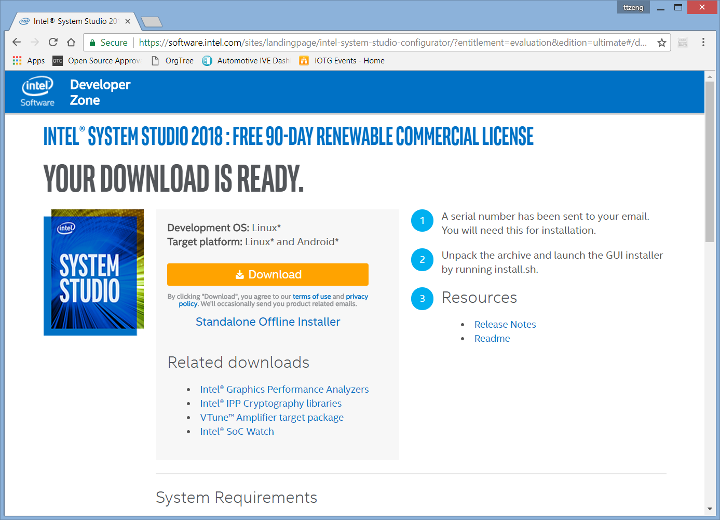

.. _profiling-system-power-consumption-with-socwatch:

Profiling System Power Consumption on |C| using  Intel® SoC Watch
#################################################################

Overview
========

Intel® SoC Watch is a command line tool for monitoring system power consumption on Intel platforms. The tool monitors active and low power states residencies for the following:

    * CPU
    * GPU
    * Devices
    * Processor frequencies and throttling reasons
    * Thermals
    * Wakeups
    * Other various metrics

This monitoring provides an outlook of the energy efficiency of the target system.

|SoC| collects the data from both hardware and OS sources at the occurring OS context-switch points. This avoids perturbing the system sleep states and keeps the overhead to a minimum. The tool summarizes reports in a comma separated values (CSV) file format at the end of collection on the target device. You can instruct |SoC| to output reports to be imported into Intel® VTune™ Amplifier or to time trace files, which are viewed as timelines with tools such as Microsoft* Excel.

This tutorial walks you through the process of using |SoC| to analyze the system power consumption on |C|.

Set up |SoC|
============

.. _download-install-iss:

Download and Install Intel® System Studio
-----------------------------------------

|SoC| is distributed as part of Intel System Studio. If you are new to Intel System Studio, click the `Download <https://software.intel.com/en-us/system-studio/choose-download>`_ page at Intel System Studio website to acquire a free renewable commercial license for 90-day use.

.. figure:: images/iss_register_download.png
    :align: center

Register yourself at the product download page and a product activation code will be sent to the registered email address. Follow the on-screen instructions, select Linux and Android as the development and target operating systems respectively. This will start the Intel System Studio release package download.

.. figure:: images/iss_select_oses.png
    :align: center

Extract the release package and launch the installer ``install.sh``. The installer will guide you through the installation process. The |SoC| package is available in the following directory after installation:

.. code-block:: bash

    <ISS_Install_Root>/system_studio_2018/energy_profiler_and_socwatch/socwatch_for_target/socwatch_android_v2.5.0.tar.gz

.. figure:: images/iss_install.png
    :align: center

Build |SoC| Kernel Modules
--------------------------

Extract the |SoC| package in the Linux development host, which pulled the source code from |C| software repositories. This is necessary because you will build the |SoC| kernel modules against the |C| kernel source code. Note that |SoC| depends on specific OS configurations and hardware capabilities. Reference the `Release Notes <https://software.intel.com/en-us/download/socwatch-linux-release-notes>`_ of the |SoC| release package to ensure the required dependencies are met, or the SoC Watch might not work properly.

You **MUST** build the |SoC| kernel modules after completely building the |C| installer image. This is required because the |C| kernel is signed, and the |SoC| kernel modules must be signed with the same keys in order to load into the |C| kernel.

Invoke the *build_drivers.sh* script and specify the full paths to the kernel source tree and the sign-file in order to build the kernel modules. The |SoC| kernel modules *socwatch2_4.ko* and *socperf2_0.ko* are generated in the *drivers/* directory.

.. code-block:: bash

    $ tar zxvf socwatch_android_v2.5.0.tar.gz
    ...
    $ cd socwatch_android_v2.5.0
    $ ./build_drivers.sh -l \
                         -k <celadon_src>/out/target/product/celadon/obj/kernel/ \
                         -s <celadon_src>/out/target/product/celadon/obj/kernel/scripts/sign-file

Set up |SoC| Watch on Intel NUC
-------------------------------

An *adb* session from the Linux development host to the |NUC| is required to set up |SoC| on the |NUC| target system. |C| enables `adb over Ethernet` to communicate to |NUC| through WiFi or wired connections. Connect the |NUC| to the same network as the Linux host and enter the following commands on the Linux host to connect to the |NUC|:

.. code-block:: bash

    $ adb kill-server
    $ adb connect 192.168.1.107
    * daemon not running. starting it now on port 5037 *
    * daemon started successfully *
    connected to 192.168.1.107:5555

The installation of |SoC| software requires root permission. The following commands restart the *adb* daemon in privileged mode and re-connects to the |NUC|:

.. code-block:: bash

    $ adb root
    restarting adbd as root
    $ adb connect 192.168.1.107
    * daemon not running. starting it now on port 5037 *
    * daemon started successfully *
    connected to 192.168.1.107:5555

Run the *socwatch_android_install.sh* script in the directory where you extracted the |SoC| package. The script will push the software to the `/data/socwatch` directory on the |NUC|.

.. code-block:: bash

    $ ./socwatch_android_install.sh
    adbd is already running as root
    Using ADB_CMD = adb wait-for-device
    Using TARGET_DIR = /data/socwatch
    Told to create dir /data/socwatch
    Copying socwatch to /data/socwatch
    socwatch: 1 file pushed. 0.7 MB/s (1833776 bytes in 2.649s)
    Copying setup_socwatch_env.sh to /data/socwatch
    setup_socwatch_env.sh: 1 file pushed. 0.4 MB/s (3587 bytes in 0.008s)
    Copying configs to /data/socwatch/configs/
    configs/: 1 file pushed. 0.6 MB/s (203232 bytes in 0.332s)
    Copying output_configs to /data/socwatch/output_configs/
    output_configs/: 34 files pushed. 0.3 MB/s (87740 bytes in 0.286s)
    Copying plugins to /data/socwatch/plugins/
    plugins/: 1 file pushed. 0.6 MB/s (3741800 bytes in 6.067s)
    Copying valleyview_soc to /data/socwatch/valleyview_soc/
    valleyview_soc/: 9 files pushed. 0.5 MB/s (55924 bytes in 0.112s)
    Copying cherryview_soc to /data/socwatch/cherryview_soc/
    cherryview_soc/: 9 files pushed. 0.5 MB/s (94765 bytes in 0.186s)
    Copying anniedale_soc to /data/socwatch/anniedale_soc/
    anniedale_soc/: 9 files pushed. 0.5 MB/s (89393 bytes in 0.171s)
    Copying tangier_soc to /data/socwatch/tangier_soc/
    tangier_soc/: 8 files pushed. 0.4 MB/s (44441 bytes in 0.111s)
    Copying libs to /data/socwatch/libs/
    libs/: 6 files pushed. 0.6 MB/s (1482088 bytes in 2.323s)
    Changing file perms for "socwatch"
    All done.

To complete the setup, push the kernel modules that you built in the previous section to |NUC|.

.. code-block:: bash

    $ adb push drivers/socwatch2_4.ko /data/socwatch
    drivers/socwatch2_4.ko: 1 file pushed. 0.5 MB/s (129918 bytes in 0.243s)
    $ adb push drivers/socperf2_0.ko /data/socwatch
    drivers/socperf2_0.ko: 1 file pushed. 0.5 MB/s (56990 bytes in 0.113s)

Collect System Power Metrics
============================

Load |SoC| Kernel Modules
-------------------------

Establish an *adb* session to the |NUC|, enter the Android command line shell, and load the |SoC| kernel modules with the following commands. For Intel platforms powered by the Intel Atom processor family, you must load the *socperf* kernel module before the *socwatch* kernel module.

.. code-block:: bash

    $ adb shell
    celadon:/ # cd /data/socwatch
    celadon:/data/socwatch # insmod socperf2_0.ko
    celadon:/data/socwatch # insmod socwatch2_4.ko

Collect Power Metrics
---------------------

Set up the collection environment with the *setup_socwatch_env.sh* script. Now, you can start collecting the power consumption data and other metrics with the *socwatch* command. For example, the following commands capture the CPU C-state data on |NUC| in 20 seconds. The collected data is stored as a `results.csv` file and other formats, depending on the given parameters. Reference the `Intel SoC Watch for Google Android OS and Linux OS User’s Guide <https://software.intel.com/sites/default/files/managed/5a/36/socwatch_android_linux_users_guide.pdf>`_ for more information on the command line parameters, supported feature names, and examples using Intel SoC Watch for energy analysis collection.

.. code-block:: none

    celadon:/data/socwatch # source setup_socwatch_env.sh
    Checking to see if we need to run ANN specific commands to enable socperf metrics...
    OK, commands not needed.
    Done.
    Using SOCWATCH_BASE_DIR = /data/socwatch
    Using SOCPERF_BASE_DIR = /data/socwatch
    
    If you haven't loaded the drivers yet, please do so.
    Check the user guide to determine which drivers to
    load, and the order in which to load them.
    celadon:/data/socwatch # ./socwatch -t 20 \
                                        -m -f cpu-cstate \
                                        -o results -r int -r json             
    
    *** Started 20 seconds data collection. Use Ctrl-C to stop collection.
    *** Post-processing results.
    *** Data written to: ./results

You can download the |SoC| output files to the development host for further analysis. An example output is shown in the following spreadsheet. Reference the `Interpreting Energy Analysis Data with Intel® VTune™ Amplifier <https://software.intel.com/en-us/socwatch-help-interpreting-energy-analysis-data-with-intel-vtune-amplifier>`_ application note for examples of visualizing the collected data using Intel VTune Amplifier.

.. code-block:: bash

    $ adb pull /data/socwatch/results.csv
    /data/socwatch/results.csv: 1 file pulled. 0.5 MB/s (10737 bytes in 0.022s)

.. figure:: images/socwatch-collect-cstate.png
    :align: center
