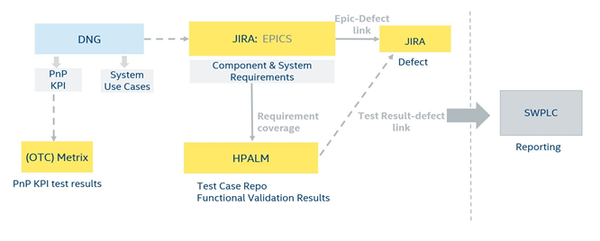
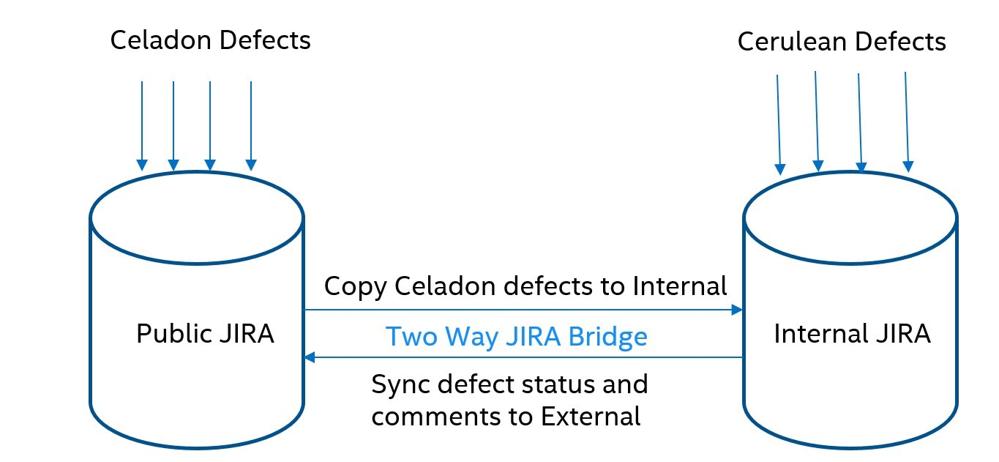

.. _system-validation-test-strategy:

System Validation - Test strategy for |C|
#########################################

|C| is an open source Android software reference stack for the Android community to bring ideas to life while developing on the latest Android release and the latest Intel hardware platforms. The following |NUC| systems are used to validate regular |C| releases.

    * |NUC| Kit `NUC7i5DNHE <https://www.intel.com/content/www/us/en/products/boards-kits/nuc/kits/nuc7i5dnhe.html>`_
    * |NUC| Kit `NUC6CAYH <https://www.intel.com/content/www/us/en/products/boards-kits/nuc/kits/nuc6cayh.html>`_

Weekly Validation Phase
-----------------------

The weekly validation cycle includes system functional test execution, Compliance testing - `CTS <https://source.android.com/compatibility/cts>`_, `VTS <https://source.android.com/compatibility/vts>`_, `CTS-Verifier <https://source.android.com/compatibility/cts/verifier>`_, STS, and Power and performance KPI's based on the defined features on the program quarterly.

    * The testplan is created based on the features in the verify/closed state from the weekly release builds. The execution is completed weekly on each domain until the SWQRC criteria is met. This criteria is defined at the start of the program.
    * The HP ALM (Application Lifecycle Management) tool is used to map/track all the testcases against the requirements defined in Jira.
    * The PLC (Product Life Cycle) portal gives the consolidated results in addition to track the software completion, requirement coverage, defects and system validation results.

Android Validation In-Scope
---------------------------

Android validation is scoped for the following:

* Bare metal Android (Native OS) for |C| project
    * KBL-NUC IVI Pie Jira
    * APL-NUC IVI Q Jira

* Functional validation of all E2E defined features in JIRA
* Non Functional (Compliance/PnP)
    * PnP KPIs defined that are captured in Jira
    * CTS/VTS/CTS-Verifier/STS testing

Android Validation Out-Scope
----------------------------

* All unit, white-box, and pre-integration testing is owned by the function domain CoEs. CoEs must guarantee component level qualification such as ABL, Kernel, Debug & Trace, USB, WIFI, and BT.
* Hardware component and relevant features
* FuSA Certification
* Pre-Certification
* Documentation

Validation Activates Key Flow
-----------------------------

Test Suite
----------

The objective of the System functional test is to ensure 100% validation coverage for POR features, and evaluate functionalities of the product as a whole from the end-to-end perspective. The System Validation includes positive, negative, feature interactive, and User experience tests.

.. list-table::
    :widths: 50 50
    :header-rows: 1

    * - Test Suite
      - Description
    * - System Functional
      - Requirement-based testing. Test cases are end-to-end and cover features captured in Jira (manual + automation)
    * - PnP - Performance
      - Measures performance KPIs
    * - Google Compliance - CTS/VTS/STS/CTS-Verifier
      - CTS/VTS/STS/CTS-Verifier test suite as per planned features on the program.

Test Suite and Defect Tracking
------------------------------

System functional testing is executed in a cumulative manner. The weekly functional test suite is focused on features moved to verify state and is validated on weekly releases.

* Full coverage for features in JIRA.
* Validation is conducted on internal builds and JIRA is raised to the internal JIRA.
* All jaised internal JIRAs are synced to external JIRA. 

